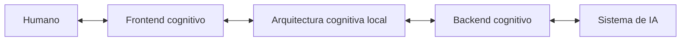

# Topología y componentes

## Topología nuclear



El frontend y el backend no son arquitecturas independientes: son las dos caras de una arquitectura de comunicación. La arquitectura cognitiva local constituye el centro organizado que ambas comunican.

## Componentes

### Humano

Responsabilidades:

- definir objetivos;
- emitir comandos;
- corregir interpretaciones;
- aprobar o rechazar propuestas;
- determinar persistencia;
- resolver ambigüedades materiales;
- conservar la autoridad sobre decisiones reservadas.

### Frontend cognitivo de interacción

Responsabilidades:

- capturar la forma humana del comando;
- hacer visible la interpretación;
- proyectar estado, relaciones y cambios;
- permitir navegación y selección;
- recibir correcciones y validaciones;
- ajustar la resolución de la representación.

### Arquitectura cognitiva local

Responsabilidades:

- mantener el estado;
- organizar estructuras activas;
- resolver procedencia y vigencia;
- aplicar autoridad y alcance;
- gestionar versiones y sustituciones;
- mantener preguntas, tareas y restricciones;
- decidir qué resultados pueden reintegrarse.

### Backend cognitivo de interacción

Responsabilidades:

- organizar cada componente operativo de la estructura de interacción;
- mantener un registro de componentes y contratos;
- resolver dependencias;
- normalizar comandos;
- seleccionar estructuras, modelos y herramientas;
- recuperar contexto mínimo suficiente;
- traducir operaciones al runtime;
- ejecutar o enrutar operaciones;
- clasificar y validar resultados;
- preparar su reintegración al estado;
- manejar capacidades y restricciones del anfitrión.

### Sistema de IA anfitrión

Puede incluir:

| Capa | Ejemplos |
|---|---|
| Modelo | LLM, multimodal, modelo local |
| Runtime | ChatGPT, API, servidor, DGX |
| Plataforma | chats, proyectos, archivos, memoria |
| Proveedor | OpenAI u otro proveedor |
| Herramientas | búsqueda, código, imágenes, conectores |
| Restricciones | permisos, contexto, formatos, políticas |
| Entorno | filesystem, red, sesión, almacenamiento |

## Registro de componentes

El backend debe poder representar cada componente como una unidad gobernable:

```yaml
component:
  id:
  type:
  role:
  version:
  lifecycle:
  inputs: []
  outputs: []
  dependencies: []
  constraints: []
  permissions: []
  validators: []
  runtime_binding:
  current_state:
```

Organizar no significa absorber la función del componente. El backend coordina identidades, contratos, dependencias y ejecución sin borrar la separación entre módulos.

## Relaciones permitidas

```text
Humano ↔ Frontend
Frontend ↔ Arquitectura local
Arquitectura local ↔ Backend
Backend ↔ Sistema anfitrión
```

Las comunicaciones que saltan una capa deben justificarse mediante un adaptador o una operación explícita. Por ejemplo, una herramienta no debe modificar directamente el estado canónico sin clasificación y validación.

