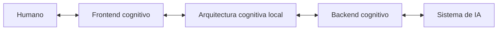

# Configuración canónica de la arquitectura

## Identidad

```yaml
document:
  id: AC-HIA-NUCLEO-CONFIG-001
  version: 0.2.0
  lifecycle: DEVELOPMENT
  authority: HUMAN

package:
  id: PC-AC-HIA
  name: PAQUETE_COGNITIVO_ARQUITECTURA_DE_COMUNICACION_HUMANO_IA
  version: 0.2.0

recommended_location:
  path: 01_nucleo/04_configuracion_canonica_de_la_arquitectura.md
  operation: ADD
```

## Propósito

Este documento concentra la configuración mínima de la `ARQUITECTURA_DE_COMUNICACION_HUMANO_IA`. No sustituye las explicaciones distribuidas del paquete: funciona como una representación canónica, compacta y procesable de sus componentes, entradas, comandos, alcances, funciones y proyecciones.

La configuración permite responder, desde un único punto, qué integra la arquitectura, qué está activo, qué depende de una instalación contextual y qué permanece experimental.

## Topología nuclear



## Configuración canónica

```yaml
interaction_architecture:
  id: AC-HIA
  version: 0.2.0
  lifecycle: DEVELOPMENT
  implementation_state: SPECIFIED_NOT_IMPLEMENTED

  authority:
    sovereign: HUMAN
    sovereignty_scope: WITHIN_PLATFORM_PERMISSIONS_AND_SAFETY_LIMITS
    reserved_decisions:
      - DEFINE_GOALS
      - CHANGE_CANON
      - APPROVE_PERSISTENCE
      - AUTHORIZE_DESTRUCTIVE_ACTIONS
      - RESOLVE_MATERIAL_AMBIGUITY
      - ACCEPT_OR_REJECT_CANDIDATE_MODIFICATIONS

  interaction_model:
    primary_pattern: STRUCTURAL_ACCUMULATIVE_INTEGRATION
    governing_dependency:
      id: PATRON_DE_INTEGRACION_ESTRUCTURAL_ACUMULATIVA
      version: 0.2.0
    linear_conversation_is_primary_model: false

  boundaries:
    human_facing_input:
      accepted_carriers:
        - NATURAL_LANGUAGE_PROMPT
        - VOICE_TRANSCRIPTION
        - UI_SELECTION
        - APPROVAL_EVENT
        - REJECTION_EVENT
        - ANNOTATION

    frontend_ingress:
      unit: HUMAN_COMMAND_EVENT
      preserves_raw_carrier: true

    architecture_operational_input:
      unit: NORMALIZED_COMMAND_GRAPH
      required_before_state_integration: true

    host_runtime_input:
      unit: EXECUTABLE_INSTRUCTION
      produced_by: HOST_ADAPTER

  components:
    - id: HUMAN
      role: SOVEREIGN_AUTHORITY
      state: ACTIVE

    - id: COGNITIVE_FRONTEND
      role: HUMAN_ARCHITECTURE_COUPLING
      state: SPECIFIED

    - id: LOCAL_COGNITIVE_ARCHITECTURE
      role: STATE_AND_VALIDITY_ORGANIZATION
      state: SPECIFIED

    - id: COGNITIVE_BACKEND
      role: ARCHITECTURE_AI_COUPLING
      state: SPECIFIED

    - id: HOST_AI_SYSTEM
      role: EXECUTION_RUNTIME
      state: CONTEXT_DEPENDENT

  cognitive_structures:
    - id: COGNICION_CENTRAL
      role: GOVERNANCE_AND_CONTEXTUAL_INSTALLATION
      installation_state: AVAILABLE_NOT_AUTOMATICALLY_ACTIVE

    - id: PATRON_DE_INTEGRACION_ESTRUCTURAL_ACUMULATIVA
      version: 0.2.0
      role: GOVERN_STATE_TRANSITIONS
      installation_state: REQUIRED_CONCEPTUAL_DEPENDENCY

    - id: FAC
      role: RESOLVE_FROM_AUTHORITATIVE_SOURCE
      installation_state: AVAILABLE_PENDING_BINDING
      note: NO_FUNCTION_IS_INVENTED_WHILE_SOURCE_IS_NOT_BOUND

    - id: ACCD
      role: OPTIONAL_PROJECTION_AND_REALIZATION_CONTROL
      installation_state: AVAILABLE_OPTIONAL

  human_input:
    human_expression: NATURAL_LANGUAGE_OR_INTERACTION_EVENT
    capture_unit: HUMAN_COMMAND_EVENT
    operational_unit: NORMALIZED_COMMAND
    compound_operational_unit: NORMALIZED_COMMAND_GRAPH
    linguistic_carrier: PROMPT

  command_scopes:
    canonical:
      - LOCAL
      - REGIONAL
      - TASK
      - CHAT
      - PROJECT
      - GLOBAL

    structural_refinements:
      LOCAL:
        - NODE
        - RELATION
        - SECTION
      REGIONAL:
        - SUBGRAPH
        - COMPONENT_FAMILY
        - OUTPUT_FAMILY
      TASK:
        - ACTIVE_TASK
        - OPERATION_RUN
      CHAT:
        - CURRENT_CHAT
      PROJECT:
        - CURRENT_PROJECT
      GLOBAL:
        - DECLARED_DOMAIN

  command_operations:
    core:
      - QUERY
      - DEFINE
      - CORRECT
      - REPLACE
      - RESTRICT
      - ACTIVATE
      - DEACTIVATE
      - APPROVE
      - REJECT
      - PROJECT
      - PERSIST
      - STOP

    specialized_operations_may_extend_core: true
    extension_requirement: PRESERVE_CORE_COMMAND_DIMENSIONS

  command_dimensions:
    - OPERATION
    - TARGETS
    - SCOPE
    - AUTHORITY
    - PAYLOAD
    - CONSTRAINTS
    - EXPECTED_RESULT
    - STATE_EFFECT
    - PERSISTENCE
    - VALIDATION
    - DEPENDENCIES
    - AMBIGUITY
    - TRACE

  projections:
    canonical:
      - SNAPSHOT
      - MERMAID_GRAPH
      - IMAGE
      - EXPLANATION
      - MARKDOWN_ARTIFACT
      - INTERACTIVE_INTERFACE

    compatible_aliases:
      MERMAID_GRAPH:
        - COGNITIVE_GRAPH
        - RELATION_GRAPH
      EXPLANATION:
        - NARRATIVE_EXPLANATION
      MARKDOWN_ARTIFACT:
        - DOCUMENT
      INTERACTIVE_INTERFACE:
        - TASK_PANEL
        - COMMAND_MAP
        - VERSION_HISTORY

    additional_supported_forms:
      - TABLE
      - TREE
      - TIMELINE

  result_classes:
    - SOURCE_RETRIEVAL
    - MODEL_INFERENCE
    - HYPOTHESIS
    - PROVISIONAL_RESPONSE
    - DRAFT
    - TOOL_OUTPUT
    - GENERATED_ARTIFACT
    - CANDIDATE_MODIFICATION
    - HUMAN_DECISION_REQUIRED
    - TRANSIENT_MANIFESTATION
    - ERROR

  persistence:
    default: NOT_REQUESTED
    requires:
      - EXPLICIT_DESTINATION
      - SUFFICIENT_AUTHORITY
      - AVAILABLE_CAPABILITY
    response_is_persistence: false

  experimental_status:
    COGNITIVE_FRONTEND: SPECIFIED_NOT_IMPLEMENTED
    COGNITIVE_BACKEND: SPECIFIED_NOT_IMPLEMENTED
    CONTEXTUAL_INSTALLER: DEFERRED
    HOST_ADAPTERS: NOT_IMPLEMENTED
```

## Interpretación de los alcances

`LOCAL` y `REGIONAL` son niveles canónicos; `NODE`, `RELATION`, `SECTION` y `SUBGRAPH` son refinamientos estructurales.

```text
LOCAL
= afecta una unidad estructural delimitada.

REGIONAL
= afecta una región compuesta sin gobernar el chat o proyecto completo.

TASK
= afecta la tarea o ejecución activa.

CHAT
= afecta el estado del chat receptor.

PROJECT
= afecta la superposición contextual del proyecto.

GLOBAL
= afecta transversalmente el dominio declarado, no todos los sistemas existentes.
```

## Regla de entrada

La arquitectura distingue cuatro fronteras:

```text
Humano
→ expresa lenguaje natural o realiza una acción de interfaz.

Frontend
→ captura el evento humano y conserva el portador original.

Arquitectura cognitiva local
→ recibe como entrada operativa el comando normalizado validado.

Sistema de IA anfitrión
→ recibe una instrucción ejecutable compilada por el adaptador.
```

Esta distinción evita dos reducciones incorrectas:

```text
prompt humano ≠ comando normalizado
comando normalizado ≠ instrucción específica del runtime
```

## Estado de las estructuras relacionadas

La aparición de una estructura en la configuración no la activa automáticamente. `COGNICION_CENTRAL`, `FAC` y `ACCD` requieren un binding contextual o una operación que justifique su uso. PIEA `0.2.0` sí es dependencia conceptual nuclear porque gobierna las transiciones del estado.

La función de `FAC` no se define en este archivo mientras no se recupere su fuente autorizada. Así se registra su lugar previsto sin inventar contenido ausente.

## Criterios de conformidad

Una implementación cumple esta configuración cuando:

1. conserva la topología de cinco componentes;
2. distingue las cuatro fronteras de entrada;
3. reconoce al humano como autoridad soberana dentro de límites efectivos;
4. integra comandos normalizados, no prompts sin gobernanza;
5. resuelve operación y alcance como dimensiones diferentes;
6. permite alcances locales, regionales y transversales;
7. no activa estructuras relacionadas sin binding;
8. no confunde generación con persistencia;
9. clasifica resultados antes de reintegrarlos;
10. permite varias proyecciones del mismo estado;
11. no declara implementado un componente únicamente porque está especificado.

