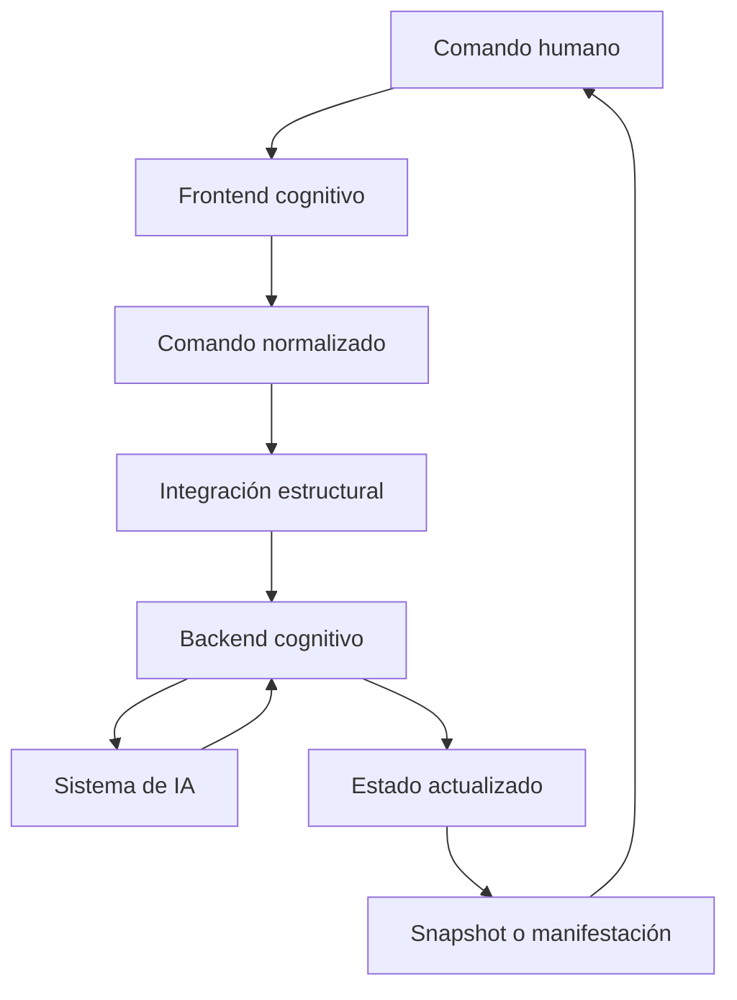

# Ciclo operativo

## Identidad

```yaml
document:
  id: AC-HIA-CICLO-001
  version: 0.2.0
  lifecycle: DEVELOPMENT
  authority: HUMAN

recommended_location:
  path: 02_modelo_operativo/05_ciclo_operativo.md
  operation: REPLACE
```

## Circuito completo



El circuito muestra la secuencia operativa dominante. No implica que cada transición sea automática ni que toda salida se persista.

## Dos fronteras de entrada

```text
ENTRADA HUMANA
lenguaje natural, selección o evento de interfaz
→ frontend cognitivo

ENTRADA OPERATIVA DE LA ARQUITECTURA
comando normalizado y validado
→ integración estructural
```

El humano escribe en lenguaje natural, pero la arquitectura cognitiva local opera sobre comandos normalizados. El portador humano se conserva para trazabilidad y reinterpretación.

## Secuencia básica

| Etapa | Responsable dominante | Transformación |
|---|---|---|
| 1 | Humano | Emite un comando mediante lenguaje natural u otro portador. |
| 2 | Frontend | Captura el evento humano y conserva su forma original. |
| 3 | Normalizador | Produce uno o más comandos estructurados. |
| 4 | Arquitectura local | Resuelve operación, objetivos, alcance, autoridad y vigencia. |
| 5 | PIEA | Integra el comando en el estado acumulativo. |
| 6 | Backend | Organiza componentes, dependencias, contexto y ejecución. |
| 7 | Adaptador | Compila el plan a capacidades del runtime. |
| 8 | Sistema de IA | Ejecuta inferencia, recuperación o herramienta. |
| 9 | Backend | Captura, clasifica y valida el resultado. |
| 10 | Arquitectura local | Reintegra únicamente los efectos autorizados. |
| 11 | Frontend | Proyecta el estado mediante snapshot u otra manifestación. |
| 12 | Humano | Aprueba, corrige, rechaza, detiene o continúa. |

## Relación con PIEA

La normalización prepara el aporte situado; PIEA gobierna la transición:

\[
G^C_t=\mathcal{N}_{\kappa_t}(p_t,S_t)
\]

\[
S_{t+\frac{1}{2}}=\mathcal{I}_{\kappa'_t}(S_t,G^C_t)
\]

\[
R_t=\mathcal{E}_{A_t}(S_{t+\frac{1}{2}})
\]

\[
S_{t+1}=\mathcal{I}_{\kappa''_t}(S_{t+\frac{1}{2}},\widehat{R}_t)
\]

Donde:

- \(p_t\) es el portador humano;
- \(G^C_t\) es el grafo de comandos normalizados;
- \(S_t\) es el estado anterior;
- \(A_t\) es el plan y adaptador de ejecución;
- \(R_t\) es el resultado bruto;
- \(\widehat{R}_t\) es el resultado clasificado y validado.

Este documento no redefine PIEA `0.2.0`; aplica su mecanismo a la interacción humano–IA.

## Fases detalladas

### F0 — Captura

Entrada: lenguaje natural o evento de interfaz.

Salida: evento humano registrado con portador original, actor, selección y referencia al estado.

### F1 — Normalización

Operaciones:

- delimitar el evento;
- separar comandos;
- clasificar operaciones;
- identificar objetivos;
- resolver referencias;
- resolver alcance;
- conservar restricciones;
- reconocer dependencias;
- registrar ambigüedad;
- identificar resultado esperado y persistencia.

Salida: grafo de comandos normalizados o solicitud de resolución humana.

### F2 — Admisión, autoridad y riesgo

La arquitectura comprueba:

- compatibilidad con el estado;
- autoridad;
- alcance;
- riesgo;
- persistencia;
- decisiones reservadas al humano.

### F3 — Integración preliminar

PIEA integra el comando en un estado de trabajo. El comando puede activar, restringir, sustituir, consultar, proyectar o quedar pendiente.

### F4 — Organización del backend

El backend:

- clasifica la operación;
- selecciona estructuras;
- localiza componentes;
- resuelve dependencias;
- recupera fuentes mínimas;
- selecciona runtime y herramientas;
- prepara validadores;
- produce un plan de ejecución.

### F5 — Compilación y ejecución

El adaptador traduce el plan al sistema anfitrión. Éste ejecuta exclusivamente operaciones compatibles con sus capacidades y permisos.

### F6 — Captura del resultado

El backend conserva:

- contenido bruto;
- modelo o herramienta de origen;
- metadatos;
- errores;
- relación con el comando.

### F7 — Clasificación y validación

El resultado se clasifica como fuente, inferencia, hipótesis, respuesta provisional, borrador, artefacto, modificación candidata, manifestación, decisión pendiente o error.

### F8 — Reintegración

La arquitectura determina si el resultado:

- se integra con estado epistemológico;
- se presenta como candidato;
- espera aprobación;
- se rechaza;
- se conserva sólo como manifestación efímera;
- produce una transición de estado.

### F9 — Proyección

El frontend hace inspeccionables el resultado, los cambios y las decisiones abiertas.

### F10 — Continuación humana

La aprobación, corrección o continuación vuelve al sistema como un nuevo evento de comando. El ciclo no retorna simplemente a “otro mensaje”: retorna a la autoridad humana sobre un estado actualizado.

## Caminos alternativos

### Ambigüedad material

```text
evento humano
→ normalización con alternativas
→ WAITING_FOR_HUMAN
→ resolución humana
→ nueva normalización
```

### Capacidad ausente

```text
plan de ejecución
→ host adapter
→ UNSUPPORTED_OPERATION
→ resultado ERROR
→ frontend informa el límite
```

### Decisión reservada

```text
modificación candidata
→ HUMAN_DECISION_REQUIRED
→ frontend presenta diferencia
→ humano aprueba o rechaza
```

### Manifestación sin persistencia

```text
PROJECT_STATE
→ snapshot
→ frontend
→ humano

sin modificación del canon
```

## Estados de ejecución

```yaml
execution_status:
  - REGISTERED
  - NORMALIZING
  - WAITING_FOR_CLARIFICATION
  - VALIDATING_AUTHORITY
  - INTEGRATED_FOR_WORK
  - PLANNED
  - RUNNING
  - CLASSIFYING_RESULT
  - VALIDATING_RESULT
  - WAITING_FOR_HUMAN
  - REINTEGRATED
  - EXECUTED
  - REJECTED
  - FAILED
  - CANCELLED
```

## Traza mínima

```yaml
operation_trace:
  event_id:
  raw_carrier_reference:
  command_ids: []
  previous_state_id:
  normalized_operations: []
  scope:
  authority_resolution:
  components_used: []
  sources_used: []
  runtime_calls: []
  validators_run: []
  raw_result_reference:
  result_class:
  human_decision:
  resulting_state_id:
  projections: []
  artifacts: []
```

## Invariantes del ciclo

1. El portador humano se conserva.
2. La arquitectura opera sobre comandos normalizados.
3. El comando no se ejecuta antes de resolver autoridad y alcance.
4. El backend no suplanta al humano.
5. El sistema anfitrión no modifica directamente el estado.
6. El resultado bruto se clasifica antes de reintegrarse.
7. El snapshot no equivale al estado completo.
8. La respuesta no equivale a persistencia.
9. Toda corrección humana entra como nuevo comando situado.

