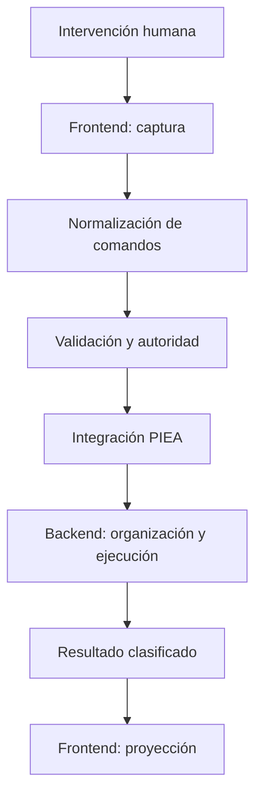

# Normalización de comandos

## Identidad

```yaml
document:
  id: AC-HIA-MO-NC-001
  title: NORMALIZACION_DE_COMANDOS
  version: 0.2.0
  lifecycle: DEVELOPMENT
  authority: HUMAN
  representation: COGNITIVE_PACKAGE_MODULE

compatibility:
  package_id: PC-AC-HIA
  package_name: PAQUETE_COGNITIVO_ARQUITECTURA_DE_COMUNICACION_HUMANO_IA
  package_version: 0.2.0
  human_name: ARQUITECTURA_DE_COMUNICACION_HUMANO_IA
  integration_mode: EXTENDS_WITHOUT_SUPERSEDING
```

Este documento desarrolla la **normalización de comandos** como mecanismo central de la `ARQUITECTURA_DE_COMUNICACION_HUMANO_IA`. Amplía `02_modelo_operativo/01_modelo_de_comandos.md`, especializa el componente `COMMAND_NORMALIZER` del backend y conserva las distinciones, contratos e invariantes del paquete.

No sustituye el modelo de comandos ya definido. Explica el proceso mediante el cual una intervención humana se convierte en una estructura operable, gobernable, verificable y transferible entre diferentes sistemas de IA.

---

## 1. Tesis nuclear

> La normalización de comandos transforma una intervención humana situada en una representación estructurada que conserva su intención, operación, objetivos, alcance, restricciones, autoridad, dependencias, ambigüedades y efectos esperados, de modo que la arquitectura cognitiva local pueda integrarla y el backend pueda organizar su ejecución sin depender de la forma superficial del prompt ni de un proveedor específico.

La normalización ocupa una posición capital porque constituye la frontera entre dos espacios:

```text
ESPACIO HUMANO
lenguaje, selección, corrección, pregunta, énfasis, referencia contextual

                         ↓ NORMALIZACIÓN

ESPACIO ARQUITECTÓNICO
operaciones, objetivos, alcance, autoridad, restricciones, dependencias,
estado, validación, persistencia y trazabilidad
```

Sin esta transformación, la arquitectura continuaría dependiendo de que cada modelo interpretara libremente cada prompt. Existiría una secuencia de respuestas, pero no un sistema de interacción estable, inspeccionable y acumulativo.

---

## 1.1 La normalización como forma de entrada operativa

La normalización de comandos constituye la forma de entrada operativa de la arquitectura cognitiva.

```text
HUMANO
→ escribe en lenguaje natural o realiza una acción de interfaz.

FRONTEND COGNITIVO
→ captura el evento humano y conserva el portador original.

NORMALIZADOR
→ transforma el evento en uno o más comandos estructurados.

ARQUITECTURA COGNITIVA LOCAL
→ recibe comandos normalizados como entrada operativa.

BACKEND COGNITIVO
→ organiza componentes y compila la operación para el runtime.

SISTEMA DE IA ANFITRIÓN
→ recibe instrucciones ejecutables compatibles con sus capacidades.
```

Por tanto:

```text
lenguaje natural
≠ entrada operativa final de la arquitectura

prompt o evento humano
≠ comando normalizado

comando normalizado
≠ instrucción específica del runtime
```

El sistema completo sí debe capturar el lenguaje natural para poder normalizarlo. Sin embargo, la arquitectura cognitiva local no integra directamente el prompt bruto como orden operativa: integra la representación normalizada después de aplicar los validadores y las reglas de autoridad correspondientes.

Este límite evita que variaciones superficiales de redacción se conviertan en variaciones silenciosas de operación y permite que la misma intención gobernada pueda compilarse para ChatGPT, una API o un runtime local.

---

## 2. La importancia de la normalización

La normalización no es un detalle previo a la ejecución. Hace posibles varias propiedades fundamentales de la `ARQUITECTURA_DE_COMUNICACION_HUMANO_IA`.

### 2.1 Soberanía humana operable

La autoridad humana no queda protegida únicamente por afirmar que el humano es soberano. Debe traducirse a campos que el sistema pueda conservar y aplicar:

```yaml
authority:
  actor: HUMAN
  decision_reserved_to_human: true

constraints:
  prohibited_effects:
    - MODIFY_CANON_WITHOUT_APPROVAL
    - PERSIST_WITHOUT_AUTHORIZATION
```

Si una prohibición expresada en lenguaje natural desaparece durante la interpretación, la soberanía humana queda declarada en teoría pero perdida en la operación.

### 2.2 Integración estructural acumulativa

PIEA integra aportes situados, no cadenas de texto indiferenciadas. La normalización permite que el comando llegue al mecanismo de integración con identidad, relaciones y alcance suficientemente explícitos.

```text
prompt humano
→ evento de comando
→ comando normalizado
→ admisión e integración PIEA
→ estado de trabajo
```

### 2.3 Organización del backend

El backend debe organizar cada componente que forma parte de la estructura de interacción. Para hacerlo necesita saber:

- qué operación debe realizarse;
- sobre qué objetivos;
- qué estructuras son necesarias;
- qué dependencias existen;
- qué está prohibido;
- qué resultado se espera;
- qué validadores deben ejecutarse;
- qué capacidad del runtime puede materializar la operación.

La normalización produce esa interfaz organizadora.

### 2.4 Portabilidad

Un prompt puede funcionar de manera diferente en ChatGPT, una API o un modelo local. Un comando normalizado permite conservar la identidad de la operación y delegar al adaptador la traducción final.

```text
MISMO COMANDO NORMALIZADO
├── adaptador ChatGPT
├── adaptador API
├── adaptador local
└── adaptador híbrido
```

### 2.5 Trazabilidad

La normalización permite reconstruir:

```text
qué expresó el humano
→ cómo fue interpretado
→ qué se ejecutó
→ qué resultado se obtuvo
→ qué cambió en el estado
```

### 2.6 Validación previa

Una estructura normalizada puede comprobarse antes de ejecutar. Esto permite detectar objetivos ausentes, alcances excesivos, prohibiciones perdidas, dependencias incompatibles o persistencia no autorizada.

### 2.7 Relación con la creación de textos

La normalización convierte lenguaje en piezas estructuradas. La realización textual puede tomar piezas estructuradas y convertirlas en frases y párrafos. Esta simetría parcial es valiosa, pero no agota la función de la normalización: un comando contiene dimensiones operativas y de gobierno que una representación puramente textual podría no requerir.

---

## 3. Distinciones obligatorias

### 3.1 Prompt, evento de comando y comando normalizado

```text
PROMPT
= portador perceptible introducido por el humano.

EVENTO DE COMANDO
= intervención humana situada que debe procesarse con respecto al estado.

COMANDO NORMALIZADO
= representación estructurada y gobernable producida al interpretar el evento.

INSTRUCCIÓN EJECUTABLE
= traducción del comando normalizado a un runtime concreto.
```

En este modelo, todo prompt humano entra al frontend como evento de comando candidato. La arquitectura cognitiva local recibe el resultado normalizado. Esto no significa que todo prompt deba convertirse inmediatamente en una llamada a una herramienta. Puede normalizarse como consulta, corrección, aprobación, espera, interrupción, cambio de alcance, solicitud de aclaración o actualización de estado.

### 3.2 Normalización e intención

```text
NORMALIZACIÓN ≠ clasificación de intención solamente
```

La intención responde parcialmente a “¿qué busca el humano?”. La normalización también debe responder:

- ¿qué operación o conjunto de operaciones se deriva?;
- ¿qué entidades son afectadas?;
- ¿hasta dónde se aplica?;
- ¿qué debe conservarse?;
- ¿qué está prohibido?;
- ¿qué depende de qué?;
- ¿qué ambigüedad permanece?;
- ¿qué autoridad es necesaria?;
- ¿qué salida permitiría considerar atendido el comando?;

### 3.3 Normalización y resumen

```text
NORMALIZACIÓN ≠ resumen del prompt
```

Un resumen puede ser más breve y, sin embargo, perder una negación, una excepción o un orden de ejecución. La normalización puede ser más extensa que el prompt cuando necesita hacer explícitas relaciones implícitas.

### 3.4 Normalización y reescritura

```text
NORMALIZACIÓN ≠ mejorar la redacción
```

Reescribir transforma una manifestación lingüística en otra. Normalizar cambia de nivel representacional: del portador humano a una estructura operativa.

### 3.5 Normalización y ejecución

```text
NORMALIZACIÓN ≠ ejecución
```

La normalización produce una representación candidata. Todavía deben resolverse admisión, autoridad, riesgo, dependencias, capacidades del runtime y validación.

### 3.6 Comando normalizado e instrucción para el modelo

```text
COMANDO NORMALIZADO ≠ prompt interno final
```

El comando normalizado debe ser relativamente independiente del proveedor. El adaptador del backend puede compilarlo después como prompt, llamada de API, operación de herramienta o secuencia híbrida.

### 3.7 Lenguaje y otros portadores

Aunque el prompt textual sea el portador principal en un chat, la arquitectura no debe reducir el comando al texto. También pueden producir eventos de comando:

- seleccionar un nodo;
- pulsar aprobar o rechazar;
- mover un elemento;
- cambiar un control de alcance;
- anotar una región de una imagen;
- elegir una versión;
- detener una ejecución;
- emitir voz convertida en una entrada verificable.

La normalización debe aceptar portadores heterogéneos y producir una estructura común.

---

## 4. Ubicación dentro de la arquitectura



La responsabilidad está distribuida:

| Componente | Responsabilidad |
|---|---|
| Frontend cognitivo | Capturar el portador, la selección, el contexto perceptible y la intervención humana. |
| Normalizador | Proponer una representación estructurada preservando la expresión original. |
| Arquitectura local | Resolver vigencia, contexto, alcance, autoridad y compatibilidad con el estado. |
| Backend cognitivo | Coordinar el normalizador, completar dependencias operativas y preparar la ejecución. |
| Adaptador del runtime | Traducir el comando validado a operaciones realizables por el anfitrión. |
| Humano | Resolver ambigüedades materiales y conservar decisiones reservadas. |

El `COMMAND_NORMALIZER` pertenece al núcleo estable del backend, pero no actúa aislado: necesita el estado cognitivo local y los datos capturados por el frontend.

---

## 5. Modelo formal mínimo

Para no redefinir la ecuación nuclear de PIEA, la normalización se expresa como una función anterior a la integración:

\[
\mathcal{N}_{\kappa_t}(p_t,S_t)
=
\langle G^C_t,A_t,Q_t,\tau_t\rangle
\]

Donde:

- \(p_t\) es el portador o conjunto de portadores de la intervención;
- \(S_t\) es el estado cognitivo local vigente;
- \(\kappa_t\) es el contexto de interpretación;
- \(G^C_t\) es el grafo de comandos normalizados;
- \(A_t\) contiene ambigüedades y alternativas conservadas;
- \(Q_t\) contiene cuestiones que requieren resolución humana;
- \(\tau_t\) es la traza entre el portador y la normalización.

Cuando la salida es admisible, el grafo normalizado puede convertirse en el aporte situado que PIEA integra:

\[
S_{t+1}=\mathcal{I}_{\kappa'_t}(S_t,G^C_t)
\]

La normalización no sustituye a PIEA. PIEA gobierna la transición del estado; la normalización prepara una representación estructuralmente admisible del comando.

---

## 6. El resultado no debe ser una lista plana

Un prompt puede contener varios comandos relacionados. Por eso la salida principal debe poder representarse como un **grafo de comandos**.

### 6.1 Nodos

Cada nodo representa una operación:

```yaml
command_node:
  id:
  operation:
  targets: []
  scope:
  payload:
  constraints: []
  expected_results: []
  authority:
  persistence:
  status:
```

### 6.2 Relaciones

```yaml
command_relations:
  - BEFORE
  - AFTER
  - DEPENDS_ON
  - CONDITIONAL_ON
  - PRESERVES
  - EXCLUDES
  - SUPERSEDES
  - REFINES
  - AFFECTS
  - PRODUCES_INPUT_FOR
  - BLOCKS
```

### 6.3 Ejemplo

```text
“Corrige únicamente la definición activa del backend, conserva sus ejemplos
y muéstrame después un grafo con las relaciones que hayan cambiado.”
```

```yaml
command_graph:
  nodes:
    - id: C1
      operation: CORRECT
      target: DEFINITION

    - id: C2
      operation: PRESERVE
      target: EXAMPLE

    - id: C3
      operation: RESTRICT
      target: NON_TARGET_CONTENT
      payload: DO_NOT_MODIFY_OUTSIDE_ACTIVE_BACKEND_DEFINITION

    - id: C4
      operation: PROJECT_RELATION_GRAPH
      target: CHANGED_RELATIONS
      representation: MERMAID

  edges:
    - from: C2
      relation: CONSTRAINS
      to: C1
    - from: C3
      relation: CONSTRAINS
      to: C1
    - from: C1
      relation: PRODUCES_INPUT_FOR
      to: C4
```

Una lista plana podría conservar las cuatro operaciones, pero perder la manera en que las restricciones gobiernan las transformaciones.

---

## 7. Esquema del comando normalizado

```yaml
normalized_command_event:
  event_id:
  timestamp:

  authority:
    actor: HUMAN
    level: SOVEREIGN_WITHIN_PLATFORM_LIMITS
    reserved_decisions: []

  carrier:
    type: PROMPT | UI_EVENT | SELECTION | ANNOTATION | VOICE
    raw_content:
    preserved: true

  context:
    state_reference:
    active_goal:
    active_task:
    selected_entities: []
    recent_referents: []
    governing_sources: []

  command_graph:
    nodes:
      - id:
        operation:
        subtype:
        targets: []
        payload:
        scope:
          level:
          domain:
          exclusions: []
        constraints:
          required: []
          prohibited: []
          preserved: []
        expected_results: []
        epistemic_effect:
        state_effect:
        persistence:
        status:
    edges: []

  interpretation:
    presuppositions: []
    resolved_references: []
    unresolved_references: []
    implicit_operations: []
    alternatives: []
    confidence_by_field: {}

  execution_policy:
    risk_level:
    human_confirmation_required:
    permitted_capabilities: []
    prohibited_capabilities: []

  validation:
    status:
    validators: []
    failures: []

  trace:
    carrier_to_fields: []
    inherited_from_state: []
    inferred_fields: []
    human_decisions: []
```

No todos los campos deben mostrarse al humano en cada interacción. La representación completa pertenece al backend y al estado operativo; el frontend puede proyectar una versión compacta cuando el riesgo es bajo.

---

## 8. Fases de normalización

La secuencia siguiente es lógica. Una implementación puede combinar fases, pero debe preservar sus funciones.

### NC-00 — Captura sin pérdida

Se conserva:

- portador original;
- actor;
- momento;
- canal;
- selección activa;
- archivos o nodos señalados;
- relación con el estado anterior.

**Regla:** nunca reemplazar el prompt original por su interpretación.

### NC-01 — Delimitación del evento

Determina si la entrada:

- inicia una tarea;
- continúa una tarea;
- corrige una salida;
- sustituye una decisión;
- responde a una pregunta del sistema;
- interrumpe una ejecución;
- cambia el nivel de alcance;
- contiene varios comandos.

### NC-02 — Segmentación operacional

Divide el aporte en unidades funcionales sin romper relaciones sintácticas o pragmáticas.

Ejemplo:

```text
“Lee el archivo, identifica contradicciones y no modifiques nada.”
```

```yaml
segments:
  - READ(file)
  - IDENTIFY(contradictions)
  - PROHIBIT(modification)
```

La tercera unidad gobierna a las dos anteriores; no es una observación secundaria.

### NC-03 — Reconocimiento del acto operativo

Una forma interrogativa, declarativa o exclamativa puede realizar diferentes operaciones.

| Forma lingüística | Operación posible |
|---|---|
| “¿Qué relación existe entre X e Y?” | `QUERY_RELATION` |
| “Esto debe aplicarse a todo el chat.” | `SET_SCOPE` + `DEFINE_POLICY` |
| “La versión anterior ya no sirve.” | `REJECT` o `SUPERSEDE` |
| “Bien.” | `ACKNOWLEDGE`, y sólo `APPROVE` si el contexto lo justifica |
| “Espera.” | `PAUSE` o `STOP`, según el estado de ejecución |

**Regla:** no inferir aprobación persistente a partir de una expresión socialmente positiva cuando la decisión no está clara.

### NC-04 — Resolución de referencias

Resuelve expresiones como:

- “esto”;
- “lo anterior”;
- “esa carpeta”;
- “la versión final”;
- “hazlo”;
- “el segundo ejemplo”.

La resolución utiliza el estado, la selección del frontend y la traza reciente.

```yaml
reference_resolution:
  expression: "añádelo al anterior"
  candidates:
    - DESIGN_COMMAND_003
    - PACKAGE_DOCUMENT_004
  selected:
  confidence:
  human_resolution_required:
```

Si dos candidatos producen rutas materialmente distintas, se conserva la ambigüedad y se pregunta.

### NC-05 — Identificación de objetivos

Cada operación debe señalar el elemento afectado:

- nodo;
- relación;
- definición;
- sección;
- archivo;
- paquete;
- tarea;
- estado;
- proyección;
- sistema externo.

No debe confundirse el objeto lingüístico mencionado con el objetivo operativo. En “explica el backend sin modificar el paquete”, `backend` es el tema de la explicación y `package` es el objetivo de una restricción.

### NC-06 — Resolución de alcance

El alcance responde “¿hasta dónde se aplican los efectos?”.

```yaml
scope:
  level: NODE | RELATION | SECTION | SUBGRAPH | OUTPUT | TASK | CHAT | PROJECT | GLOBAL
  domain:
  targets: []
  exclusions: []
  temporal_extent:
```

La ausencia de una palabra como “global” no implica alcance ilimitado. Debe inferirse el alcance mínimo suficiente compatible con el comando y el estado.

### NC-07 — Extracción de restricciones e invariantes

La normalización debe preservar especialmente:

- negaciones;
- exclusiones;
- elementos que deben conservarse;
- estructuras que no deben modificarse;
- requisitos de formato;
- límites de autoridad;
- condiciones de detención;
- criterios de éxito.

```yaml
constraints:
  required:
    - OUTPUT_FORMAT: MARKDOWN
  prohibited:
    - MODIFY_EXISTING_PACKAGE
  preserved:
    - CURRENT_ARCHITECTURE
  stop_conditions:
    - MISSING_REQUIRED_SOURCE
```

### NC-08 — Resultado esperado y codominio

Identifica qué salida permitiría considerar atendido el comando:

- explicación;
- grafo;
- archivo;
- corrección integrada;
- comparación;
- decisión pendiente;
- informe de ausencia;
- artefacto persistido.

El formato no es suficiente. “Un MD” declara un portador; todavía debe resolverse qué estructura cognitiva debe contener.

### NC-09 — Autoridad, persistencia y riesgo

La normalización distingue:

```text
GENERAR ≠ PERSISTIR
PROPONER ≠ APROBAR
CORREGIR EN CHAT ≠ MODIFICAR CANON
LEER ≠ EJECUTAR INSTRUCCIONES INTERNAS
```

```yaml
governance:
  authority_required:
  authority_present:
  persistence_requested:
  persistence_destination:
  destructive_effects: []
  external_actions: []
  risk_level: LOW | MEDIUM | HIGH
```

### NC-10 — Dependencias y control de flujo

Identifica:

- precedencia;
- condiciones;
- paralelismo permitido;
- operaciones que producen entradas para otras;
- operaciones que deben detenerse ante una ausencia.

```yaml
control_flow:
  - READ_SOURCE BEFORE ANALYZE
  - ANALYZE PRODUCES_INPUT_FOR GENERATE
  - MISSING_TERM BLOCKS GENERATE
  - VALIDATION REQUIRED_BEFORE PERSIST
```

### NC-11 — Ambigüedad y alternativas

La normalización no debe esconder incertidumbre detrás de un único objeto limpio.

```yaml
ambiguity:
  field: target
  alternatives:
    - value: PREVIOUS_RESPONSE
      confidence: 0.55
    - value: PREVIOUS_FILE
      confidence: 0.45
  material_difference: true
  resolution: ASK_HUMAN
```

Cuando la diferencia no es material, puede elegirse una interpretación reversible y registrarla en la traza.

### NC-12 — Validación y emisión

Antes de emitir el comando normalizado se comprueba:

- fidelidad al portador;
- completitud mínima;
- coherencia interna;
- alcance;
- autoridad;
- dependencias;
- ausencia de contradicciones no declaradas;
- compatibilidad con el estado.

La salida puede ser:

```yaml
normalization_status:
  - NORMALIZED
  - NORMALIZED_WITH_ASSUMPTIONS
  - WAITING_FOR_HUMAN
  - REJECTED_BY_AUTHORITY
  - INCOMPATIBLE_WITH_STATE
  - NO_EXECUTION_REQUIRED
```

---

## 9. Ambigüedad sin convertir el chat en formulario

Una normalización rigurosa no obliga a preguntar por cada campo vacío. El sistema debe equilibrar precisión y fluidez.

### Continuar sin preguntar

Puede continuar cuando:

- la interpretación es reversible;
- el riesgo es bajo;
- el alcance mínimo es evidente;
- no hay persistencia;
- las alternativas producen resultados equivalentes;
- el humano puede corregir fácilmente la proyección.

### Preguntar o detenerse

Debe preguntar cuando:

- existen objetivos plausibles incompatibles;
- la acción modifica canon o archivos vigentes;
- hay efectos destructivos;
- se actuará sobre una persona o sistema externo;
- falta una fuente obligatoria;
- la ambigüedad cambia materialmente el resultado;
- una decisión está reservada al humano.

### Representación compacta para riesgo bajo

La normalización puede permanecer implícita y mostrar sólo:

```yaml
interpreted_command:
  operation: EXPLAIN
  target: COMMAND_NORMALIZATION
  output: MARKDOWN_DOCUMENT
  persistence: NEW_FILE
```

La traza completa puede mantenerse en el backend sin convertir la interfaz en un formulario permanente.

---

## 10. Normalización contextual y referencias elípticas

El significado operativo no reside completamente en el prompt aislado.

```text
“Hazlo.”
```

carece de operación explícita si se separa del estado, pero puede estar completamente determinado dentro de una interacción:

```yaml
state_before:
  pending_proposal:
    operation: GENERATE_MARKDOWN
    target: NORMALIZATION_DOCUMENT
  awaiting_human_authorization: true

prompt: "Hazlo."

normalized_command:
  operation: APPROVE_AND_EXECUTE
  target: pending_proposal
```

Por tanto:

\[
\text{comando normalizado}
\neq
f(\text{prompt aislado})
\]

Depende del portador, del estado y del contexto de integración.

La dependencia contextual no autoriza al sistema a inventar antecedentes. Si el estado no contiene una propuesta inequívoca, “hazlo” debe permanecer sin resolver.

---

## 11. Correcciones, sustituciones y efectos retrospectivos

Algunos comandos no añaden una nueva tarea: cambian cómo debe interpretarse el estado existente.

Ejemplo:

```text
“En adelante no los llames comentarios; son comandos.”
```

Normalización:

```yaml
command_graph:
  nodes:
    - id: C1
      operation: SUPERSEDE_TERM
      target: COMMENT
      replacement: COMMAND
      scope:
        level: CHAT
        temporal_extent: CURRENT_AND_FUTURE_OPERATIONS

    - id: C2
      operation: REINTERPRET_LEGACY_RECORDS
      target: PREVIOUS_COMMENT_RECORDS
      rule: PRESERVE_CONTENT_CHANGE_ONTOLOGICAL_CLASS

  edges:
    - from: C1
      relation: GOVERNS
      to: C2
```

La normalización debe distinguir:

- sustitución terminológica;
- modificación ontológica;
- alcance temporal;
- tratamiento del historial;
- preservación o pérdida del contenido anterior.

---

## 12. Normalización de comandos múltiples

### Coordinación

```text
“Lee A y B y compáralos.”
```

```text
READ(A) ─┐
         ├→ COMPARE(A,B)
READ(B) ─┘
```

### Secuencia

```text
“Primero valida el esquema; después genera el archivo.”
```

```text
VALIDATE_SCHEMA → GENERATE_FILE
```

### Condición

```text
“Si falta la definición, no prosigas y reporta.”
```

```text
CHECK(DEFINITION)
├── present → CONTINUE
└── absent  → STOP + REPORT
```

### Restricción transversal

```text
“Analiza todos los documentos, pero no modifiques ninguno.”
```

La prohibición gobierna cada nodo de ejecución, no sólo el resultado final.

### Sustitución

```text
“Descarta tu versión anterior y usa la adjunta.”
```

Debe producir una transición de autoridad entre versiones, no una preferencia estilística.

---

## 13. Relación con la creación de textos

La cercanía entre normalización y creación textual no es accidental. Ambas trabajan con una zona intermedia situada entre la manifestación lingüística y la estructura cognitiva.

### Dirección analítica

```text
frase
→ proposiciones
→ entidades y relaciones
→ jerarquía
→ modalidad
→ restricciones
→ piezas normalizadas
```

### Dirección realizativa

```text
piezas normalizadas
→ selección discursiva
→ orden
→ conexión
→ frases
→ párrafos
→ texto
```

### Zona compartida

```yaml
normalized_semantic_piece:
  entities: []
  relations: []
  hierarchy:
  modality:
  negation:
  epistemic_status:
  provenance:
  discourse_role:
```

### Dimensiones exclusivas o reforzadas del comando

```yaml
operational_extension:
  operation:
  target:
  scope:
  authority:
  execution_dependencies: []
  persistence:
  risk:
  validators: []
```

Por ello, las piezas para crear texto y las piezas para normalizar comandos pueden compartir un sustrato semántico, pero no deben confundirse.

### Procesos inversos, no reversibles

La relación es inversa en dirección dominante, no una inversión matemática perfecta:

- una frase puede admitir varias estructuras;
- una estructura puede realizarse mediante muchas frases;
- el texto añade énfasis, ritmo, audiencia y progresión;
- el comando añade autoridad, alcance, persistencia y control de flujo;
- algunos rasgos retóricos deben preservarse porque modifican prioridad o negación;
- otros rasgos pueden no afectar la operación.

### Efecto del priming textual

El desarrollo paralelo de una teoría o arquitectura de textos vuelve especialmente visible la dirección `lenguaje → piezas → estructura`. Esa proximidad puede producir priming, pero la importancia de la normalización dentro de la `ARQUITECTURA_DE_COMUNICACION_HUMANO_IA` posee fundamentos independientes:

- habilita integración PIEA;
- permite organización del backend;
- hace verificable la autoridad;
- desacopla proveedores;
- conserva restricciones;
- permite trazabilidad;
- soporta portadores no textuales.

Por tanto, la conexión con los textos debe aprovecharse como una relación estructural fértil sin reducir la normalización de comandos a análisis textual.

---

## 14. Compilación hacia el runtime

Después de normalizar y validar, el adaptador puede compilar el comando para un sistema concreto.

### Representación independiente

```yaml
normalized_command:
  operation: QUERY_RELATION
  targets:
    - PIEA
    - COGNITIVE_BACKEND
  constraints:
    - DISTINGUISH_SOURCE_AND_INFERENCE
  expected_results:
    - EXPLANATION
    - RELATION_GRAPH
```

### Adaptador de chat

Puede convertirlo en una instrucción lingüística con contexto recuperado.

### Adaptador de API

Puede convertirlo en:

- mensajes;
- llamadas a herramientas;
- esquema de salida;
- metadatos de trazabilidad.

### Adaptador local

Puede traducirlo a:

- consulta de base de datos;
- prompt para modelo local;
- ejecución de script;
- escritura controlada en filesystem.

La compilación pertenece al adaptador. El normalizador no debe contaminar la estructura central con detalles exclusivos de un proveedor salvo que sean restricciones declaradas del contexto.

---

## 15. Validadores especializados

Estos validadores amplían `V0_COMMAND`, `V1_AUTHORITY`, `V2_SCOPE`, `V5_STRUCTURE` y `V6_EPISTEMIC` del paquete.

### NC-V0 — Fidelidad al portador

- ¿Se conserva el prompt o evento original?
- ¿Cada campo inferido puede trazarse al portador o al estado?
- ¿Se preservan negaciones, excepciones y énfasis operativos?

### NC-V1 — Segmentación

- ¿Se identificaron todos los comandos?
- ¿Alguna restricción fue tratada como contenido secundario?
- ¿Se conservaron las relaciones entre operaciones?

### NC-V2 — Referencias

- ¿Cada expresión elíptica tiene referente?
- ¿El referente procede del estado real?
- ¿Se conservaron alternativas cuando no existe resolución segura?

### NC-V3 — Operación y objetivo

- ¿La operación describe qué debe ocurrir?
- ¿El objetivo identifica qué resulta afectado?
- ¿Se evitó confundir tema y objetivo operativo?

### NC-V4 — Alcance

- ¿El alcance es el mínimo suficiente?
- ¿Existen exclusiones?
- ¿Se declaró la extensión temporal?
- ¿Se evitó convertir una regla local en global?

### NC-V5 — Restricciones

- ¿Se conservaron todos los “no”, “sólo”, “sin”, “mantén” y equivalentes?
- ¿Se distinguieron requisitos, prohibiciones y elementos preservados?
- ¿Las restricciones gobiernan los nodos correctos?

### NC-V6 — Autoridad y persistencia

- ¿Se distingue generar de persistir?
- ¿La autoridad es suficiente?
- ¿Existen decisiones reservadas al humano?
- ¿La operación implica efectos externos o destructivos?

### NC-V7 — Dependencias

- ¿El orden es correcto?
- ¿Se declararon condiciones de detención?
- ¿Una operación recibe las entradas que necesita?

### NC-V8 — Ambigüedad

- ¿Se muestra la incertidumbre por campo?
- ¿La ambigüedad cambia materialmente la ruta?
- ¿Debe intervenir el humano?

### NC-V9 — Compatibilidad estructural

- ¿El resultado satisface el esquema del paquete?
- ¿Puede integrarse mediante PIEA sin perder identidad?
- ¿Puede el backend organizar componentes a partir de él?

---

## 16. Fallos característicos

| Fallo | Consecuencia |
|---|---|
| Reducir todo el prompt a una etiqueta de intención | Se pierden objetivos, restricciones y dependencias. |
| Emitir un solo comando cuando existen varios | Se destruye la composición interna. |
| Eliminar el prompt original | Se pierde trazabilidad y capacidad de reinterpretación. |
| Tratar una negación como detalle | El sistema ejecuta una acción prohibida. |
| Confundir tema con objetivo | Se modifica o recupera la entidad equivocada. |
| Inferir alcance global por defecto | Una corrección local altera todo el sistema. |
| Ocultar ambigüedad | Una hipótesis del modelo aparece como orden humana. |
| Mezclar normalización con adaptador | El comando queda dependiente del proveedor. |
| Confundir salida con persistencia | Un borrador se registra como estado vigente. |
| Convertir cada interacción en formulario | La arquitectura se vuelve pesada e interrumpe la comunicación. |
| Reducir el comando a texto | Se excluyen selecciones, aprobaciones y otros portadores. |

---

## 17. Ejemplo completo

### Intervención humana

```text
Explica qué relación existe entre PIEA y el backend cognitivo. Después muestra
esa relación como un grafo Mermaid. No conviertas la explicación en una
modificación del estado canónico.
```

### Normalización

```yaml
normalized_command_event:
  authority:
    actor: HUMAN

  carrier:
    type: PROMPT
    raw_content_preserved: true

  context:
    active_architecture: ARQUITECTURA_DE_COMUNICACION_HUMANO_IA
    active_topic: RELATION_BETWEEN_PIEA_AND_COGNITIVE_BACKEND

  command_graph:
    nodes:
      - id: C1
        operation: QUERY_RELATION
        targets:
          - PATRON_DE_INTEGRACION_ESTRUCTURAL_ACUMULATIVA
          - COGNITIVE_BACKEND
        expected_results:
          - EXPLANATION

      - id: C2
        operation: PROJECT_RELATION
        source: RESULT_OF_C1
        representation: MERMAID

      - id: C3
        operation: RESTRICT
        target: CANONICAL_STATE
        payload: DO_NOT_MODIFY

    edges:
      - from: C1
        relation: PRODUCES_INPUT_FOR
        to: C2
      - from: C3
        relation: CONSTRAINS
        to: C1

  scope:
    level: OUTPUT
    targets:
      - RELATION_EXPLANATION
      - RELATION_GRAPH
    exclusions:
      - CANONICAL_STATE_MUTATION

  persistence:
    requested: false

  expected_result:
    sequence:
      - EXPLANATION
      - MERMAID_GRAPH
```

### Por qué este ejemplo importa

La pregunta contiene dos operaciones encadenadas y una restricción de estado. La explicación debe producir los datos que consume la proyección, mientras que la restricción impide confundir una manifestación solicitada con una modificación canónica. La normalización conserva esas tres dimensiones y su orden de dependencia.

---

## 18. Contrato del componente `COMMAND_NORMALIZER`

```yaml
component_contract:
  id: COMMAND_NORMALIZER
  version: 0.2.0

  accepts:
    - HUMAN_COMMAND_EVENT
    - COGNITIVE_STATE_REFERENCE
    - FRONTEND_SELECTION_CONTEXT
    - GOVERNING_RULES

  produces:
    - NORMALIZED_COMMAND_GRAPH
    - AMBIGUITY_SET
    - HUMAN_RESOLUTION_REQUEST
    - NORMALIZATION_TRACE

  preserves:
    - HUMAN_AUTHORITY
    - RAW_CARRIER
    - EXPLICIT_CONSTRAINTS
    - NEGATION
    - SCOPE
    - PROVENANCE

  must_not:
    - EXECUTE_AUTOMATICALLY
    - PERSIST_AUTOMATICALLY
    - HIDE_MATERIAL_AMBIGUITY
    - INVENT_MISSING_AUTHORITY
    - COLLAPSE_MULTIPLE_COMMANDS_WITHOUT_TRACE
    - DEPEND_ON_ONE_PROVIDER

  validators:
    - NC-V0
    - NC-V1
    - NC-V2
    - NC-V3
    - NC-V4
    - NC-V5
    - NC-V6
    - NC-V7
    - NC-V8
    - NC-V9
```

---

## 19. Relaciones con los demás módulos

La normalización no funciona como una operación aislada. Ocupa una posición definida entre la captura del evento humano, la integración estructural y la compilación del backend. Sus relaciones normativas son:

```yaml
document_relations:
  governed_by:
    - 01_nucleo/04_configuracion_canonica_de_la_arquitectura.md

  extends:
    - 02_modelo_operativo/01_modelo_de_comandos.md

  precedes_operationally:
    - 02_modelo_operativo/02_estado_e_integracion_acumulativa.md
    - 02_modelo_operativo/05_ciclo_operativo.md

  specializes_component_in:
    - 02_modelo_operativo/04_backend_cognitivo.md

  strengthens_contracts_in:
    - 03_contratos/01_contratos_de_intercambio.md
    - 03_contratos/02_validadores.md

  develops_function:
    - 04_funcionalidades/01_catalogo_de_funcionalidades_basicas.md#F02

  complements:
    - 04_funcionalidades/03_normalizacion_y_realizacion_textual.md

  exemplified_by:
    - 05_ejemplos/04_catalogo_de_normalizacion_de_comandos.md
```

Estas relaciones expresan dependencias semánticas y operativas internas. No implican activación automática, persistencia ni modificación de otros módulos.

---

## 20. Criterios de aceptación

El componente de normalización satisface esta especificación cuando:

1. el prompt original siempre permanece recuperable;
2. cada prompt se procesa como evento de comando situado;
3. pueden producirse varios comandos desde un mismo portador;
4. las relaciones entre comandos se representan;
5. operación, objetivo y alcance permanecen separados;
6. negaciones, exclusiones y preservaciones se conservan;
7. la autoridad y persistencia son explícitas;
8. la ambigüedad material no se resuelve silenciosamente;
9. el comando normalizado puede integrarse mediante PIEA;
10. el backend puede organizar componentes a partir de la salida;
11. el adaptador puede traducir la misma estructura a runtimes diferentes;
12. la interacción de bajo riesgo sigue siendo fluida;
13. se admiten portadores no textuales;
14. las piezas semánticas pueden relacionarse con la creación textual sin reducir el comando a texto;
15. la traza permite reconstruir portador → interpretación → ejecución → cambio de estado.

---

## Síntesis

```text
PROMPT O EVENTO HUMANO
→ captura sin pérdida
→ delimitación
→ segmentación operacional
→ resolución de referencias
→ identificación de operaciones y objetivos
→ resolución de alcance
→ extracción de restricciones
→ autoridad, persistencia y riesgo
→ dependencias y control de flujo
→ conservación de ambigüedad
→ validación
→ GRAFO DE COMANDOS NORMALIZADOS
→ integración PIEA
→ organización del backend
→ compilación al runtime
```

La normalización es el mecanismo que impide que la arquitectura dependa exclusivamente de una interpretación momentánea del modelo. Convierte la intervención humana en una estructura explícita sin borrar su forma original, conserva las condiciones de gobierno necesarias para ejecutar y proporciona el puente entre la comunicación humana, el estado cognitivo local y las capacidades concretas del sistema de IA.
