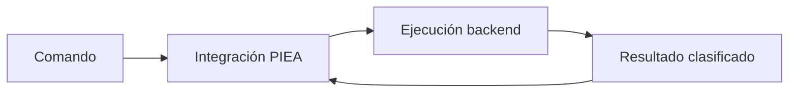

# Ejemplo 1 — Consulta de relación

## Prompt

```text
¿Qué relación existe entre PIEA y el backend cognitivo?
```

## Normalización

```yaml
command:
  id: CMD-EX-001
  authority: HUMAN
  carrier: PROMPT
  operation: QUERY_RELATION
  scope:
    level: LOCAL
    targets:
      - PIEA
      - COGNITIVE_BACKEND
  expected_results:
    - EXPLANATION
    - RELATION_GRAPH
  persistence:
    requested: false
```

## Estado de trabajo

```yaml
working_state:
  active_goal: EXPLAIN_RELATION
  relevant_structures:
    - PATRON_DE_INTEGRACION_ESTRUCTURAL_ACUMULATIVA@0.2.0
    - BACKEND_COGNITIVO_DE_INTERACCION@0.1.0
  question_status: ACTIVE
```

## Organización del backend

```yaml
execution_subgraph:
  components:
    - COMMAND_NORMALIZER
    - CONTEXT_RETRIEVER
    - RELATION_ANALYZER
    - RESULT_CLASSIFIER
    - STRUCTURE_VALIDATOR
    - EXPLANATION_GENERATOR
    - GRAPH_GENERATOR
  required_sources:
    - PIEA_NUCLEAR_SPECIFICATION
    - BACKEND_DEFINITION
```

## Piezas normalizadas de respuesta

```yaml
pieces:
  - subject: PIEA
    relation: GOVERNS
    object: STRUCTURAL_INTEGRATION
  - subject: COGNITIVE_BACKEND
    relation: MEDIATES
    object: EXECUTION_AND_RESULT_RETURN
  - subject: COGNITIVE_BACKEND_RESULT
    relation: MUST_BE_CLASSIFIED_BEFORE
    object: PIEA_REINTEGRATION
```

## Realización

> PIEA explica cómo los comandos y los resultados se integran en el estado estructural acumulado. El backend cognitivo prepara y ejecuta operaciones sobre el sistema de IA y devuelve resultados clasificados. Por eso el backend participa en el ciclo, pero PIEA gobierna la transición mediante la cual esos aportes reorganizan el estado.

## Proyección gráfica



## Validación

```yaml
validation:
  command: PASS
  authority: PASS
  scope: PASS
  structure: PASS
  epistemic: PASS
  projection: PASS
  human_approval_required: false
```

## Efecto sobre el estado

La consulta puede cerrar una pregunta y registrar una explicación provisional. No modifica por sí sola las definiciones canónicas ni persiste archivos.

