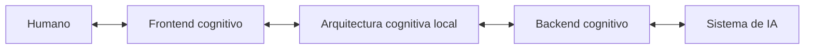

https://chatgpt.com/g/g-p-6a777363d7108191b2cafddb3fd424f0-cognicion-central/c/6a7beece-a184-83e8-9c6e-7dee1605831f

# Arquitectura de comunicación humano–IA

## Identidad

```yaml
package_id: PC-AC-HIA
package_name: PAQUETE_COGNITIVO_ARQUITECTURA_DE_COMUNICACION_HUMANO_IA
human_name: ARQUITECTURA_DE_COMUNICACION_HUMANO_IA
formal_name: ARQUITECTURA_DE_COMUNICACION_HUMANO_IA
version: 0.2.0
lifecycle: DEVELOPMENT
authority: HUMAN
representation: COGNITIVE_PACKAGE
```

Este paquete formaliza una arquitectura de interacción con estado entre un humano y un sistema de IA. Sustituye el modelo explicativo de conversación lineal por un circuito gobernado por comandos humanos normalizados, integración estructural acumulativa, ejecución mediada y proyecciones inspeccionables.

La versión `0.2.0` amplía la configuración canónica, la normalización de comandos, los flujos bidireccionales del backend, el ciclo operativo, el catálogo de funciones y los ejemplos.

## Componentes

1. **Humano soberano:** define objetivos, límites, correcciones y decisiones.
2. **Frontend cognitivo:** captura eventos humanos y proyecta el estado.
3. **Arquitectura cognitiva local:** mantiene estado, estructuras, versiones y validez.
4. **Backend cognitivo:** organiza componentes, traduce operaciones y media con el sistema de IA.
5. **Sistema de IA anfitrión:** aporta modelos, runtime, herramientas y capacidades bajo restricciones concretas.

El paquete describe una arquitectura experimental. No declara que exista todavía una implementación completa ni que un chat quede instalado automáticamente por leer estos documentos.

## Topología



## Regla de entrada

```text
Humano
→ expresa lenguaje natural o realiza una acción de interfaz.

Frontend
→ captura el evento y preserva el portador.

Normalizador
→ produce un grafo de comandos normalizados.

Arquitectura cognitiva local
→ recibe el comando normalizado como entrada operativa.

Backend y adaptador
→ producen una instrucción ejecutable para el sistema anfitrión.
```

El prompt es el portador lingüístico habitual. El comando normalizado es la unidad operativa de la arquitectura.

## Tesis nuclear

> El humano emite comandos mediante el frontend cognitivo. El normalizador transforma sus intervenciones en estructuras operables. La arquitectura cognitiva local resuelve operación, alcance, autoridad y efectos, e integra los comandos mediante el `PATRÓN_DE_INTEGRACIÓN_ESTRUCTURAL_ACUMULATIVA`. El backend organiza los componentes necesarios, compila las operaciones para el sistema de IA disponible, clasifica sus resultados y propone su reintegración. El frontend proyecta el nuevo estado para que el humano pueda inspeccionarlo y emitir el siguiente comando.

## Funcionalidades formalizadas

- captura y preservación de eventos humanos;
- normalización en grafos de comandos;
- clasificación de operaciones;
- resolución de referencias, objetivos, alcance y autoridad;
- gestión de ambigüedad, restricciones y riesgo;
- mantenimiento de estado cognitivo local;
- integración acumulativa de comandos y resultados;
- registro y organización de componentes;
- selección de estructuras;
- resolución de dependencias;
- recuperación dirigida de contexto;
- routing de modelos, herramientas y fuentes;
- compilación al runtime;
- clasificación, validación y reintegración de resultados;
- producción de datos para snapshots;
- proyecciones y navegación del frontend;
- validación, corrección, rechazo y aprobación humana;
- trazabilidad, versionado y persistencia gobernada;
- normalización semántica y realización textual;
- adaptación e instalación contextual futura.

## Árbol del paquete

```text
PAQUETE_COGNITIVO_ARQUITECTURA_DE_COMUNICACION_HUMANO_IA_v0_2_0/
├── README.md
├── 00_gobierno/
│   ├── 01_ficha_del_paquete.md
│   ├── 02_autoridad_estado_y_versionado.md
│   └── 03_manifiesto_del_paquete.md
├── 01_nucleo/
│   ├── 01_definicion_y_limites.md
│   ├── 02_topologia_y_componentes.md
│   ├── 03_invariantes.md
│   └── 04_configuracion_canonica_de_la_arquitectura.md
├── 02_modelo_operativo/
│   ├── 01_modelo_de_comandos.md
│   ├── 02_estado_e_integracion_acumulativa.md
│   ├── 03_frontend_cognitivo.md
│   ├── 04_backend_cognitivo.md
│   ├── 05_ciclo_operativo.md
│   └── 06_normalizacion_de_comandos.md
├── 03_contratos/
│   ├── 01_contratos_de_intercambio.md
│   └── 02_validadores.md
├── 04_funcionalidades/
│   ├── 01_catalogo_de_funcionalidades_basicas.md
│   ├── 02_snapshots_y_proyecciones.md
│   └── 03_normalizacion_y_realizacion_textual.md
├── 05_ejemplos/
│   ├── 01_consulta_de_relacion.md
│   ├── 02_correccion_de_alcance_local.md
│   ├── 03_directiva_de_alcance_global.md
│   └── 04_catalogo_de_normalizacion_de_comandos.md
└── 06_integracion_futura/
    └── 01_puntos_de_extension.md
```

## Ruta de lectura

### Comprensión completa

```text
README
→ definición y límites
→ topología
→ invariantes
→ configuración canónica
→ modelo de comandos
→ normalización de comandos
→ estado e integración
→ frontend
→ backend
→ ciclo operativo
→ contratos
→ validadores
→ funcionalidades
→ ejemplos
```

### Consulta operativa

Para una tarea particular debe recuperarse el documento responsable y sus dependencias directas. El paquete no exige lectura lineal completa en cada operación.

## Documentos responsables

| Necesidad                 | Documento                                                      |
| ------------------------- | -------------------------------------------------------------- |
| Configuración procesable  | `01_nucleo/04_configuracion_canonica_de_la_arquitectura.md`    |
| Normalización profunda    | `02_modelo_operativo/06_normalizacion_de_comandos.md`          |
| Backend bidireccional     | `02_modelo_operativo/04_backend_cognitivo.md`                  |
| Circuito completo         | `02_modelo_operativo/05_ciclo_operativo.md`                    |
| Catálogo funcional        | `04_funcionalidades/01_catalogo_de_funcionalidades_basicas.md` |
| Ejemplos de normalización | `05_ejemplos/04_catalogo_de_normalizacion_de_comandos.md`      |

## Dependencias

```yaml
dependencies:
  required_conceptual:
    - id: PATRON_DE_INTEGRACION_ESTRUCTURAL_ACUMULATIVA
      version: 0.2.0
      role: GOVERN_STATE_TRANSITIONS

  related:
    - id: COGNICION_CENTRAL
      role: GOVERNANCE_AND_CONTEXTUAL_INSTALLATION
      state: AVAILABLE_NOT_AUTOMATICALLY_ACTIVE

    - id: FAC
      role: RESOLVE_FROM_AUTHORITATIVE_SOURCE
      state: AVAILABLE_PENDING_BINDING

    - id: ACCD
      role: OPTIONAL_PROJECTION_AND_REALIZATION_CONTROL
      state: AVAILABLE_OPTIONAL

  future_local_documents:
    - role: LOCAL_COGNITION_AND_ROUTER
      status: NOT_GENERATED_IN_THIS_PACKAGE
    - role: ARTIFACT_BOOTLOADER_AND_READING_PROTOCOL
      status: NOT_GENERATED_IN_THIS_PACKAGE
```

La inclusión de una estructura relacionada no equivale a activación. Su función y binding deben resolverse desde fuentes autorizadas.

## Estado de implementación

```yaml
design_formalized: true
canonical_configuration_specified: true
basic_functions_specified: true
command_normalization_specified: true
runtime_implemented: false
installation_documents_generated: false
host_adapter_implemented: false
canonical_persistence_authorized: false
```

## Invariantes resumidos

```text
HUMANO = autoridad soberana dentro de límites efectivos.
PROMPT = portador lingüístico.
COMANDO NORMALIZADO = entrada operativa de la arquitectura.
PIEA = patrón de integración del estado.
BACKEND = mediador operativo, no modelo ni proveedor.
FRONTEND = superficie de inspección y comando, no simple renderer.
RESULTADO = salida clasificable, no verdad automática.
SNAPSHOT = proyección parcial, no estado completo.
RESPUESTA = salida revisable, no persistencia implícita.
```
