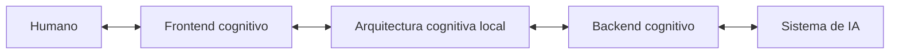

# Cognición local de la Arquitectura de comunicación humano–IA

## Identidad

```yaml
document:
  id: CC-LOCAL-AC-HIA-001
  title: COGNICION_CENTRAL_ARQUITECTURA_DE_COMUNICACION_HUMANO_IA
  lifecycle: LIVE
  authority: HUMAN
  representation: LOCAL_COGNITION_MODULE

target_package:
  package_id: PC-AC-HIA
  package_name: PAQUETE_COGNITIVO_ARQUITECTURA_DE_COMUNICACION_HUMANO_IA
  formal_name: ARQUITECTURA_DE_COMUNICACION_HUMANO_IA

distribution:
  placement: EXTERNAL_TO_PACKAGE_ARTIFACT
  travels_with:
    - ART_ARQUITECTURA_DE_COMUNICACION_HUMANO_IA.txt
    - como_leer_el_artefacto_adjunto.md
```

## 1. Función

Este documento proporciona la cognición local necesaria para que una instancia de COGNICIÓN_CENTRAL pueda reconocer, recuperar y operar el paquete `ARQUITECTURA_DE_COMUNICACION_HUMANO_IA` dentro de un chat, proyecto o aplicación receptora.

No reemplaza los documentos internos del paquete. Tampoco resume toda su teoría. Funciona como:

```text
MAPA
→ identifica dónde reside cada responsabilidad.

ROUTER
→ selecciona los módulos mínimos requeridos por cada comando.

CAPA DE ACOPLAMIENTO
→ vincula la arquitectura con COGNICIÓN_CENTRAL y con el contexto receptor.

COORDINADOR DE VALIDACIÓN
→ conserva autoridad, alcance, procedencia, estado y límites.
```

Su propósito operativo es evitar dos fallos opuestos:

1. tratar el artefacto como un texto monolítico que debe leerse completo en cada interacción;
2. activar fragmentos aislados sin recuperar sus contratos, dependencias e invariantes.

## 2. Tesis cognitiva

> COGNICIÓN_CENTRAL gobierna la selección y coordinación de estructuras; la `ARQUITECTURA_DE_COMUNICACION_HUMANO_IA` organiza el circuito local mediante el cual el humano emite comandos, la arquitectura mantiene estado, el backend media con las capacidades disponibles y el frontend hace inspeccionables los resultados.

La relación no es de sustitución:

```text
COGNICIÓN_CENTRAL
≠ frontend cognitivo
≠ backend cognitivo
≠ arquitectura cognitiva local
≠ sistema de IA anfitrión
```

COGNICIÓN_CENTRAL puede gobernar y coordinar la instalación contextual. El paquete aporta la arquitectura de interacción. El chat o aplicación aporta el runtime concreto.

## 3. Autoridad y precedencia

Aplica este orden:

```text
0. Reglas efectivas de plataforma, seguridad, acceso y herramientas.
1. Comando humano actual, explícito y autorizado.
2. Decisiones humanas vigentes en el contexto local.
3. Gobierno aplicable de COGNICIÓN_CENTRAL.
4. Gobierno e invariantes del paquete PC-AC-HIA.
5. Configuración canónica y contratos operativos del paquete.
6. Estructuras relacionadas activadas mediante bindings válidos.
7. Resultados de modelos, herramientas y fuentes externas.
8. Ejemplos, historial, borradores y material sustituido.
```

Invariantes de autoridad:

- el humano conserva soberanía sobre objetivos, límites, aprobación y persistencia;
- una respuesta del modelo no se convierte automáticamente en decisión;
- la aparición de una estructura relacionada no la activa;
- una instalación contextual no modifica el paquete fuente;
- un archivo generado no se convierte automáticamente en canon;
- una capacidad no expuesta por el runtime no debe fingirse.

## 4. Espacios lógicos

Mantén separados los siguientes espacios:

```text
CC://
  gobierno y estructuras recuperadas de COGNICIÓN_CENTRAL.

PACKAGE://
  unidades internas del artefacto PC-AC-HIA.

CONTEXT://
  objetivos, fuentes, restricciones, herramientas y estado del chat receptor.

OVERLAY://
  bindings, configuración local, decisiones de activación y adaptadores.

HOST://
  capacidades y límites reales del sistema de IA anfitrión.

OUTPUT://
  respuestas, snapshots, grafos, archivos y otras manifestaciones generadas.
```

Reglas:

- `CC://` y `PACKAGE://` son de sólo lectura por defecto;
- `CONTEXT://` no se atribuye al canon del paquete;
- `OVERLAY://` contiene la superposición contextual y puede ser efímero;
- `HOST://` describe capacidades reales, no capacidades deseadas;
- `OUTPUT://` no implica persistencia ni aprobación;
- las direcciones deben conservarse en la traza cuando una operación use fuentes internas.

## 5. Modelo nuclear que debe conservarse



Distinciones obligatorias:

```text
HUMANO
= autoridad soberana dentro de los límites efectivos.

PROMPT
= portador lingüístico habitual de uno o más comandos.

EVENTO DE COMANDO HUMANO
= captura del portador, actor, selección y contexto inmediato.

COMANDO NORMALIZADO
= entrada operativa de la arquitectura cognitiva local.

PIEA
= patrón que gobierna la integración estructural acumulativa.

BACKEND COGNITIVO
= capa que organiza componentes y media con el sistema anfitrión.

FRONTEND COGNITIVO
= superficie de comando, inspección, navegación y validación humana.

RESULTADO
= salida clasificable; no verdad, decisión ni canon automáticos.

SNAPSHOT
= proyección parcial e inspeccionable del estado.
```

## 6. Fronteras de entrada

La instalación debe conservar cuatro fronteras:

```text
HUMANO
→ lenguaje natural, voz, selección, aprobación, rechazo o anotación.

FRONTEND
→ HUMAN_COMMAND_EVENT con portador original preservado.

ARQUITECTURA COGNITIVA LOCAL
→ NORMALIZED_COMMAND_GRAPH validado.

SISTEMA ANFITRIÓN
→ EXECUTABLE_INSTRUCTION compilada por un adaptador.
```

Regla principal:

> El humano puede comunicarse en lenguaje natural, pero la entrada operativa de la arquitectura es el comando normalizado.

El portador original nunca se elimina: se conserva para trazabilidad, corrección y reinterpretación.

## 7. Mapa de recuperación del paquete

| Necesidad | Unidad principal | Dependencias directas |
|---|---|---|
| Identidad y alcance | `PACKAGE://00_gobierno/01_ficha_del_paquete.md` | README |
| Autoridad, estados y persistencia | `PACKAGE://00_gobierno/02_autoridad_estado_y_versionado.md` | invariantes |
| Índice lógico y responsabilidades | `PACKAGE://00_gobierno/03_manifiesto_del_paquete.md` | README |
| Definiciones y límites | `PACKAGE://01_nucleo/01_definicion_y_limites.md` | topología |
| Componentes y relaciones | `PACKAGE://01_nucleo/02_topologia_y_componentes.md` | invariantes |
| Reglas que no deben romperse | `PACKAGE://01_nucleo/03_invariantes.md` | gobierno |
| Configuración procesable | `PACKAGE://01_nucleo/04_configuracion_canonica_de_la_arquitectura.md` | manifiesto |
| Operaciones y alcances | `PACKAGE://02_modelo_operativo/01_modelo_de_comandos.md` | normalización |
| Estado y transiciones | `PACKAGE://02_modelo_operativo/02_estado_e_integracion_acumulativa.md` | PIEA |
| Interfaz humana | `PACKAGE://02_modelo_operativo/03_frontend_cognitivo.md` | snapshots |
| Organización y ejecución | `PACKAGE://02_modelo_operativo/04_backend_cognitivo.md` | contratos, host adapter |
| Secuencia completa | `PACKAGE://02_modelo_operativo/05_ciclo_operativo.md` | frontend, backend, PIEA |
| Normalización profunda | `PACKAGE://02_modelo_operativo/06_normalizacion_de_comandos.md` | modelo de comandos, validadores |
| Intercambio entre componentes | `PACKAGE://03_contratos/01_contratos_de_intercambio.md` | configuración |
| Validación | `PACKAGE://03_contratos/02_validadores.md` | invariantes |
| Funciones disponibles | `PACKAGE://04_funcionalidades/01_catalogo_de_funcionalidades_basicas.md` | documentos responsables |
| Proyecciones | `PACKAGE://04_funcionalidades/02_snapshots_y_proyecciones.md` | frontend |
| Relación estructura–texto | `PACKAGE://04_funcionalidades/03_normalizacion_y_realizacion_textual.md` | normalización |
| Ejecución mental y pruebas | `PACKAGE://05_ejemplos/` | documento normativo correspondiente |
| Extensiones no implementadas | `PACKAGE://06_integracion_futura/01_puntos_de_extension.md` | gobierno |

Los ejemplos no gobiernan una operación cuando contradicen al núcleo, los contratos o los invariantes.

## 8. Router cognitivo

### 8.1 Reglas generales

Para cada comando:

1. identifica la operación esperada;
2. resuelve el alcance;
3. determina si requiere consulta, transición de estado, ejecución o proyección;
4. recupera el documento responsable;
5. recupera únicamente sus dependencias directas necesarias;
6. aplica autoridad, contratos e invariantes;
7. selecciona componentes y capacidades del runtime;
8. clasifica el resultado antes de reintegrarlo;
9. proyecta el resultado con el nivel de detalle adecuado;
10. conserva trazabilidad y estado de persistencia.

### 8.2 Tabla de enrutamiento

| Familia de comando | Recuperación mínima | Componentes dominantes |
|---|---|---|
| `QUERY`, `QUERY_RELATION`, `EXPLAIN` | definición, documento temático, procedencia | normalizador, retriever, frontend |
| `DEFINE`, `CORRECT`, `REPLACE` | modelo de comandos, estado, PIEA, autoridad | normalizador, scope resolver, state integrator |
| `RESTRICT`, `PRESERVE`, `EXCLUDE` | normalización, invariantes, estado | constraint resolver, validator |
| `ACTIVATE`, `DEACTIVATE` | configuración, registro de componentes, dependencias | structure selector, component registry |
| `APPROVE`, `REJECT` | autoridad, estado candidato, diferencias | frontend, authority resolver, state reintegrator |
| `PROJECT`, `GENERATE_SNAPSHOT` | snapshots, frontend, alcance | snapshot provider, projection validator |
| `PERSIST` | autoridad, destino, política de persistencia | persistence coordinator |
| `AUDIT`, `TRACE` | manifiesto, trazas, validadores, procedencia | trace manager, validation coordinator |
| `GENERATE_TEXT` | normalización textual, estado fuente, restricciones | realization component, backend |
| `INSTALL`, `CONFIGURE_HOST` | configuración canónica, backend, puntos de extensión | overlay builder, host capability mapper |

### 8.3 Recuperación mínima suficiente

No recuperes todo el artefacto por defecto. Amplía la recuperación sólo cuando:

- exista una dependencia explícita;
- falte una definición necesaria;
- haya contradicción aparente;
- se requiera procedencia;
- el comando afecte autoridad, persistencia o canon;
- el resultado deba validarse contra un contrato adicional.

Declara `PARTIAL_RETRIEVAL` cuando no sea posible inspeccionar las unidades necesarias.

## 9. Estructuras relacionadas y bindings

```yaml
cognitive_bindings:
  - id: COGNICION_CENTRAL
    role: GOVERNANCE_AND_CONTEXTUAL_INSTALLATION
    state: ACTIVE_WHEN_THIS_MODULE_IS_AUTHORIZED

  - id: PATRON_DE_INTEGRACION_ESTRUCTURAL_ACUMULATIVA
    role: GOVERN_STATE_TRANSITIONS
    state: REQUIRED_CONCEPTUAL_DEPENDENCY
    rule: DO_NOT_REDEFINE_FROM_MEMORY

  - id: FAC
    role: RESOLVE_FROM_AUTHORITATIVE_SOURCE
    state: AVAILABLE_PENDING_BINDING
    rule: DO_NOT_INVENT_FUNCTION

  - id: ACCD
    role: OPTIONAL_PROJECTION_AND_REALIZATION_CONTROL
    state: AVAILABLE_OPTIONAL
    rule: DO_NOT_ACTIVATE_WITHOUT_NEED_AND_AUTHORITY
```

Si PIEA no está disponible como fuente independiente, utiliza únicamente las relaciones y fórmulas explícitamente incluidas en `PACKAGE://` y declara el binding como `PARTIAL`.

FAC no recibe una función inventada mientras su fuente autorizada no haya sido recuperada.

ACCD sólo se activa cuando una operación requiere control de proyección o realización y existe un binding válido.

## 10. Configuración contextual del runtime

Antes de ejecutar operaciones productivas, construye:

```yaml
host_profile:
  provider:
  runtime:
  platform:
  models_available: []
  tools_available: []
  file_access:
  web_access:
  code_execution:
  external_connectors: []
  persistence_destinations: []
  context_limits: []
  permissions: []
  safety_constraints: []
  unsupported_capabilities: []
```

Después crea el adaptador local:

```yaml
local_host_adapter:
  operation_to_capability: {}
  normalized_command_to_instruction: {}
  representation_to_renderer: {}
  persistence_to_destination: {}
  fallback_rules: []
  unavailable_operations: []
```

No atribuyas al backend acceso a mecanismos privados del proveedor. Sólo puede mediar con las capacidades efectivamente expuestas.

## 11. Registro local de componentes

```yaml
local_component_registry:
  - id: COGNITIVE_FRONTEND
    role: HUMAN_ARCHITECTURE_COUPLING
    installation_state: SPECIFIED
    runtime_binding:

  - id: LOCAL_COGNITIVE_ARCHITECTURE
    role: STATE_AND_VALIDITY_ORGANIZATION
    installation_state: CONTEXTUALLY_CONFIGURED
    runtime_binding:

  - id: COMMAND_NORMALIZER
    role: PRODUCE_NORMALIZED_COMMAND_GRAPH
    installation_state: CONTEXTUALLY_CONFIGURED
    runtime_binding:

  - id: COGNITIVE_BACKEND
    role: ARCHITECTURE_AI_COUPLING
    installation_state: CONTEXTUALLY_CONFIGURED
    runtime_binding:

  - id: HOST_AI_SYSTEM
    role: EXECUTION_RUNTIME
    installation_state: CONTEXT_DEPENDENT
    runtime_binding:
```

Los estados permitidos son:

```text
ACTIVE
AVAILABLE
SPECIFIED
CONTEXTUALLY_CONFIGURED
PENDING
PARTIAL
EXCLUDED
UNAVAILABLE
```

## 12. Ciclo operativo local

```text
1. Capturar el portador humano.
2. Normalizarlo como grafo de comandos.
3. Resolver autoridad, alcance, objetivos y restricciones.
4. Integrar preliminarmente mediante PIEA.
5. Seleccionar documentos, estructuras y componentes.
6. Recuperar contexto mínimo suficiente.
7. Compilar un plan para el runtime disponible.
8. Ejecutar la operación autorizada.
9. Capturar procedencia, metadatos y errores.
10. Clasificar y validar el resultado.
11. Proponer o efectuar únicamente la reintegración autorizada.
12. Proyectar el estado o resultado para el humano.
13. Recibir aprobación, corrección, rechazo o continuación.
```

La continuación humana es un nuevo evento de comando situado, no una simple prolongación textual de la respuesta anterior.

## 13. Clasificación de resultados

Todo resultado debe clasificarse antes de adquirir efectos sobre el estado:

```yaml
result_classes:
  - SOURCE_RETRIEVAL
  - MODEL_INFERENCE
  - HYPOTHESIS
  - PROVISIONAL_RESPONSE
  - DRAFT
  - TOOL_OUTPUT
  - GENERATED_ARTIFACT
  - CANDIDATE_MODIFICATION
  - HUMAN_DECISION_REQUIRED
  - TRANSIENT_MANIFESTATION
  - ERROR
```

Regla:

```text
EL MODELO PRODUJO X
≠ X ES VERDADERO
≠ X ESTÁ APROBADO
≠ X ESTÁ PERSISTIDO
≠ X ES CANÓNICO
```

## 14. Validadores locales

### CL-V0 — Autoridad

- identifica al actor;
- verifica decisiones reservadas;
- impide persistencia o cambio canónico no autorizados.

### CL-V1 — Entrada operativa

- conserva el portador original;
- exige comando normalizado antes de la integración estructural;
- mantiene relaciones entre comandos múltiples.

### CL-V2 — Alcance

- separa operación y alcance;
- evita que una corrección local se vuelva global;
- conserva exclusiones y preservaciones.

### CL-V3 — Recuperación

- utiliza el documento responsable;
- sigue dependencias directas;
- no presenta recuperación parcial como lectura completa.

### CL-V4 — Componentes

- conserva identidades entre frontend, arquitectura local, backend y host;
- comprueba dependencias y estados de instalación;
- impide que el backend absorba funciones de otros componentes.

### CL-V5 — Runtime

- verifica que la capacidad exista;
- registra permisos y límites;
- emite `UNSUPPORTED_OPERATION` cuando corresponda.

### CL-V6 — Resultado

- distingue fuente, inferencia, hipótesis, decisión y error;
- compara el resultado con el contrato esperado;
- impide reintegración automática no autorizada.

### CL-V7 — Proyección

- declara alcance y omisiones relevantes;
- no confunde snapshot con estado completo;
- no confunde manifestación con persistencia.

### CL-V8 — Trazabilidad

- conserva portador, comando, fuentes, componentes, runtime y resultado;
- identifica cambios de estado;
- distingue contenido del paquete y configuración local.

## 15. Prueba mínima de instalación contextual

Utiliza este evento de prueba sin producir persistencia:

```text
¿Qué relación existe entre PIEA y el backend cognitivo?
Explícala y muestra después un grafo Mermaid. No modifiques el estado canónico.
```

La instalación supera la prueba si puede producir conceptualmente:

```yaml
minimal_test_expectation:
  normalized_operations:
    - QUERY_RELATION
    - PROJECT_RELATION
    - RESTRICT
  targets:
    - PATRON_DE_INTEGRACION_ESTRUCTURAL_ACUMULATIVA
    - COGNITIVE_BACKEND
    - CANONICAL_STATE
  dependencies:
    - EXPLANATION_BEFORE_GRAPH
  persistence:
    requested: false
  required_retrieval:
    - 02_modelo_operativo/02_estado_e_integracion_acumulativa.md
    - 02_modelo_operativo/04_backend_cognitivo.md
    - 02_modelo_operativo/06_normalizacion_de_comandos.md
  expected_projection:
    - EXPLANATION
    - MERMAID_GRAPH
```

La prueba valida routing, normalización, restricción, recuperación, secuencia y proyección. No demuestra una implementación persistente ni acceso a herramientas no verificadas.

## 16. Estado de instalación

Usa estos estados:

```text
NOT_LOCATED
  no se localizó el artefacto o su gobierno.

INVALID
  el artefacto no puede reconstruirse de manera segura.

SPECIFIED
  la lógica fue recuperada, pero no se configuró para el contexto.

PARTIALLY_CONFIGURED
  existen bindings, pero faltan dependencias o capacidades materiales.

CONTEXTUALLY_INSTALLED
  mapa, router, autoridad, componentes y host fueron configurados y la prueba mínima pasó.

RUNTIME_READY
  además existe una implementación ejecutable verificada para las operaciones declaradas.
```

No declares `RUNTIME_READY` únicamente porque el chat pueda razonar sobre los documentos.

## 17. Manifiesto de superposición

```yaml
ac_hia_overlay:
  package:
    id: PC-AC-HIA
    artifact_detected:
    integrity:

  authority:
    sovereign: HUMAN
    reserved_decisions: []

  context:
    purpose:
    active_task:
    sources: []
    constraints: []

  active_bindings: []
  available_bindings: []
  excluded_bindings: []
  unresolved_dependencies: []

  component_registry: []
  host_profile: {}
  local_host_adapter: {}

  validators: []
  minimal_test:
    status:
    evidence: []

  persistence:
    mode: EPHEMERAL
    authorized_destinations: []

  installation_status:
```

Este manifiesto puede mantenerse conceptualmente en el chat. Sólo debe materializarse o persistirse cuando el humano lo solicite y exista un destino autorizado.

## 18. Comandos humanos reconocibles

Los siguientes son atajos opcionales. El lenguaje natural sigue siendo válido.

```text
INSTALA LA ARQUITECTURA DE COMUNICACIÓN HUMANO–IA
→ ejecuta configuración contextual y prueba mínima.

USA LA ARQUITECTURA PARA <OBJETIVO>
→ activa el router y selecciona capacidades mínimas.

MUESTRA EL ESTADO DE LA ARQUITECTURA
→ produce un snapshot sin persistencia implícita.

NORMALIZA ESTE COMANDO: <TEXTO>
→ muestra la representación operativa sin ejecutarla, salvo petición explícita.

MUESTRA LA TRAZABILIDAD DE <OPERACIÓN>
→ reconstruye portador, normalización, componentes, fuentes, resultado y efectos.

AUDITA LA INSTALACIÓN
→ revisa bindings, capacidades, dependencias, validadores y límites.

ACTUALIZA EL CONTEXTO LOCAL
→ modifica OVERLAY://, no PACKAGE:// ni CC://.

DESACTIVA LA ARQUITECTURA
→ deja de usar sus bindings activos sin borrar fuentes ni historial.
```

## 19. Respuesta operativa proporcional

No muestres siempre toda la normalización ni toda la traza. Ajusta la proyección:

| Situación | Respuesta recomendada |
|---|---|
| Consulta de bajo riesgo | respuesta directa y breve |
| Ambigüedad material | alternativas y pregunta concreta |
| Cambio estructural | alcance, diferencia y efecto previsto |
| Persistencia | destino, autoridad y confirmación necesaria |
| Error de capacidad | límite real y alternativas disponibles |
| Auditoría | traza, fuentes, validadores y omisiones |

La complejidad interna de la arquitectura no debe convertir toda conversación en un formulario.

## 20. Invariantes finales

```text
HUMANO = autoridad soberana.

COGNICIÓN_CENTRAL = gobierno y coordinación; no sustitución del humano.

PAQUETE = fuente estructurada; no instrucción activada por mera presencia.

ARTEFACTO = fotografía serializada; no repositorio vivo.

COMANDO NORMALIZADO = entrada operativa de la arquitectura.

PIEA = integración del estado; no ejecución del runtime.

BACKEND = organización y mediación; no proveedor ni modelo.

FRONTEND = acoplamiento humano; no simple renderer.

RESULTADO = salida clasificable; no verdad automática.

SNAPSHOT = proyección parcial; no estado completo.

INSTALACIÓN = superposición contextual; no modificación de plataforma.

PERSISTENCIA = efecto explícito, autorizado y dirigido.
```

## Síntesis ejecutiva

```text
COMANDO HUMANO
→ frontend conserva el portador
→ normalizador produce estructura operativa
→ arquitectura local integra mediante PIEA
→ router recupera módulos mínimos
→ backend organiza componentes y capacidades
→ host ejecuta dentro de sus límites
→ backend clasifica el resultado
→ arquitectura reintegra efectos autorizados
→ frontend proyecta el estado
→ humano decide cómo continuar
```

Este documento aporta la cognición local que permite coordinar ese circuito bajo COGNICIÓN_CENTRAL sin confundir el artefacto, el runtime, el estado local y la autoridad humana.
