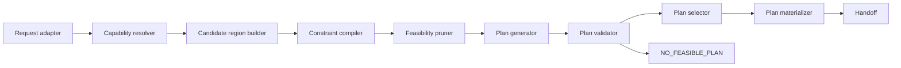

# Topología, componentes y responsabilidades

**ID:** `MCCR-CORE-TOPO-001`  
**Versión:** `0.1.0`  
**Estado:** `CANDIDATE / NON_CANONICAL`  
**Autoridad:** `HUMAN`  
**Fecha:** `2026-08-14`

> Este documento es una especificación candidata. No declara implementación de runtime ni modifica el canon.

## Tesis y propósito

MCCR funciona como una tubería de decisión auditable: adquiere una solicitud situada, construye un espacio factible, propone configuraciones, las valida y entrega una selección materializada.

## Responsabilidad

Este documento es responsable de:

- componentes internos lógicos
- puertos entre componentes
- separación entre recuperación, generación, validación y selección

No es responsable de:

- imponer una implementación monolítica
- duplicar registries o validadores externos
- ocultar decisiones dentro de un puntaje

## Contrato de entrada

| Entrada | Función | Condición |
|---|---|---|
| MCCR_REQUEST | solicitud estructurada | REQUIRED |
| COMPONENT_VIEW | candidatos y dependencias | REQUIRED |
| HOST_PROFILE | bindings efectivos | REQUIRED |

El humano expresa intención, restricciones y decisiones en lenguaje natural. AC-HIA/backend materializa la representación estructurada; MCCR no exige que el humano escriba YAML, grafos, fórmulas ni restricciones formales.

## Procedimiento normativo

1. `REQUEST_ADAPTER` recibe y valida forma mínima.
2. `CAPABILITY_RESOLVER` obtiene el snapshot efectivo.
3. `REGION_BUILDER` reúne candidatos con procedencia.
4. `CONSTRAINT_COMPILER` formaliza reglas.
5. `FEASIBILITY_PRUNER` elimina imposibles.
6. `PLAN_GENERATOR` compone candidatos.
7. `PLAN_VALIDATOR` aplica gates.
8. `PLAN_SELECTOR` compara sólo válidos.
9. `PLAN_MATERIALIZER` crea contrato y handoff.

## Contrato de salida

| Salida | Significado | Consumidor |
|---|---|---|
| ACTIVE_SUBGRAPH | componentes seleccionados | MCCR |
| CANDIDATE_SET | planes con veredictos | MCCR |
| EXECUTION_PLAN | plan materializado | MCCR |

## Especificación

Cada componente es una responsabilidad lógica. En modo contextual una misma IA puede realizar varios, pero debe conservar las salidas intermedias y los gates para que la operación siga siendo auditable.

## Invariantes y gates

- La autoridad humana y las restricciones de plataforma prevalecen.
- La trazabilidad enlaza comando, fuentes, decisiones, plan, ejecución y resultado.
- Primero se determina `VALID`; sólo después se compara `OPTIMAL` entre planes válidos.
- Una restricción dura nunca se relaja de forma silenciosa.
- Feedback y resultado no se convierten automáticamente en verdad, decisión o persistencia.
- Generador y validador son roles distinguibles aunque los ejecute el mismo host.

## Ejemplo operativo

El generador propone dos cadenas ACCD. El validador descarta la que usa una capacidad ausente. El selector compara costo y fidelidad sólo en la cadena restante; no “premia” al candidato inválido.

## Fallos y comportamiento requerido

| Condición | Respuesta |
|---|---|
| Componente no localizable | marcar dependencia y buscar alternativa autorizada |
| Generación sin procedencia | no admitir candidato |
| Selector recibe inválidos | detener por violación de topología |

## Relaciones y límites

Los componentes se implementan como especializaciones de servicios del backend AC-HIA; consultan fuentes externas sin absorber su identidad.

## Procedencia

- [FUENTE_CC] `01_nucleo_cognitivo/teoria_tmc/ARQUITECTURA_DE_COMUNICACION_HUMANO_IA/02_modelo_operativo/04_backend_cognitivo.md`: backend, componentes y planificación.
- [FUENTE_CC] `01_nucleo_cognitivo/teoria_tmc/ARQUITECTURA_DE_COMUNICACION_HUMANO_IA/03_contratos/01_contratos_de_intercambio.md`: EXECUTION_REQUEST y EXECUTION_PLAN.
- [FUENTE_CC] `01_nucleo_cognitivo/registro_estructuras_cognitivas/REGISTRO_DE_ESTRUCTURAS_COGNITIVAS_v0_1_0.md`: registro semántico provisional.
- [FUENTE_CC] `01_nucleo_cognitivo/teoria_tmc/MTC_MAQUINA_DE_TRANSDUCCION_COGNITIVA/cognicion_central_mtc.md`: recuperación, MTC-WORK, operadores y validación.
- [DECISION_HUMANA] `MCCR_CONTEXTO_DE_CONSTRUCCION_CODEX_v0_1_0`: requisitos, decisiones y preguntas abiertas.

Los elementos no atribuidos literalmente a esas fuentes son `[INFERENCIA]` de diseño local de MCCR. Una ausencia se registra como `[AUSENCIA]`; no se rellena con contenido inventado.

## Criterios de aceptación

- Cada componente tiene entrada y salida.
- La validación precede a la selección.
- La topología admite ejecución manual/contextual.
