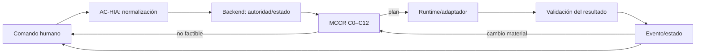

# Ciclo extremo a extremo

**ID:** `MCCR-OPS-E2E-001`  
**Versión:** `0.1.0`  
**Estado:** `CANDIDATE / NON_CANONICAL`  
**Autoridad:** `HUMAN`  
**Fecha:** `2026-08-14`

> Este documento es una especificación candidata. No declara implementación de runtime ni modifica el canon.

## Tesis y propósito

MCCR ocupa una fase delimitada dentro del ciclo canónico: recibe un comando ya normalizado, configura una ejecución, entrega el plan y vuelve a intervenir sólo si un evento exige replanificación.

## Responsabilidad

Este documento es responsable de:

- secuencia completa desde comando hasta resultado/replan
- puntos de entrada, salida y retorno
- gates intermodulares

No es responsable de:

- absorber todo el ciclo AC-HIA
- clasificar como ejecución lo que sólo fue planificación
- reintegrar resultados sin validación

## Contrato de entrada

| Entrada | Función | Condición |
|---|---|---|
| HUMAN_COMMAND_EVENT | origen trazable | REQUIRED |
| NORMALIZED_COMMAND_GRAPH | entrada operativa | REQUIRED |
| LOCAL_STATE/HOST_PROFILE | condiciones situadas | REQUIRED |

El humano expresa intención, restricciones y decisiones en lenguaje natural. AC-HIA/backend materializa la representación estructurada; MCCR no exige que el humano escriba YAML, grafos, fórmulas ni restricciones formales.

## Procedimiento normativo

1. AC-HIA captura y normaliza el comando.
2. Backend resuelve autoridad, estado y necesidad de configuración.
3. MCCR ejecuta C0–C12 y produce plan o inviabilidad.
4. Backend realiza handoff al adaptador/runtime.
5. Runtime ejecuta y emite eventos/resultados.
6. Validadores clasifican el resultado.
7. AC-HIA propone reintegración autorizada.
8. Un evento material puede volver a MCCR para replanificar.

## Contrato de salida

| Salida | Significado | Consumidor |
|---|---|---|
| EXECUTION_PLAN | salida MCCR al ciclo | MCCR |
| CLASSIFIED_RESULT | salida del runtime validada fuera de MCCR | MCCR |
| REPLAN_REQUEST | retorno por evento | MCCR |

## Especificación

Puntos de control: G0 solicitud interpretable; G1 autoridad; G2 capacidades; G3 factibilidad; G4 plan estructuralmente válido; G5 autorización de handoff; G6 resultado válido; G7 persistencia/reintegración.

## Invariantes y gates

- La autoridad humana y las restricciones de plataforma prevalecen.
- La trazabilidad enlaza comando, fuentes, decisiones, plan, ejecución y resultado.
- Primero se determina `VALID`; sólo después se compara `OPTIMAL` entre planes válidos.
- Una restricción dura nunca se relaja de forma silenciosa.
- Feedback y resultado no se convierten automáticamente en verdad, decisión o persistencia.
- Cada transición conserva `parent_command_id` y traza.
- La reintegración nunca se deduce del mero éxito técnico.

## Ejemplo operativo

Comando ACCD → normalización → plan de guion → ejecución textual → validación de codominio → salida revisable. Si desaparece una capacidad antes del paso 3, el evento vuelve a MCCR y crea una nueva versión.

## Fallos y comportamiento requerido

| Condición | Respuesta |
|---|---|
| Normalización incompleta | volver a AC-HIA, no adivinar |
| Plan rechazado en handoff | registrar evento y revisar binding |
| Resultado inválido | no reintegrar; aplicar política de corrección/replan |

## Relaciones y límites

El ciclo canónico `prompt → command → plan → execution → result → event → state` da el marco; C0–C12 detalla sólo el tramo de plan.

## Procedencia

- [FUENTE_CC] `00_gobierno/canon/COGNICION_CENTRAL_CANONICA.md`: autoridad, invariantes y ciclo general.
- [FUENTE_CC] `01_nucleo_cognitivo/teoria_tmc/ARQUITECTURA_DE_COMUNICACION_HUMANO_IA/02_modelo_operativo/05_ciclo_operativo.md`: ciclo F0–F10.
- [FUENTE_CC] `01_nucleo_cognitivo/teoria_tmc/ARQUITECTURA_DE_COMUNICACION_HUMANO_IA/02_modelo_operativo/06_normalizacion_de_comandos.md`: NORMALIZED_COMMAND_GRAPH.
- [FUENTE_CC] `01_nucleo_cognitivo/teoria_tmc/ARQUITECTURA_DE_COMUNICACION_HUMANO_IA/02_modelo_operativo/04_backend_cognitivo.md`: backend, componentes y planificación.
- [DECISION_HUMANA] `MCCR_CONTEXTO_DE_CONSTRUCCION_CODEX_v0_1_0`: requisitos, decisiones y preguntas abiertas.

Los elementos no atribuidos literalmente a esas fuentes son `[INFERENCIA]` de diseño local de MCCR. Una ausencia se registra como `[AUSENCIA]`; no se rellena con contenido inventado.

## Criterios de aceptación

- El límite de MCCR es visible.
- Hay ruta de inviabilidad y de replan.
- Resultado y estado se validan fuera del planificador.
