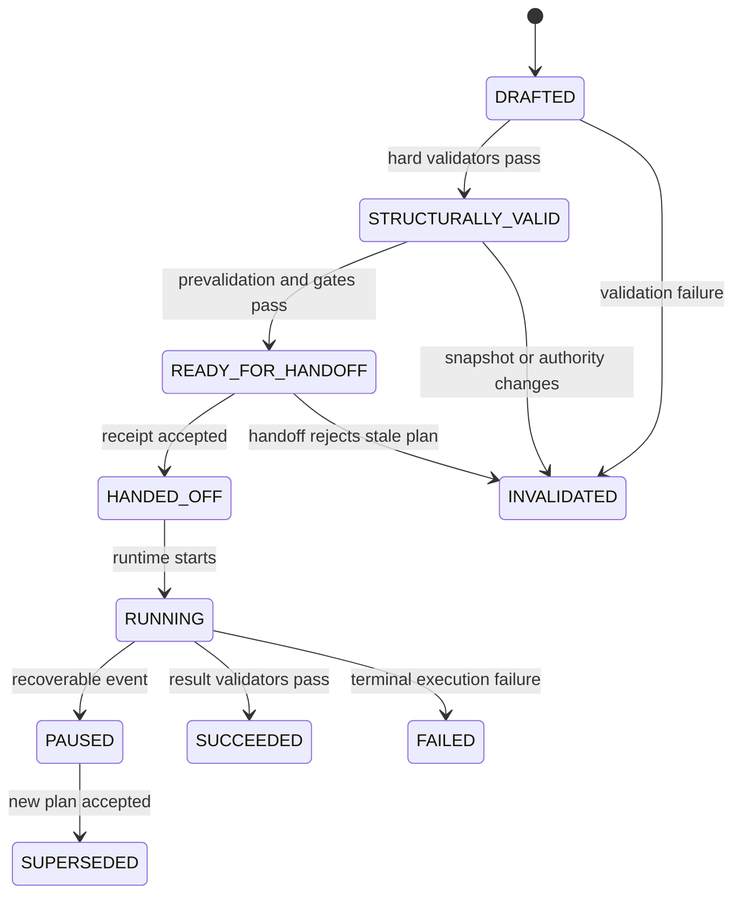

# Estados y máquina de estados del plan

**ID:** `MCCR-OPS-FSM-001`  
**Versión:** `0.1.0`  
**Estado:** `CANDIDATE / NON_CANONICAL`  
**Autoridad:** `HUMAN`  
**Fecha:** `2026-08-14`

> Este documento es una especificación candidata. No declara implementación de runtime ni modifica el canon.

## Tesis y propósito

El estado de un plan expresa evidencia y posición en el ciclo. Evita declarar “ejecutado” un plan apenas redactado o “listo” uno aún no validado.

## Responsabilidad

Este documento es responsable de:

- estados candidatos
- transiciones, guards y eventos
- estados terminales y supersesión

No es responsable de:

- modelar todos los estados del proyecto
- usar el estado como autoridad
- ocultar transiciones automáticas

## Contrato de entrada

| Entrada | Función | Condición |
|---|---|---|
| PLAN_ARTIFACT | objeto versionado | REQUIRED |
| VALIDATION/HANDOFF/EVENT | veredictos y eventos | REQUIRED |
| AUTHORITY_DECISION | aprobaciones o revocaciones | REQUIRED |

El humano expresa intención, restricciones y decisiones en lenguaje natural. AC-HIA/backend materializa la representación estructurada; MCCR no exige que el humano escriba YAML, grafos, fórmulas ni restricciones formales.

## Procedimiento normativo

1. Crear en `DRAFTED`.
2. Pasar a `STRUCTURALLY_VALID` al cumplir reglas duras.
3. Pasar a `READY_FOR_HANDOFF` tras prevalidación/gates.
4. Registrar `HANDED_OFF` sólo con acuse.
5. Runtime marca `RUNNING` vía evento.
6. Terminar en `SUCCEEDED`, `FAILED`, `INVALIDATED` o `SUPERSEDED`.

## Contrato de salida

| Salida | Significado | Consumidor |
|---|---|---|
| PLAN_STATE_TRANSITION | from, to, event y guard | MCCR |
| INVALID_TRANSITION | rechazo explicable | MCCR |

## Especificación

`NO_FEASIBLE_PLAN` es un resultado del proceso de planificación, no un estado de un plan existente. Los nombres son `MCCR_LOCAL` y permanecen abiertos a armonización con futuros estados canónicos.

## Invariantes y gates

- La autoridad humana y las restricciones de plataforma prevalecen.
- La trazabilidad enlaza comando, fuentes, decisiones, plan, ejecución y resultado.
- Primero se determina `VALID`; sólo después se compara `OPTIMAL` entre planes válidos.
- Una restricción dura nunca se relaja de forma silenciosa.
- Feedback y resultado no se convierten automáticamente en verdad, decisión o persistencia.
- Cada transición tiene guard y evento.
- Estados terminales no se reabren; se crea una nueva versión.

## Ejemplo operativo

`Π-001` llega a `READY_FOR_HANDOFF`; el host reporta cambio de capacidad y pasa a `INVALIDATED`. `Π-002` se crea en `DRAFTED` y, si es aceptado, `Π-001` queda `SUPERSEDED`.

## Fallos y comportamiento requerido

| Condición | Respuesta |
|---|---|
| Salto DRAFTED→RUNNING | `INVALID_TRANSITION` |
| Éxito sin validación de resultado | no alcanzar `SUCCEEDED` |
| Modificar plan terminal | crear nueva versión |

## Relaciones y límites

La FSM local se alinea con ciclo AC-HIA/MTC, pero no se declara canónica.

## Procedencia

- [FUENTE_CC] `01_nucleo_cognitivo/teoria_tmc/ARQUITECTURA_DE_COMUNICACION_HUMANO_IA/02_modelo_operativo/05_ciclo_operativo.md`: ciclo F0–F10.
- [FUENTE_CC] `01_nucleo_cognitivo/teoria_tmc/MTC_MAQUINA_DE_TRANSDUCCION_COGNITIVA/10_mecanismo/13_pipeline_y_maquina_de_estados.md`: pipeline y estado.
- [DECISION_HUMANA] `MCCR_CONTEXTO_DE_CONSTRUCCION_CODEX_v0_1_0`: requisitos, decisiones y preguntas abiertas.

Los elementos no atribuidos literalmente a esas fuentes son `[INFERENCIA]` de diseño local de MCCR. Una ausencia se registra como `[AUSENCIA]`; no se rellena con contenido inventado.

## Criterios de aceptación

- No factibilidad no es estado de plan.
- Cada estado tiene evidencia.
- La supersesión es versionada.
