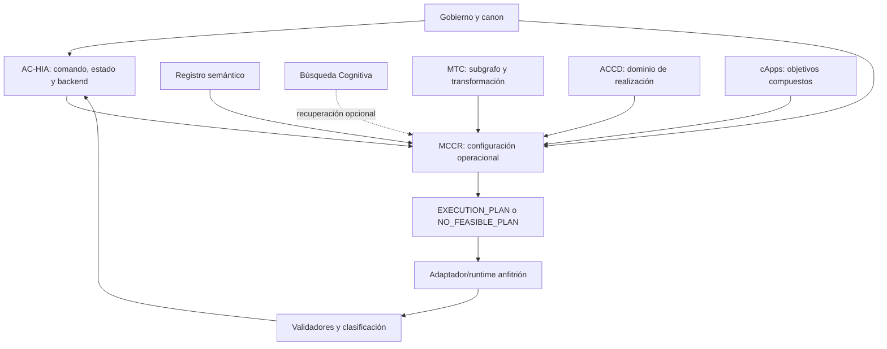

# Mapa de dependencias de construcción

## Regla

Una flecha `A → B` significa que B requiere que A esté definido. El mapa separa autoridad, conocimiento, coordinación, configuración, ejecución y dominio para impedir sustituciones.




## Fronteras de responsabilidad

| Componente | Proporciona | MCCR consume | MCCR no hace |
|---|---|---|---|
| Gobierno | autoridad, invariantes, precedencia | límites no negociables | promoverse a canon |
| Registro | identidad, rol, evidencia, dependencias declaradas | candidatos estructurales | decidir el plan |
| AC-HIA frontend/normalizador | evento y grafo de comandos | solicitud normalizada | interpretar la interfaz humana desde cero |
| AC-HIA backend | coordinación, capacidades, contexto, ejecución y reintegración | perfil situado y llamada de planificación | ser reemplazado |
| MCCR | espacio factible, candidatos, validación comparativa y plan | todo lo anterior | ejecutar herramientas o persistir resultados |
| MTC | regiones cognitivas, subgrafo de trabajo, operaciones y validación | configuración de transformaciones | seleccionar por sí solo todo el plan del host |
| ACCD | regiones, instancias, adaptadores y codominios | restricciones y componentes de realización | volverse algoritmo universal de MCCR |
| cApps | propósito, cadenas y criterios propios | requerimientos de aplicación | perder su identidad dentro del plan |
| Búsqueda Cognitiva | candidatos con procedencia | recuperación cuando el Registro no basta | autorizar activación o escritura |
| Runtime/host | capacidades efectivas | ejecución del plan aceptado | alterar objetivo o permisos |
| Validadores | veredictos y evidencia | gates antes/después de ejecución | convertir feedback en verdad |

## Orden topológico de documentos


```text
gobierno
→ núcleo conceptual
→ solicitud y EXECUTION_PLAN
→ grafos y composición
→ ciclo C0–C12
→ restricciones y selección
→ contratos de fallo, traza y autoridad
→ integraciones
→ fixtures
→ referencias
→ propuesta de integración
→ README y validación cruzada
```

## Dependencias duras de operación

- Comando normalizado o entrada equivalente con objetivo y alcance.
- Autoridad y permisos resolubles.
- Perfil explícito de capacidades disponibles/ausentes/desconocidas.
- Al menos un resultado esperado o criterio de terminación.
- Validadores de plan aplicables.

Si falta objetivo, autoridad material o capacidad indispensable sin alternativa autorizada, MCCR se detiene. Si falta sólo una preferencia, la registra como desconocida y continúa sin inventarla.

## Dependencias diferidas

- Orquestador independiente: `OPEN_DECISION`, no requerido para el modo contextual porque AC-HIA puede invocar el servicio desde su backend especificado.
- Runtime ejecutable completo: no requerido para construir/prevalidar el plan; sí requerido para declarar ejecución real.
- Solvers externos: opcionales; v1 debe funcionar con razonamiento estructurado, reglas, grafos simples y validadores disponibles.
