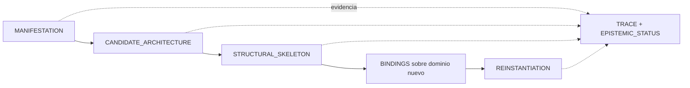

# Ficha del paquete MRRE

## Identidad

| Campo | Valor |
|---|---|
| ID | `PC-MRRE` |
| Nombre | `MOTOR_DE_RETROCONSTRUCCIÓN_Y_REINSTANCIACIÓN_ESTRUCTURAL` |
| Clase | cApp de infraestructura estructural de `COGNICIÓN_CENTRAL` |
| Versión materializada | `0.2.0` |
| Estado | `MATERIALIZED_CANDIDATE / NON_CANONICAL` |
| Autoridad de promoción | humana |

## Definición funcional

MRRE transforma manifestaciones y materiales autorizados en representaciones estructurales trazables. En dirección retroconstructiva produce subgrafos de efecto, arquitecturas candidatas y esqueletos; en dirección reinstanciativa puebla un esqueleto con materiales nuevos mediante equivalencias contractuales y bindings aprobados.

## Problema

Las manifestaciones ocultan o comprimen relaciones, dependencias, trayectorias, selecciones y funciones. La semejanza superficial tampoco demuestra que una arquitectura sea transferible. MRRE vuelve esas estructuras inspeccionables y permite probar su transferencia sin promover hipótesis a hechos.

## Objetos de trabajo

`MANIFESTATION`, `STRUCTURAL_FIELD`, `ORIENTED_CUT`, `NODE/mNODE`, `TYPED_EDGE`, `SUBGRAPH_OF_EFFECT`, `CANDIDATE_ARCHITECTURE`, `STRUCTURAL_SKELETON`, `BINDING`, `REINSTANTIATION`, redes `G_D/G_P/G_R/G_A/G_U`, `EXPECTED_RESULT`, `EPISTEMIC_STATUS` y `TRACE`.

## Alcance y consumidores

MRRE admite texto y contratos extensibles para imagen, secuencia, audio, video, SPA, conducta registrada y manifestaciones compuestas. AC-HIA y MCCR son integraciones de entrada/configuración; ACCD, Aprendizaje Estructural u otros sistemas pueden consumir resultados sin definir el kernel.

## Criterios de pertenencia

Una capacidad pertenece al MRRE si:

1. opera sobre estructuras reconstruidas o reinstanciadas;
2. conserva trazabilidad hacia portador, fuente, inferencia o decisión;
3. respeta invariantes y no-colapsos;
4. admite alternativas o huecos cuando la evidencia no cierra;
5. no usurpa autoridad humana ni ontologías de otros paquetes;
6. produce contratos verificables y artefactos versionados.

## Incompatibilidades

No pertenecen al kernel: extracción sin arquitectura, resumen como sustituto de análisis, intención psicológica afirmada sin evidencia, generación basada en plantilla universal, binding por coincidencia léxica, realización codominial obligatoria, persistencia o promoción automática.

## Procedencia

Esta ficha materializa `SRC-MRRE-DESIGN` §§0–5 y 18, `SRC-MRRE-SUBGRAPH`, `PAT-COG-064/065/089/091/126` y el scaffolding `0.2.0`, preservados en `90_historial/antecedentes/`.

## Uso de esta ficha

Antes de cada run, copia identidad, versión, estado, host, autoridad y operaciones al `CASE_SPEC`. Comprueba que el propósito cae dentro de las responsabilidades; si requiere interacción, configuración, transducción, realización o evaluación receptoral, activa el adapter correspondiente en vez de absorberlo.

La procedencia correcta es [SRC-MRRE-DESIGN](../90_historial/antecedentes/DISENO_INTEGRAL_NUEVO_PAQUETE_v0_1_0.md), [SRC-MRRE-SUBGRAPH](../90_historial/antecedentes/MANIFESTACION_LINGUISTICA_COMO_SUBGRAFO_MRRE_v0_1.md) y [SRC-MRRE-SCAFFOLD](../90_historial/antecedentes/SCAFFOLDING_RECONSTRUCTIVO_ARQUITECTURA_MRRE_v0_2_0.md). La pertenencia se rige por [SRC-CC-INSTALL](../../../../00_gobierno/protocolos/PROMPT_CENTRAL_INSTALACION_COGNICION_CENTRAL_EN_CHATGPT_v0_1_0.txt); la puerta operativa es [README-MRRE](../README.md).
