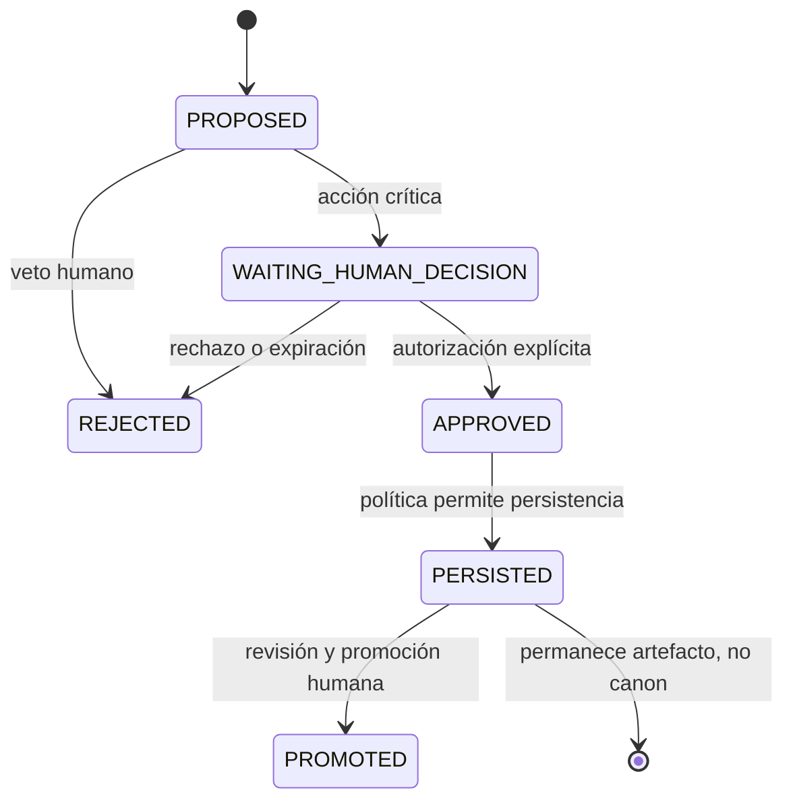

# Autoridad, soberanía y límites

## Principio

La capacidad de producir una hipótesis no concede autoridad para aceptarla. En MRRE se separan procesamiento, recomendación, decisión, persistencia y promoción conforme a `SRC-CC-INSTALL`, `PAT-COG-030…039`, `106`, `124` y `125`.

## Matriz de autoridad

| Decisión | MRRE | MCCR/consumidor | Humano |
|---|---:|---:|---:|
| proponer segmentación o arquitectura | ejecuta | configura/consume | inspecciona |
| fijar fines y `EXPECTED_RESULT` | no | transporta | decide |
| autorizar fuentes y alcance | aplica | transporta | decide/veta |
| elegir umbrales runtime | recomienda | configura | limita/aprueba si es crítico |
| aceptar equivalencia o binding crítico | propone | no promueve | decide |
| persistir artefacto de ejecución | prepara | puede solicitar | autoriza según política |
| promover al acervo o kernel | bloqueado por defecto | no | decide |
| publicar o ejecutar efectos externos | fuera del kernel | consumidor responsable | autoriza |



## Gates humanos

- `HG-SOURCE`: fuentes sensibles, contradictorias o fuera del alcance.
- `HG-SCOPE`: ampliación material del campo o profundidad.
- `HG-INFERENCE`: atribución causal o receptoral de riesgo alto.
- `HG-BINDING`: binding irreversible, controvertido o con pérdidas críticas.
- `HG-CONSUMER`: handoff con efecto externo.
- `HG-PERSIST`: persistencia fuera del run.
- `HG-PROMOTE`: promoción a acervo, patrón, invariante o kernel.

La espera se representa como `WAITING_HUMAN_DECISION`; no se simula consentimiento.

## Reversibilidad

Segmentar, comparar, proponer alternativas y producir artefactos en `10_artefactos_generados/` son acciones reversibles mientras no modifiquen fuentes. Alterar el acervo, reemplazar un invariante, publicar, realizar una intervención o cerrar una pregunta abierta requiere gate. Todo rollback conserva el run log y la razón.

## Protección teleológica

MRRE no redefine fines por conveniencia del análisis. Si no puede satisfacer el resultado esperado dentro de restricciones, produce `NO_FEASIBLE_PLAN`, `PARTIAL` o `WAITING_HUMAN_DECISION`; nunca sustituye silenciosamente el objetivo.

## Procedimiento de gate

1. identifica acción crítica y objeto exacto;
2. localiza autoridad declarada, no inferida;
3. presenta alternativas, riesgos y efecto de no actuar;
4. registra `approve/reject/modify/defer`, alcance y vigencia;
5. reanuda sólo ramas autorizadas y conserva la decisión en trace;
6. reabre el gate al cambiar objeto, versión o alcance.

```yaml
human_gate: {gate_id: HG-..., action: bind, object_ref: ART-..., decision: defer, expires_on_change: true}
```

El contrato adopta [SRC-MCCR-AUTH](../../MOTOR_DE_CONFIGURACION_COGNITIVA_EN_RUNTIME/03_contratos/07_autoridad_permisos_validadores_y_gates.md) y se alinea con [SRC-CS-OPS](../../CONSCIENCIA_Y_SOBERANIA/ARQUITECTURA_DE_OPERACIONES_Y_EFECTOS_COGNITIVOS_v0_1_0.md). [CASE-MRRE-BRIDGE](../09_casos_y_ejemplos/puente_del_valle/DOSSIER_OPERATIVO.md) muestra un gate que detiene sin inventar.
