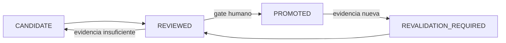

# Estado, versionado y decisiones

## Estados epistemológicos

| Estado | Significado | Puede promoverse automáticamente |
|---|---|---:|
| `OBSERVATION` | dato directamente ligado al portador | no |
| `SOURCE_ASSERTION` | afirmación atribuida a fuente identificada | no |
| `SYNTHESIS` | composición explícita de fuentes | no |
| `INFERENCE` | conclusión derivada con regla declarada | no |
| `HYPOTHESIS` | explicación candidata refutable | no |
| `RECOMMENDATION` | opción propuesta | no |
| `HUMAN_DECISION` | decisión con autoridad identificada | sólo mediante gate aplicable |
| `RUN_RESULT` | salida de una ejecución | no |
| `PROMOTED_KNOWLEDGE` | elemento aceptado mediante gobierno | ya pasó gate |

## Versionado

Se usa SemVer para contratos y archivos estabilizados. Un cambio es mayor si rompe schema, invariante o interpretación operacional; menor si añade una capacidad compatible; parche si corrige sin alterar contrato. Todo cambio declara `supersedes`, dependientes y revalidaciones.

## Registro D1–D10

Cada decisión material conserva:

1. `decision_id` y fecha;
2. problema y alcance;
3. alternativas consideradas;
4. evidencia y fuentes;
5. criterios y restricciones;
6. decisión y autoridad;
7. consecuencias y riesgos;
8. archivos/componentes afectados;
9. pruebas que deben ejecutarse;
10. condición de reapertura o supersesión.

## Promoción

`RUN_RESULT`, `FIXTURE_PASSED` y `VALIDATOR_PASSED` no son sinónimos de `PROMOTED`. Las versiones reemplazadas van a `90_historial/versiones_superadas/` con relación explícita.

## Procedimiento de cambio

1. identifica archivos/claims afectados;
2. clasifica `editorial | compatible | semantic | breaking`;
3. crea diff y decisión con fuentes `[ID](ruta)`;
4. consulta trace para obtener dependientes;
5. actualiza versiones según alcance y ejecuta pruebas;
6. conserva versión anterior, resultados y condición de rollback;
7. solicita gate si cambia kernel, acervo o canon.

Los eventos y supersesión adaptan [SRC-MCCR-RUNLOG](../../MOTOR_DE_CONFIGURACION_COGNITIVA_EN_RUNTIME/03_contratos/06_trazabilidad_observabilidad_y_run_log.md). Las citas cumplen [MRRE-REF-NORM-01](06_norma_de_referencias_y_citacion.md), y las decisiones viven en [MRRE-HISTORY-DECISIONS](../90_historial/decisiones_historicas/README.md).
