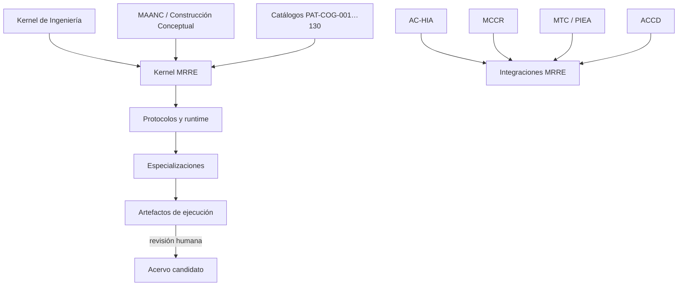

# Fuentes, genealogía y dependencias

## Regla

MRRE reutiliza conocimiento de `COGNICIÓN_CENTRAL` por referencia y adaptación. No copia una ontología ajena como propia ni usa “inspirado por” como sustituto de trazabilidad. El índice federado conserva IDs originales; este mapa declara qué se toma, qué cambia y qué se excluye.

## Registro normativo de fuentes

| ID | Ruta actual desde `cognicion-central/` | Toma | Adaptación MRRE | No toma |
|---|---|---|---|---|
| `SRC-MRRE-DESIGN` | `01_nucleo_cognitivo/teoria_tmc/MOTOR_DE_RETROCONSTRUCCIÓN_Y_REINSTANCIACIÓN_ESTRUCTURAL/90_historial/antecedentes/DISENO_INTEGRAL_NUEVO_PAQUETE_v0_1_0.md` | campo, corte, redes, contratos, V&V | se estabiliza como MRRE | nombre `[NUEVO PAQUETE]` ni decisiones provisionales como canon |
| `SRC-MRRE-SUBGRAPH` | `01_nucleo_cognitivo/teoria_tmc/MOTOR_DE_RETROCONSTRUCCIÓN_Y_REINSTANCIACIÓN_ESTRUCTURAL/90_historial/antecedentes/MANIFESTACION_LINGUISTICA_COMO_SUBGRAFO_MRRE_v0_1.md` | subgrafo de efecto, deslinealización, multirresolución | ontología y protocolo | atribución receptoral no evidenciada |
| `SRC-CAT-MRRE-02` | `01_nucleo_cognitivo/teoria_tmc/MOTOR_DE_RETROCONSTRUCCIÓN_Y_REINSTANCIACIÓN_ESTRUCTURAL/05_acervo_estructural/CATALOGO_COMPLEMENTARIO_DE_PATRONES_DE_DISENO_COGNITIVO_REUTILIZABLES_v0_2_0.md` | `PAT-COG-064…115` | índice y validadores | duplicación de definiciones |
| `SRC-CAT-MRRE-03` | `01_nucleo_cognitivo/teoria_tmc/MOTOR_DE_RETROCONSTRUCCIÓN_Y_REINSTANCIACIÓN_ESTRUCTURAL/05_acervo_estructural/CATALOGO_DE_PATRONES_DE_DISENO_COGNITIVO_REUTILIZABLES_EXTENSION_v0_3_0.md` | `PAT-COG-116…125` | sistemas, gobierno y coordinación | metáforas de dominio como invariantes |
| `SRC-CAT-CS-01` | `01_nucleo_cognitivo/teoria_tmc/CONSCIENCIA_Y_SOBERANIA/CATALOGO_PATRONES_DE_DISENO_COGNITIVO_REUTILIZABLES_v0_1_0.md` | `PAT-COG-001…063` | fuentes, redes, gobierno, aprendizaje | redefinición de consciencia |
| `SRC-CAT-ASIOO-04` | `01_nucleo_cognitivo/teoria_tmc/ARQUITECTURA DE SISTEMAS INTEGRADOS ORIENTADOS A OBJETIVOS/CATALOGO_DE_PATRONES_DE_DISENO_COGNITIVO_REUTILIZABLES_EXTENSION_v0_4_0.md` | `PAT-COG-126…130` | estratos, topología y procedimiento | inventarios o metáforas militares |
| `SRC-KI-11` | `04_conocimiento_y_contexto/memoria_conceptual/incubacion-conceptual/ingenieria/kernel-de-ingenieria-1-1.txt` | F1–F7, A–I, D1–D10, V&V y riesgos | ingeniería de hipótesis estructurales | equivalencia con producto físico |
| `SRC-MAANC-*` | `04_conocimiento_y_contexto/memoria_conceptual/construccion_conceptual/` | mNodes, observadores, composición y segmentación | observadores configurables y contratos genéricos | pipeline fijo e `integrador_ACCD` obligatorio |
| `SRC-ACHIA-*` | `01_nucleo_cognitivo/teoria_tmc/ARQUITECTURA_DE_COMUNICACION_HUMANO_IA/` | comando, normalización, handoffs, validadores, scaffolding | entrada/presentación de MRRE | análisis estructural en el frontend |
| `SRC-MCCR-*` | `01_nucleo_cognitivo/teoria_tmc/MOTOR_DE_CONFIGURACION_COGNITIVA_EN_RUNTIME/` | configuración, plan, grafos, estados, fallos y run log | selección de capacidades MRRE | semántica estructural decidida por MCCR |
| `SRC-MTC-*` | `01_nucleo_cognitivo/teoria_tmc/MTC_MAQUINA_DE_TRANSDUCCION_COGNITIVA/` | estado, transformación, acción, capacidad, contexto, manifestación y feedback | lente/adaptador para casos pertinentes | apropiación de ontología MTC o causalidad no probada |
| `SRC-PIEA-*` | `01_nucleo_cognitivo/teoria_tmc/PATRON_DE_INTEGRACION_ESTRUCTURAL_ACUMULATIVA/` | transición e integración acumulativa | modelado opcional del receptor | confundir estado con manifestación |
| `SRC-CS-OPS` | `01_nucleo_cognitivo/teoria_tmc/CONSCIENCIA_Y_SOBERANIA/ARQUITECTURA_DE_OPERACIONES_Y_EFECTOS_COGNITIVOS_v0_1_0.md` | red de efectos, triple red, triangulación, gobierno | no-colapsos y protocolos | afirmaciones sobre consciencia |
| `SRC-ACCD-EQUATION/REGIONS` | `03_aplicaciones/creacion_de_contenido/accd/` y `03_aplicaciones/sistema-de-transferencia-accd/grafo_de_regiones/` | campo, regiones, instancia, codominio, realización | handoff opcional; grafo regional como modelo material | corte = instancia o ACCD en kernel |
| `SRC-AE-README` | `03_aplicaciones/aprendizaje_estructural/README.md` | responsabilidad de aprendizaje | frontera y pruebas fuertes | aprendizaje inferido de exposición |
| `SRC-CC-INSTALL` | `00_gobierno/protocolos/PROMPT_CENTRAL_INSTALACION_COGNICION_CENTRAL_EN_CHATGPT_v0_1_0.txt` | soberanía, precedencia y recuperación mínima | gates y no promoción silenciosa | persistencia implícita |

## Lectura de cobertura

Durante la materialización se leyeron los 46 IDs fuente del scaffolding: 2 618 archivos físicos, 5 598 969 bytes y 2 476 JSON ACCD sin errores de parseo. La cobertura reproducible y sus huellas agregadas se conservan en `90_historial/decisiones_historicas/COBERTURA_DE_FUENTES_MATERIALIZACION_v0_1_0.md`.

## Grafo genealógico



## Fuentes adjuntas pendientes

`APRENDIZAJE_ESTRUCTURAL_COGNICION_CENTRAL_v0_1.pdf`, `analisis-de-estructuras.pdf`, `theme_visual_video_4.pdf`, `secuencia_de_imagenes.pdf`, `EC06`, `EC07`, `EC10` y `EC12` permanecen como `ATTACHED_SOURCE / PATH_PENDING_CONFIRMATION`. No se inventa ruta ni autoridad.

## Registro operativo por uso

```yaml
source_use:
  citation: "[SRC-ID](relative/path)"
  locator: "sección/span/clave"
  relation: ADOPTADO | ADAPTADO | DERIVADO | CONTRASTADO | EJEMPLO
  transformation: "qué conserva y cambia MRRE"
  dependent_claims: []
  dependent_artifacts: []
```

Todos los IDs y rutas están en [MRRE-BIB-CC](07_bibliografia_cognicion_central.md); la sintaxis se define en [MRRE-REF-NORM-01](06_norma_de_referencias_y_citacion.md). La auditoría inicial [MRRE-AUDIT-0.1](../90_historial/decisiones_historicas/COBERTURA_DE_FUENTES_MATERIALIZACION_v0_1_0.md) demuestra lectura, pero no sustituye el vínculo semántico por claim.
