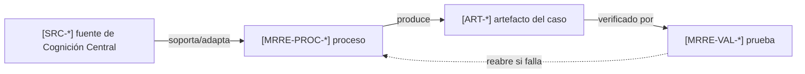

# Norma de referencias y citación MRRE

**ID:** `MRRE-REF-NORM-01`  
**Versión:** `0.2.0`  
**Aplicación:** todo archivo activo del paquete, sus artefactos y sus casos.

## 1. Propósito

Una referencia MRRE no es una mención ornamental. Es una arista navegable del grafo de conocimiento de Cognición Central. Debe permitir que una IA o una persona:

1. identifique sin ambigüedad el recurso consultado;
2. resuelva su ubicación desde el archivo que contiene la cita;
3. separe contenido adoptado, adaptado, contrastado o meramente relacionado;
4. reconstruya qué afirmaciones, decisiones o artefactos dependen de él;
5. vuelva a validar los dependientes si la fuente cambia.

Esta norma operacionaliza la procedencia exigida por [SRC-ACHIA-SCAFFOLD](../../ARQUITECTURA_DE_COMUNICACION_HUMANO_IA/04_funcionalidades/04_scaffolding_cognitivo_para_construccion_de_paquetes.md), la trazabilidad de ejecución de [SRC-MCCR-RUNLOG](../../MOTOR_DE_CONFIGURACION_COGNITIVA_EN_RUNTIME/03_contratos/06_trazabilidad_observabilidad_y_run_log.md) y la separación entre capacidad, manifestación y evidencia de [SRC-MTC-MANIFESTATION](../../MTC_MAQUINA_DE_TRANSDUCCION_COGNITIVA/10_mecanismo/14_capacidad_contexto_manifestacion.md).

## 2. Sintaxis obligatoria

La cita mínima es un enlace Markdown relativo con identificador estable entre corchetes:

```markdown
[ID-ESTABLE](ruta/relativa/al/recurso.ext)
```

Cuando la fuente sostiene una proposición concreta se añade localizador y modo de uso:

```markdown
La selección de componentes se realiza sobre `G_active(Q_t)`
[SRC-MCCR-GRAPHS](../../MOTOR_DE_CONFIGURACION_COGNITIVA_EN_RUNTIME/01_nucleo/06_grafos_possible_available_active.md; §3; ADOPTADO).
```

Como Markdown no interpreta el localizador después de la ruta, la forma ejecutable recomendada es:

```markdown
La selección de componentes se realiza sobre `G_active(Q_t)`
([SRC-MCCR-GRAPHS](../../MOTOR_DE_CONFIGURACION_COGNITIVA_EN_RUNTIME/01_nucleo/06_grafos_possible_available_active.md), §3, `ADOPTADO`).
```

## 3. Identificador y tipos de relación

Los IDs externos se registran una sola vez en [MRRE-BIB-CC](07_bibliografia_cognicion_central.md). Los IDs internos usan el prefijo `MRRE-` y apuntan directamente al archivo operativo.

| Relación | Uso | Obligación |
|---|---|---|
| `ADOPTADO` | se usa la definición o contrato sin cambio semántico | conservar nombre, restricciones y alcance |
| `ADAPTADO` | se transforma para el dominio MRRE | explicar transformación y diferencias |
| `DERIVADO` | el contenido se infiere de una o más fuentes | registrar pasos y estatus epistémico |
| `CONTRASTADO` | la fuente se usa para comprobar o falsar | declarar criterio y resultado |
| `EJEMPLO` | el recurso prueba una operación | enlazar entrada, artefacto y resultado |
| `RELACIONADO` | aporta contexto, no soporte directo | no usarlo para elevar confianza |

## 4. Reglas de ruta

1. Toda ruta debe ser relativa al archivo que contiene la referencia.
2. No se permiten rutas absolutas, `file://`, letras de unidad ni rutas copiadas desde la raíz del repositorio como sustituto de enlace.
3. Una ruta a directorio sólo es válida si la unidad citada es realmente el conjunto recursivo; para una afirmación localizada debe citarse el archivo.
4. Los anexos aún no localizados se expresan como `PATH_PENDING_CONFIRMATION`; nunca se inventa una ruta.
5. Los enlaces internos también usan `[ID](relative/path)`; un texto entre backticks no cuenta como referencia.
6. Al mover un archivo se actualizan todos sus dependientes y se ejecuta el validador de documentación.

## 5. Registro de dependencia por afirmación

Las afirmaciones de diseño importantes usan este registro compacto:

```yaml
claim_id: CL-MRRE-XXX
statement: "proposición evaluable"
epistemic_status: ADOPTED | ADAPTED | DERIVED | HYPOTHESIS | HUMAN_DECISION
source_citations:
  - id: SRC-...
    relative_path: ../../...
    locator: "sección, nodo, span o clave"
    relation: ADOPTADO | ADAPTADO | DERIVADO | CONTRASTADO | EJEMPLO
transformation: "qué conservó y qué cambió MRRE"
dependent_artifacts: [ART-...]
falsifiers: ["condición que invalidaría la afirmación"]
```

## 6. Citas de fuentes, casos y procesos

Una operación bien documentada enlaza tres capas:



Por ello un ejemplo no puede citar sólo su texto fuente. Debe citar también los protocolos, componentes, schemas y validadores que produjeron cada artefacto.

## 7. Ejemplos válidos e inválidos

Válido desde un archivo de primer nivel del paquete:

```markdown
El plan se recibe conforme a [SRC-MCCR-PLAN](../../MOTOR_DE_CONFIGURACION_COGNITIVA_EN_RUNTIME/01_nucleo/05_execution_plan_definicion_y_contrato.md).
```

Inválidos:

```text
según MCCR                       # no identifica archivo
`01_nucleo/.../archivo.md`       # no es enlace y no es relativo al archivo
C:\repositorio\archivo.md        # depende de la máquina
[fuente](C:\repositorio\...)     # enlace absoluto
```

## 8. Checklist antes de aceptar un archivo

- [ ] Cada dependencia externa tiene un ID estable entre `[` y `]`.
- [ ] Cada ID tiene enlace relativo resoluble.
- [ ] La relación epistemológica está explícita cuando soporta una afirmación.
- [ ] Los ejemplos enlazan fuente, proceso, artefacto y validación.
- [ ] Las rutas pendientes están marcadas, no inferidas.
- [ ] El archivo puede recorrerse hacia atrás hasta la fuente y hacia adelante hasta sus outputs.

El procedimiento de comprobación está en [MRRE-VAL-DOC](../08_validacion_y_pruebas/04_validacion_de_referencias_y_operabilidad.md).
