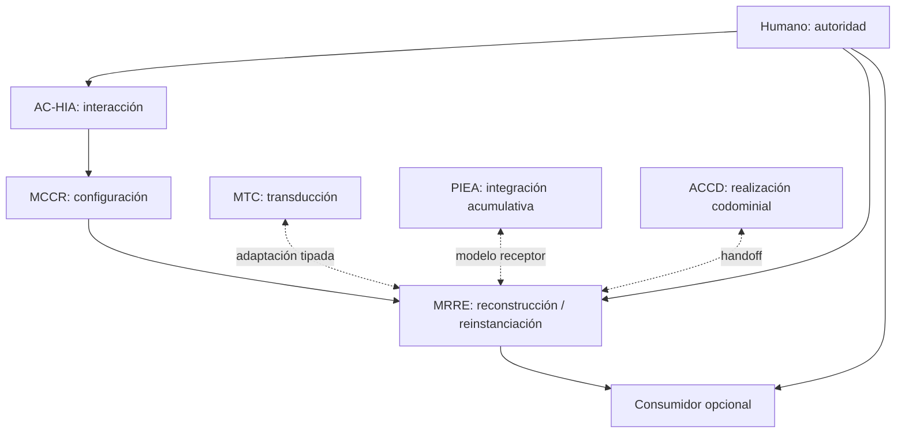

# Definición, fronteras e invariantes

## Núcleo estable

MRRE es el procedimiento reusable que:

1. delimita y navega un campo;
2. registra manifestaciones sin sustituirlas;
3. reconstruye subgrafos de efecto y arquitecturas candidatas;
4. abstrae roles, relaciones, invariantes y variaciones como esqueletos;
5. compara materiales nuevos y produce bindings contractuales;
6. reinstancia sólo hasta donde la evidencia y la autoridad permiten;
7. valida, falsifica y conserva trazabilidad.

El kernel es aparato estable; módulos, profundidad, modalidades, observadores, consumidor y esqueleto resultante son configuración dinámica (`PAT-COG-064`).

## Definiciones

- **Retroconstrucción:** transformación abductiva `MANIFESTATION → CANDIDATE_ARCHITECTURE → STRUCTURAL_SKELETON`, con evidencia, alternativas y certeza graduada.
- **Reinstanciación:** transformación `STRUCTURAL_SKELETON + NEW_FIELD → BINDINGS → REINSTANTIATION`, seguida por prueba de preservación.
- **Manifestación:** materialización observable, parcial y situada; no equivale a capacidad ni arquitectura completa.
- **Arquitectura candidata:** hipótesis relacional que explica funciones y efectos del portador dentro de un dominio declarado.
- **Esqueleto:** abstracción reinstanciable de roles, relaciones, topología, invariantes, variación y condiciones; no es plantilla editorial.

## Invariantes

| ID | Invariante | Detector mínimo |
|---|---|---|
| `INV-MRRE-01` | portador y derivaciones permanecen diferenciados | hash/ref del portador y trace |
| `INV-MRRE-02` | manifestación no agota la arquitectura | campo `missing_regions` y límites |
| `INV-MRRE-03` | campo y corte son objetos reversiblemente enlazados | `field_ref` por inclusión/omisión |
| `INV-MRRE-04` | función es situada en vecindario, trayectoria y contexto | subgrafo con edges y posición |
| `INV-MRRE-05` | la unidad de efecto puede superar oración/proposición | segmentación multirresolución |
| `INV-MRRE-06` | `G_D`, `G_P`, `G_R`, `G_A`, `G_U` no colapsan | tipos de red y evidence scope |
| `INV-MRRE-07` | observación, fuente, inferencia, hipótesis y decisión no colapsan | ledger epistémico |
| `INV-MRRE-08` | recuperación, equivalencia y binding son pasos distintos | eventos y contratos separados |
| `INV-MRRE-09` | hueco no autoriza invención | estado `UNBOUND_GAP` |
| `INV-MRRE-10` | esqueleto deriva del caso pero no lo copia | roles abstractos + source trace |
| `INV-MRRE-11` | comparación declara nivel, contexto y pérdidas | comparison contract |
| `INV-MRRE-12` | feedback es evidencia candidata, no verdad | reingreso y revalidación |
| `INV-MRRE-13` | ejecución y resultado no equivalen a canon | `promotion_status` |
| `INV-MRRE-14` | fines, fuentes, acciones críticas y promoción son humanos | gates de autoridad |
| `INV-MRRE-15` | kernel no depende de ACCD ni de consumidor particular | ejecución válida sin adapter |
| `INV-MRRE-16` | ejemplos tensionan el kernel, no lo definen | matriz multicorpus/negative cases |

## Dominio de variación

Pueden variar modalidad, idioma, escala, número de manifestaciones, disponibilidad de fuentes, observadores MAANC, topología descubierta, profundidad, presupuesto, consumidor, métricas y certeza. Toda variación debe pasar por schema extensible, plan MCCR o especialización; no puede alterar silenciosamente un invariante.

## Fronteras



MRRE no es extracción, resumen, clasificación, renderer, detector de intención, MTC, MCCR, ACCD, PIEA ni aprendizaje. Puede consumir sus contratos sin absorber sus responsabilidades.

## Pertenencia y falsación del kernel

Una implementación que produce texto plausible sin trace, colapsa red proyectada y activada, rellena huecos o exige un esqueleto fijo no implementa MRRE. Una implementación pertenece si ejecuta el protocolo general, cumple los 16 invariantes y entrega resultados parciales trazables cuando no puede cerrar.

## Cómo aplicar los invariantes

Al abrir un run, copia los 16 IDs a una matriz `invariante → artefactos afectados → validador → evidencia → resultado`. Reevalúa la matriz en P6, P11 y P12; no esperes al resultado final. Un `FAIL` en `INV-MRRE-01/07/09/13/14` bloquea la rama porque afecta procedencia, epistemología, invención o autoridad.

```yaml
invariant_check:
  id: INV-MRRE-08
  artifact_refs: [RET-01, EQ-01, BND-01]
  validator: V_RETRIEVAL_EQUIVALENCE_BINDING_SEPARATION
  evidence_refs: [EV-01, EV-02]
  result: PASS
```

La disciplina de función, riesgo y V&V se adapta de [SRC-KI-11](../../../../04_conocimiento_y_contexto/memoria_conceptual/incubacion-conceptual/ingenieria/kernel-de-ingenieria-1-1.txt); la frontera capacidad/manifestación se adopta de [SRC-MTC-MANIFESTATION](../../MTC_MAQUINA_DE_TRANSDUCCION_COGNITIVA/10_mecanismo/14_capacidad_contexto_manifestacion.md). La ejecución completa está en [MRRE-AGENT-MANUAL](09_manual_de_operacion_para_agentes.md).
