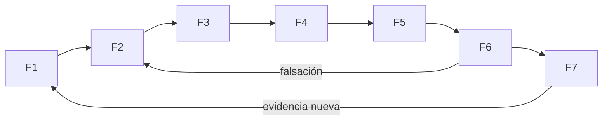
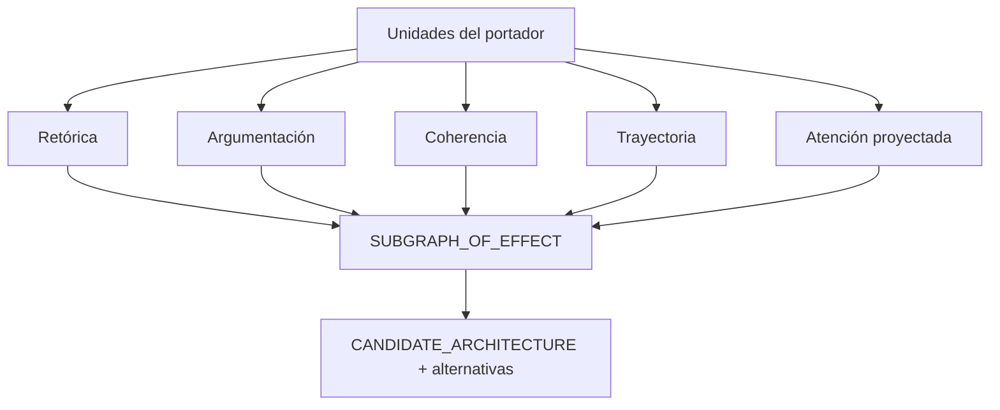

# Kernel de Ingeniería y MAANC

## Genealogía operativa

Este archivo adapta `SRC-KI-11` y Construcción Conceptual/MAANC; no los duplica. Ingeniería aporta disciplina de formulación, riesgo, V&V y mejora. MAANC aporta observadores y unidades componibles. MRRE los integra sobre un objeto relacional común.

## Ciclo F1–F7 adaptado

| Fase fuente | MRRE | Entrada | Salida | Riesgo controlado |
|---|---|---|---|---|
| F1 Formulación | fijar operación, portador, alcance, autoridad y aceptación | solicitud normalizada | `MRRE_CASE_SPEC` | objetivo implícito |
| F2 Modelado | representar fuentes, manifestación, contextos y estados epistémicos | case spec | modelos de entrada | interpretación como dato |
| F3 Arquitectura | segmentar, relacionar y reconstruir subgrafos | portadores/modelos | arquitecturas candidatas | atomización o agregación |
| F4 Optimización | comparar alternativas por cobertura, parsimonia y restricciones | candidatas | ranking no vinculante | score = verdad |
| F5 Control/Riesgo | ejecutar gates, límites inferenciales y degradación | plan/candidatas | riesgos y decisiones | opacidad/autoridad implícita |
| F6 V&V | verificar contratos y validar propósito, causalidad y preservación | artefactos | evidence bundle | confirmación unilateral |
| F7 Operación/Mejora | registrar run, feedback y propuestas de actualización | resultado/feedback | corrección versionada | feedback = canon |



La Portada A–I se materializa como propósito, invariantes, ontología, interfaces, métricas, validaciones duras, cadencia, aprendizaje y trazabilidad. D1–D10 se reserva para decisiones materiales; cada microinferencia usa trace/ledger, no un documento de decisión completo.

## MAANC como banco de observadores

Los 83 archivos de `SRC-MAANC-MACRO`, además de `SRC-MAANC-UNDERSTANDING`, `COMPOSITION` y `STRUCTURAL`, se interpretan como observadores configurables:

| Observador | Aporte al mismo grafo | No decide |
|---|---|---|
| macroestructura | niveles, tópicos, jerarquía | intención real |
| estructura expositiva | patrón expositivo candidato | validez causal |
| segmentación funcional | límites, funciones locales | esqueleto final |
| trayectoria narrativa | orden funcional y transición | red activada real |
| relaciones retóricas | edges discursivos | verdad de claims |
| coherencia | continuidad y rupturas | corrección factual |
| situación cognitiva | estados/proyecciones tipados | estado mental observado |
| intencional-atencional | saliencia e intención proyectadas | intención psicológica |
| esquemas narrativos | familias candidatas | plantilla obligatoria |
| moves retóricos | operaciones locales | arquitectura completa |
| metadiscurso | navegación y posicionamiento | autoridad |
| argumentación | claims, evidencia y garantías | promoción epistemológica |



`integrador_ACCD` se conserva como antecedente y adapter posible, no como cierre obligatorio. Las relaciones tipadas de mNodes se adaptan a `NODE`, `TYPED_EDGE`, `source_binding`, `operational_role`, invariantes y variación.

## Contrato por módulo

Todo observador registrado declara fuente exacta, transformación semántica, input/output schema, trigger MCCR, costo, riesgo, modalidad, evidencia y razón de no copia literal. Ningún informe aislado se agrega por yuxtaposición: sus afirmaciones se alinean o conservan como alternativas sobre objetos compartidos.

## Activación operativa de observadores

1. define una pregunta que el observador puede responder;
2. registra fuente y contrato de transformación;
3. recibe unidades con IDs, no texto suelto;
4. emite claims/edges sobre esos IDs con estatus;
5. alinea outputs compatibles o conserva conflicto;
6. mide contribución: qué subgrafo/chain pierde soporte al desactivarlo;
7. no activa todo MAANC por defecto: MCCR selecciona según costo/riesgo.

```yaml
observer_run:
  observer_id: OBS-ARGUMENTATION
  source: SRC-MAANC-MACRO
  question: "qué claims soportan o atacan la conclusión"
  input_unit_refs: []
  output_edge_refs: []
  contribution_test: REMOVE_OBSERVER_OUTPUTS
```

Las fuentes exactas son [SRC-MAANC-UNDERSTANDING](../../../../04_conocimiento_y_contexto/memoria_conceptual/construccion_conceptual/entendimiento_construccion_conceptual_MAANC_EST.md), [SRC-MAANC-COMPOSITION](../../../../04_conocimiento_y_contexto/memoria_conceptual/construccion_conceptual/modelo-composicion-cognitiva.md), [SRC-MAANC-STRUCTURAL](../../../../04_conocimiento_y_contexto/memoria_conceptual/construccion_conceptual/modelo_instrucciones_procesamiento_estructural.md) y [SRC-MAANC-MACRO](../../../../04_conocimiento_y_contexto/memoria_conceptual/construccion_conceptual/modelo_arquitectura_macro_narrativo_cognitiva/). La selección runtime sigue [SRC-MCCR-GRAPHS](../../MOTOR_DE_CONFIGURACION_COGNITIVA_EN_RUNTIME/01_nucleo/06_grafos_possible_available_active.md).
