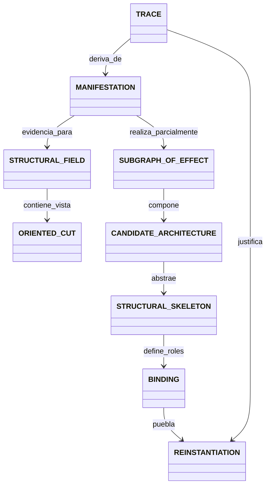

# Ontología mínima MRRE

La ontología existe para preservar operaciones y no-colapsos. Cada objeto tiene identidad, campos mínimos, operaciones, procedencia y contraejemplo.

| Tipo | Identidad y campos mínimos | Operaciones | Procedencia | No equivale a |
|---|---|---|---|---|
| `MANIFESTATION` | `id`, modalidad, carrier/ref, versión, orden, contexto, hash | registrar, segmentar, comparar | MTC manifestación; `PAT-COG-015/024/029` | arquitectura o capacidad |
| `STRUCTURAL_FIELD` | frontera, capas, nodos, edges, fuentes, conflictos, huecos | federar, multiplexar, cortar | diseño MRRE; `074/075`; ACCD regions | corte o corpus sin identidad |
| `ORIENTED_CUT` | field ref, orientación, inclusiones, exclusiones, prominencia | seleccionar, revertir, comparar | `015/024/025/083` | instancia contextual |
| `NODE/mNODE` | ID, tipo, contenido/ref, rol local, source binding | abrir, encapsular, enlazar | MAANC; `011/070` | proposición autosuficiente |
| `TYPED_EDGE` | source, target, semántica, dirección, condición, alcance, evidencia | validar, componer | MAANC composición; `085` | asociación sin tipo |
| `SUBGRAPH_OF_EFFECT` | foco, vecindario, edges, dependencias, estados, función, contexto | reconstruir, anidar, comparar | subgraph antecedent; `012/017/026` | oración o nodo |
| `CANDIDATE_ARCHITECTURE` | subgrafos, trayectoria, cobertura, alternativas, certeza | comparar, falsificar, abstraer | `065/073/080/103` | arquitectura probada |
| `STRUCTURAL_SKELETON` | roles, relaciones, topología, invariantes, variación, huecos | poblar, componer, transferir | `065/067/068/128/129` | plantilla editorial |
| `BINDING` | skeleton role, material, equivalence evidence, restricciones, autoridad | proponer, aprobar, revocar | `077/078/079/104` | retrieval o semejanza |
| `REINSTANTIATION` | skeleton ref, field ref, bindings, instancia, diff, validación | producir, reingresar, revisar | `076…082`; MTC como disciplina | copia o instanciación MTC |
| `EXPECTED_RESULT` | tipo, target, evidencias, prohibiciones, tolerancias | compilar, orientar, evaluar | `025`; AC-HIA | salida literal |
| `EPISTEMIC_STATUS` | clase, evidencia, regla, confianza, autoridad, versión | promover, degradar, superseder | `073/097/108/115` | score único |
| `TRACE` | input/output refs, actor, operación, span, tiempo, versión | recorrer forward/backward | `028/072/104`; KI | ledger de autoridad |

## Redes no colapsables

| Red | Pregunta | Evidencia predeterminada |
|---|---|---|
| `G_D` | ¿cómo organiza la manifestación el recorrido discursivo? | reconstrucción cercana |
| `G_P` | ¿qué red se proyectó como disponible? | hipótesis de diseño |
| `G_R` | ¿qué quedó materializado? | observable/reconstruible |
| `G_A` | ¿qué se activó en un receptor? | sólo evidencia receptoral; de otro modo simulación |
| `G_U` | ¿qué estado resultó? | modelo PIEA/MTC con evidencia |

`G_K` puede representar conocimiento del dominio y tampoco se colapsa con `G_D`.

## Grafo de tipos

## Extensión

Los schemas admiten vocabularios extensibles, pero un tipo nuevo debe demostrar qué operación se pierde si se expresa con los existentes. Se registra como candidato y no modifica el kernel sin gate.

## Reglas de construcción y consumo

1. crea IDs antes de relacionar objetos;
2. valida el tipo con su schema;
3. no reutilices un ID para una nueva versión;
4. una operación consume sólo tipos declarados en su contrato;
5. toda conversión entre tipos produce trace `generated_by/derived_from`;
6. una extensión incluye dominio, rango, operaciones, inversa y contraejemplo;
7. un nombre igual en otro paquete no implica tipo compartido: usa adapter.

Ejemplo válido: un span produce `NODE`, varios nodes/edges producen `SUBGRAPH_OF_EFFECT`, y varios subgrafos/chains producen `CANDIDATE_ARCHITECTURE`. Ejemplo inválido: serializar una oración directamente como `STRUCTURAL_SKELETON`.

Los schemas normativos están en [MRRE-SCHEMAS](../02_contratos_y_schemas/manifestation_input.schema.yaml). La ontología MTC se conserva mediante [SRC-MTC-ONTOLOGY](../../MTC_MAQUINA_DE_TRANSDUCCION_COGNITIVA/00_core/01_ontologia_y_tipos.md), y los estados receptores se mantienen separados conforme a [SRC-PIEA-CORE](../../PATRON_DE_INTEGRACION_ESTRUCTURAL_ACUMULATIVA/00_core/00_especificacion_nuclear.md).
