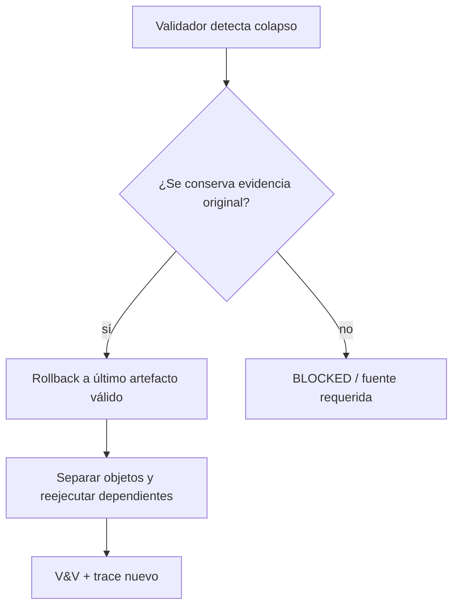

# Reglas de no colapso

Cada regla tiene consecuencia operacional, detector y recuperación. Los IDs se reflejan en `08_validacion_y_pruebas/negative_cases/`.

| ID | No equivalencia | Síntoma/daño | Detector | Recuperación |
|---|---|---|---|---|
| `NC-01` | fuente ≠ material ≠ mediación ≠ recepción | se atribuye significado al lugar incorrecto | source bindings incompletos | separar capas y recalcular trace |
| `NC-02` | grafo de fuentes ≠ grafo cognitivo ≠ bindings | una cita se vuelve relación cognitiva | `graph_kind`/edge type | reconstruir grafos y bridge explícito |
| `NC-03` | campo ≠ corte ≠ instancia contextual | pérdida irreversible o invasión ACCD | refs y schemas | restaurar field y crear objetos separados |
| `NC-04` | manifestación ≠ arquitectura | texto tratado como totalidad | missing regions ausente | degradar a arquitectura candidata |
| `NC-05` | oración ≠ subgrafo | efecto asignado a fragmento aislado | vecindario/dependencias vacíos | ampliar resolución |
| `NC-06` | nodo ≠ función | rol esencializado | función sin contexto | recalcular rol situado |
| `NC-07` | `G_P` ≠ `G_R` ≠ `G_A` | intención/activación afirmada | evidence type incompatible | separar redes y rebajar estatus |
| `NC-08` | retrieval ≠ equivalence ≠ binding | coincidencia integrada automáticamente | eventos faltantes | reabrir equivalencia y gate |
| `NC-09` | verificación ≠ validación | schema válido se considera útil | purpose evidence ausente | ejecutar validación externa |
| `NC-10` | feedback ≠ verdad | una reacción reescribe modelo | método/fuente no declarados | ingresar como evidencia candidata |
| `NC-11` | capacidad ≠ autoridad | módulo se autopromueve | gate/owner ausente | `WAITING_HUMAN_DECISION` |
| `NC-12` | configuración ≠ ejecución | MCCR inventa semántica | plan contiene claims | devolver al contrato MRRE |
| `NC-13` | arquitectura ≠ aplicación ≠ chain ≠ ejecución ≠ resultado | caso redefine kernel | estrato ausente | tipar y reubicar |
| `NC-14` | ejemplo ≠ kernel | sobreajuste | invariante con un solo caso | devolver a candidato multicorpus |
| `NC-15` | output ≠ canon | persistencia silenciosa | promotion status inválido | bloquear y auditar |
| `NC-16` | esqueleto ≠ plantilla editorial | todos los casos forzados al mismo orden | slots universales no derivados | permitir tipo nuevo |
| `NC-17` | hueco ≠ permiso de invención | material fabricado | binding sin evidencia | marcar `UNBOUND_GAP` |
| `NC-18` | semejanza ≠ transferencia | analogía superficial | prueba contractual ausente | ruptura de analogía |
| `NC-19` | acción ≠ estado | causalidad falsa | tipo MTC incompatible | usar adapter MTC |
| `NC-20` | integración pasiva ≠ ausencia de procesamiento | gobierno inferido por complejidad | owner/authority no demostrado | separar procesamiento/gobierno |

## Uso como diagnóstico

Antes de cerrar cada fase, pregunta si un artefacto de la columna izquierda fue usado como sustituto del de la derecha. Registra el chequeo aunque no haya fallo. Si se detecta colapso:

1. congela artefactos dependientes;
2. vuelve al último objeto con procedencia íntegra;
3. separa tipos e IDs;
4. reconstruye bridges explícitos;
5. reejecuta validadores y consumidores;
6. conserva el artefacto fallido como caso negativo.

[CASE-MRRE-COLLAR](../09_casos_y_ejemplos/caso_del_collar/DOSSIER_OPERATIVO.md) prueba `NC-19` y capacidad/manifestación; [CASE-MRRE-MULTIMODAL](../09_casos_y_ejemplos/triangulacion_multimodal/DOSSIER_OPERATIVO.md) prueba fuente/modalidad/identidad; [CASE-MRRE-BRIDGE](../09_casos_y_ejemplos/puente_del_valle/DOSSIER_OPERATIVO.md) prueba hueco/invención. Los casos negativos estructurados están en [MRRE-NEGATIVE-CASES](../08_validacion_y_pruebas/negative_cases/no_colapsos.yaml).
