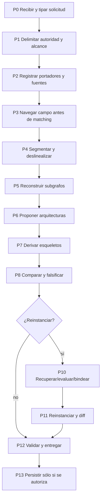

# Protocolo general MRRE

Este protocolo es invariante entre dominios; MCCR configura módulos, profundidad y rutas. Cada fase produce artefactos tipados, eventos y fallos.



## Contrato de fases

| Fase | Trigger/precondición | Procedimiento y artefacto | Gate/fallo | Aceptación |
|---|---|---|---|---|
| P0 recibir | solicitud AC-HIA/directa | validar operación, `EXPECTED_RESULT`, restricciones | `INVALID_REQUEST` | request ID y propósito explícitos |
| P1 delimitar | P0 válido | autoridad, fuentes, alcance, riesgos | `HG-SOURCE/SCOPE` | case spec cerrado o espera |
| P2 registrar | acceso permitido | ingestión inmutable, hash/ref, contexto | `INVALID_CARRIER` | portador recuperable |
| P3 navegar | portadores registrados | capas, relaciones, conflictos, huecos, firma de búsqueda | `INCOMPLETE_NAVIGATION` | hallazgos previos al matching |
| P4 segmentar | modalidad soportada | unidades, spans, orden, jerarquía, solapamiento | `UNSUPPORTED_MODALITY` | navegación multirresolución |
| P5 subgrafos | unidades tipadas | observers, edges, dependencias, función, efecto | `UNSUPPORTED_CAUSALITY` | evidencia y alternativas |
| P6 arquitecturas | subgrafos suficientes | integrar, trayectorias, redes y candidatas | `ALTERNATIVES_PENDING` | ≥1 candidata o parcial justificado |
| P7 esqueletos | candidata trazable | abstraer materiales, roles, invariantes y variación | `OVERFIT_SKELETON` | procedencia y dominio |
| P8 comparar | ≥1 candidata/esqueleto | contrapruebas, parsimonia, modelos rivales | `FALSIFIED_LOCAL` | supervivientes explícitos |
| P9 decidir ruta | propósito/plan | omitir o activar reinstanciación | `HG-BINDING` | decisión registrada |
| P10 binding | esqueleto + campo nuevo | retrieval → equivalence → binding; conservar huecos | `NO_VALID_BINDING` | pruebas contractuales |
| P11 reinstanciar | bindings válidos | composición, diff, reingreso | `FORBIDDEN_INVENTION` | invariantes preservados |
| P12 V&V | artefactos disponibles | validadores por capa, consumer handoff opcional | `VALIDATION_FAILED` | resultado tipado |
| P13 persistir | política y autorización | run log, artefactos, propuesta de promoción | `HG-PERSIST/PROMOTE` | nunca promoción automática |

## Degradación

Un fallo local puede producir `PARTIAL` si los artefactos válidos conservan utilidad y límites. Fallos de autoridad, trace crítico, portador irrecuperable o invención bloquean la rama. El sistema no reinicia todo si un componente opcional falla; MCCR puede replanificar una ruta disponible.

## Ejemplo y contraejemplo

El mismo protocolo puede procesar una explicación de aspiradora y una noticia Reuters: cambian observadores y esqueleto, no las fases. Forzar ambos a `INTRODUCCIÓN–DESARROLLO–CONCLUSIÓN` viola P7 y `INV-MRRE-10`.

## Regla de transición

Ninguna fase avanza sólo porque se produjo prosa. Para pasar `Pn→Pn+1` deben existir: artefacto tipado, trace de entradas/salidas, validator mínimo y estado de fallos. Si una fase no aplica se registra `NOT_APPLICABLE` con razón.

```yaml
phase_transition:
  from: P5
  to: P6
  input_refs: [SG-01, SG-02]
  output_refs: [CH-01, CA-01, CA-ALT-01]
  validators: [V_SUBGRAPH_RELATIONALITY, V_CHAIN_REMOVAL]
  failures: []
  decision_ref: DEC-ARCH-01
```

Las instrucciones de cada fase están en [MRRE-AGENT-MANUAL](09_manual_de_operacion_para_agentes.md); plantillas y algoritmos, en [MRRE-WORKBOOK](../03_protocolos_operacionales/07_libro_de_trabajo_y_algoritmos.md). [CASE-MRRE-VACUUM](../09_casos_y_ejemplos/aspiradora/DOSSIER_OPERATIVO.md) recorre P0–P8/P12 y [CASE-MRRE-REUTERS](../09_casos_y_ejemplos/reuters/DOSSIER_OPERATIVO.md) añade P9–P11.

La configuración externa adopta [SRC-MCCR-PLAN](../../MOTOR_DE_CONFIGURACION_COGNITIVA_EN_RUNTIME/01_nucleo/05_execution_plan_definicion_y_contrato.md) y [SRC-MCCR-STATE](../../MOTOR_DE_CONFIGURACION_COGNITIVA_EN_RUNTIME/02_modelo_operativo/10_estados_y_maquina_de_estados_del_plan.md); MRRE no altera esos contratos.
