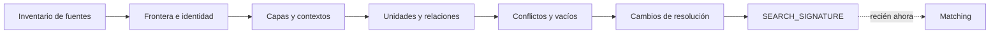

# Protocolo de navegación estructural

## Propósito y contrato

Examinar información nueva antes de matching, clasificación o transferencia (`PAT-COG-076/105`). Recibe solicitud, portadores, alcance y fuentes; produce `STRUCTURAL_FIELD`, `MISSING_REGION_REPORT`, conflictos y `SEARCH_SIGNATURE`.



## Procedimiento

| Paso | Acción | Artefacto/validador |
|---|---|---|
| N0 | registrar fuentes, materiales y mediaciones por separado | manifestation input; `NC-01` |
| N1 | declarar frontera, identidad focal y no-alcance | field boundary |
| N2 | tipar contextos; federar sólo con bridge explícito | `PAT-COG-074/092` |
| N3 | inventariar capas, unidades, nodos y relaciones observables | field layers |
| N4 | conservar contradicciones, versiones y vigencia | conflict records |
| N5 | registrar ausencia sin completarla | missing regions |
| N6 | abrir/cerrar resolución y anotar pérdidas | multiresolution trace |
| N7 | formular firma de necesidad sin recuperar aún | search signature |

## Gates y fallos

Fuentes fuera de alcance activan `HG-SOURCE`; identidades incompatibles producen federación o campos separados; navegación incompleta produce `PARTIAL` si el hueco está trazado. La aceptación exige demostrar qué se conoció antes de consultar el acervo y qué sesgo habría introducido una clasificación prematura.

## Cuaderno de ejecución

Escribe primero [MRRE-WORKBOOK § Plantilla C](07_libro_de_trabajo_y_algoritmos.md#plantilla-c-structural_field_and_cut). Por cada identidad propuesta añade evidencia y un falsador; por cada federación añade bridge; por cada ausencia añade efecto sobre el análisis. Sólo después emite `SEARCH_SIGNATURE`.

```yaml
search_signature:
  needed_functions: []
  required_relations: []
  topology_constraints: []
  context_constraints: []
  forbidden_matches: []
  unresolved_gaps: []
```

**Ejemplo:** [CASE-MRRE-REUTERS § A2](../09_casos_y_ejemplos/reuters/DOSSIER_OPERATIVO.md#a2-campo-estructural-y-cortes) muestra cómo dos portadores permanecen separados hasta resolver identidad; [CASE-MRRE-MULTIMODAL § A2](../09_casos_y_ejemplos/triangulacion_multimodal/DOSSIER_OPERATIVO.md#a2-campos-locales-y-federación) requiere bridge por modalidad. Los patrones de navegación/retrieval se consultan en [SRC-CAT-MRRE-03](../05_acervo_estructural/CATALOGO_DE_PATRONES_DE_DISENO_COGNITIVO_REUTILIZABLES_EXTENSION_v0_3_0.md) sólo después de crear la firma.
