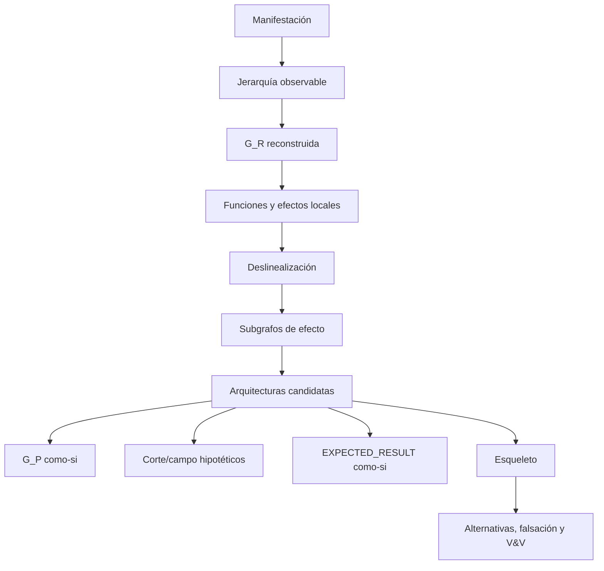

# Protocolo de retroconstrucción

## Modos

- `ANALYSIS_WITH_SOURCE`: manifestación y materiales fuente; compara campo, corte y realización.
- `MANIFESTATION_ONLY`: produce campo mínimo compatible; no afirma omisiones ni mente del productor.

## Pipeline

## Etapas R0–R13

1. registrar portador, alcance, modalidad, versión y contexto;
2. navegar fuentes/campo sin matching;
3. segmentar con spans, jerarquía, orden y solapamiento;
4. extraer entidades, relaciones, negación, modalidad y procedencia;
5. reconstruir `G_R` sin atribuir `G_P/G_A`;
6. activar observadores MAANC configurados;
7. asignar funciones y efectos situados con alternativas;
8. deslinealizar dependencias y reconstruir subgrafos;
9. integrar trayectorias y arquitecturas candidatas;
10. inferir `G_P`, corte, campo y resultado sólo con estatus abductivo;
11. abstraer esqueletos y dominio de variación;
12. comparar modelos, contrapruebas y causalidad;
13. entregar resultado, incertidumbre, huecos y trace.

## Gradiente

`OBSERVATION → RECONSTRUCTION_CLOSE → STRUCTURAL_INFERENCE → DESIGN_HYPOTHESIS → AS_IF_EXPECTED_RESULT`. `G_A` requiere evidencia receptoral; una simulación conserva etiqueta `PROJECTED_ACTIVATION_RISK`.

## Salida y aceptación

Debe existir al menos una arquitectura candidata o un parcial que explique por qué no; toda candidata incluye evidencia, alternativas materiales, límites y falsadores. Está prohibido presentar una reconstrucción elegante como acceso a intención psicológica, frecuencia léxica como centralidad o resumen como red receptoral.

## Cómo ejecutar sin saltos

Usa una fila de run por etapa `R0…R13` con `input_refs`, `operation`, `output_refs`, `decision`, `failure` y `next`. El output mínimo no es un texto explicativo: son las plantillas B–G de [MRRE-WORKBOOK](07_libro_de_trabajo_y_algoritmos.md).

En R5–R9 aplica estos controles:

- un edge sin locator queda `INFERRED` o se elimina;
- una causalidad fuerte debe superar alternativa no causal;
- un chain requiere prueba de remoción;
- una arquitectura requiere candidata rival;
- un esqueleto requiere instancia distante y contraejemplo cercano.

**Ejemplos completos:** [CASE-MRRE-VACUUM](../09_casos_y_ejemplos/aspiradora/DOSSIER_OPERATIVO.md) muestra el camino texto→unidades→subgrafos→chain→esqueleto; [CASE-MRRE-COLLAR](../09_casos_y_ejemplos/caso_del_collar/DOSSIER_OPERATIVO.md) muestra composición de subgrafos y no-colapsos. La deslinealización adapta [SRC-MAANC-STRUCTURAL](../../../../04_conocimiento_y_contexto/memoria_conceptual/construccion_conceptual/modelo_instrucciones_procesamiento_estructural.md) y [SRC-MRRE-SUBGRAPH](../90_historial/antecedentes/MANIFESTACION_LINGUISTICA_COMO_SUBGRAFO_MRRE_v0_1.md).
