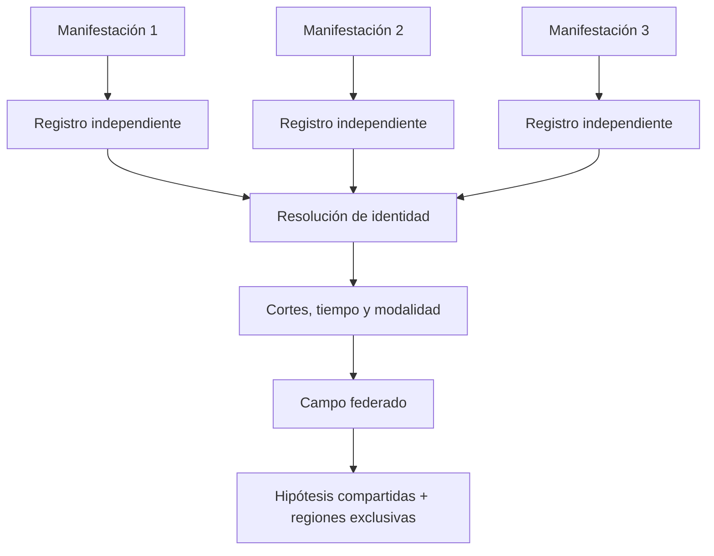

# Protocolo de triangulación multimanifestación

## Propósito

Integrar evidencia parcial sin asumir que manifestaciones heterogéneas representan el mismo corte, momento o estado (`PAT-COG-002/074/075/107`).

## Procedimiento

T0 registra portador, fuente, fecha y contexto por manifestación. T1 reconstruye cada una sin contaminación cruzada. T2 propone correspondencias de identidad con evidencia. T3 compara cortes, prominencia, omisiones, temporalidad y modalidad. T4 clasifica convergencia, complementariedad, contradicción o incompatibilidad. T5 crea campo federado preservando source bindings. T6 actualiza confianza con método declarado, nunca por simple mayoría. T7 solicita evidencia adicional cuando una diferencia discrimina alternativas.

## Reglas

- Repeticiones de una copia no cuentan como fuentes independientes.
- Contradicciones no se promedian ni borran.
- Identidad compartida no implica mismo corte.
- Contextos incompatibles permanecen separados o multiplexados.
- La agregación conserva qué aporta cada manifestación.

La aceptación exige consultas forward/backward por modalidad y que una manifestación pueda retirarse para observar qué hipótesis pierden soporte.

## Matriz de trabajo

| Manifestación | Identidad propuesta | Corte | Tiempo | Modalidad | Aporta | Contradice | Pierde soporte al retirarla |
|---|---|---|---|---|---|---|---|
| `MAN-*` | `HYP-ID-*` | `CUT-*` | `T-*` | `...` | `CL-*` | `CL-*` | `CL-*` |

No se rellena una celda con “igual” o “diferente” sin indicar feature y locator. El field builder conserva primero campos locales; luego el bridge produce federación. El algoritmo completo es [MRRE-WORKBOOK § Algoritmo A](07_libro_de_trabajo_y_algoritmos.md#algoritmo-a-navegación-estructural-sin-matching).

[CASE-MRRE-MULTIMODAL](../09_casos_y_ejemplos/triangulacion_multimodal/DOSSIER_OPERATIVO.md) muestra una contradicción que sólo existe si “estabilidad” incluye posición, y [CASE-MRRE-REUTERS](../09_casos_y_ejemplos/reuters/DOSSIER_OPERATIVO.md) muestra cortes distintos de un campo común. Ambos preservan la alternativa de identidad fallida.
