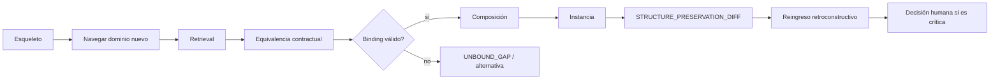

# Protocolo de reinstanciación

## Propósito

Transferir un esqueleto validado a materiales nuevos preservando función, relaciones, topología e invariantes; toda pérdida o hueco queda explícito.



## Pasos I0–I11

1. declarar esqueleto, estado, dominio y condiciones de suficiencia;
2. navegar campo nuevo antes de buscar;
3. construir firma por rol/relación/contexto;
4. recuperar candidatos y registrar ranking no vinculante;
5. probar equivalencia funcional, relacional, topológica y contextual;
6. conservar candidatos incompatibles y razones;
7. proponer binding con evidencia, restricciones y autoridad;
8. marcar huecos sin inventar materiales;
9. componer instancia y ejecutar validación descendente/ascendente;
10. producir diff `PRESERVED/MODIFIED_ALLOWED/LOST/ADDED_JUSTIFIED/UNBOUND_GAP/FORBIDDEN_INVENTION`;
11. reingresar y cerrar como completa, parcial, múltiple o bloqueada.

Un binding por semejanza léxica falla. La aceptación exige informar preservaciones, modificaciones, pérdidas, adiciones, huecos, alternativas y condición de reapertura.

## Registro ejecutable

Para cada rol completa [MRRE-WORKBOOK § Plantilla H](07_libro_de_trabajo_y_algoritmos.md#plantilla-h-binding_and_diff) y conserva cuatro resultados independientes:

```text
retrieval_score
equivalence_verdict
binding_authority/status
preservation_after_reentry
```

Un candidato puede ser recuperado y fallar equivalencia; puede pasar equivalencia y esperar autoridad; puede tener binding autorizado y fallar reingreso. Cada estado produce una acción distinta.

**Ejemplo:** [CASE-MRRE-REUTERS § A8–A9](../09_casos_y_ejemplos/reuters/DOSSIER_OPERATIVO.md#a8-reinstanciación-ficticia-y-bindings) mapea roles a un instituto ficticio y prueba el esqueleto al reingresar; [CASE-MRRE-COLLAR § A8](../09_casos_y_ejemplos/caso_del_collar/DOSSIER_OPERATIVO.md#a8-reinstanciación-controlada-privilegio-ficticio) cambia el objeto manteniendo la chain. La familia de patrones se referencia en [SRC-CAT-MRRE-02](../05_acervo_estructural/CATALOGO_COMPLEMENTARIO_DE_PATRONES_DE_DISENO_COGNITIVO_REUTILIZABLES_v0_2_0.md).
