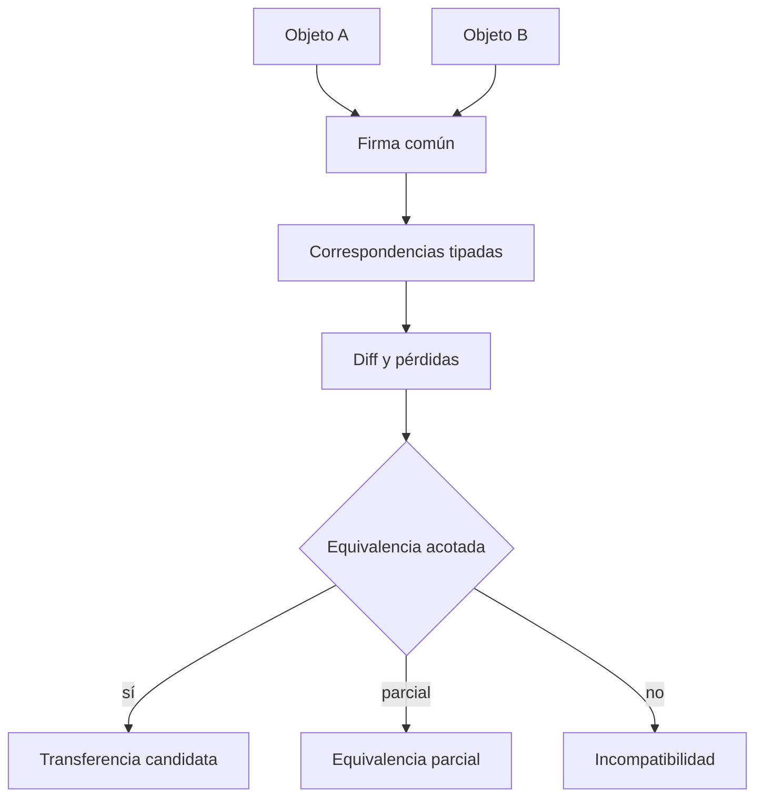

# Protocolo de comparación y transferencia

## Contrato

Compara manifestaciones, subgrafos, arquitecturas o esqueletos al nivel declarado. No mezcla niveles ni usa “se parece a” como resultado.

| Etapa | Pregunta | Salida |
|---|---|---|
| C0 alcance | ¿qué objetos, versiones y contextos? | comparison spec |
| C1 firma | ¿qué roles, relaciones, estados y rutas importan? | signatures |
| C2 correspondencia | ¿qué mappings sobreviven a pruebas? | typed mappings |
| C3 diferencia | ¿qué se conserva, omite, invierte o añade? | structural diff |
| C4 invariantes | ¿qué relaciones son comunes y en qué dominio? | candidate invariants |
| C5 incompatibilidad | ¿qué contradice función/contexto? | prohibited transfers |
| C6 transferencia | ¿qué ruta puede trasladarse con bindings? | transfer proposal |

Cada equivalencia declara alcance, condiciones, relaciones conservadas, confidence y ruptura de analogía. La misma lógica en sistemas distintos (`PAT-COG-060`) es una posibilidad a demostrar, no una licencia metafórica.

## Matriz de comparación

| Elemento A | Elemento B | Nivel | Mapping | Relaciones conservadas | Diferencias | Ruptura | Veredicto |
|---|---|---|---|---|---|---|---|
| `...` | `...` | nodo/edge/chain/esqueleto | `...` | `...` | `...` | `...` | `PASS/PARTIAL/FAIL` |

Procedimiento: normaliza nivel, construye firma común, prueba correspondencias, produce diff, busca incompatibilidades y sólo entonces propone transferencia. Comparar un nodo con una arquitectura completa es `LEVEL_MISMATCH`.

[CASE-MRRE-REUTERS § A2](../09_casos_y_ejemplos/reuters/DOSSIER_OPERATIVO.md#a2-campo-estructural-y-cortes) compara cortes; [CASE-MRRE-VACUUM § A6](../09_casos_y_ejemplos/aspiradora/DOSSIER_OPERATIVO.md#a6-arquitectura-candidata-y-alternativa) contrasta arquitecturas rivales; [CASE-MRRE-BRIDGE](../09_casos_y_ejemplos/puente_del_valle/DOSSIER_OPERATIVO.md) muestra por qué una metáfora sin fuente y contrato queda bloqueada.
