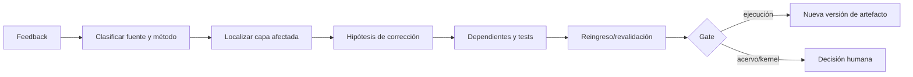

# Protocolo de feedback y actualización

## Principio

Feedback es evidencia candidata (`PAT-COG-042`), no verdad ni orden de reescritura. Toda actualización es localizada, versionada y revalidable.



## Procedimiento

F0 registra fuente, método, contexto y contenido. F1 clasifica feedback como error factual, estructural, receptoral, contractual, de objetivo o preferencia. F2 identifica capa: ejecución, candidata, esqueleto, acervo o kernel. F3 formula corrección y alternativas. F4 calcula grafo de dependientes y validaciones retroactivas. F5 aplica en rama/version candidata. F6 ejecuta reingreso y regression. F7 solicita gate si afecta acervo/kernel. F8 conserva versión previa, diff, decisión y condición de rollback.

Un comentario receptoral sólo soporta lo que su método permite. Una actualización sin evidencia nueva, región afectada, versión previa y pruebas queda rechazada como `UNSCOPED_FEEDBACK`.

## Registro ejecutable

```yaml
feedback_record:
  feedback_id: FB-...
  source_citation: "[ID](relative/path)"
  method: observation | test | preference | authority_decision
  affected_claims: []
  proposed_change: "..."
  alternatives: []
  dependent_artifacts: []
  required_reruns: []
  gate: null
  rollback_ref: ART-PREVIOUS
```

La procedencia de feedback adopta [SRC-MTC-FEEDBACK](../../MTC_MAQUINA_DE_TRANSDUCCION_COGNITIVA/10_mecanismo/15_feedback_control_observabilidad.md); la autoridad y gates adoptan [SRC-MCCR-AUTH](../../MOTOR_DE_CONFIGURACION_COGNITIVA_EN_RUNTIME/03_contratos/07_autoridad_permisos_validadores_y_gates.md). Una preferencia puede cambiar un corte o presentación; no falsifica por sí misma la arquitectura.
