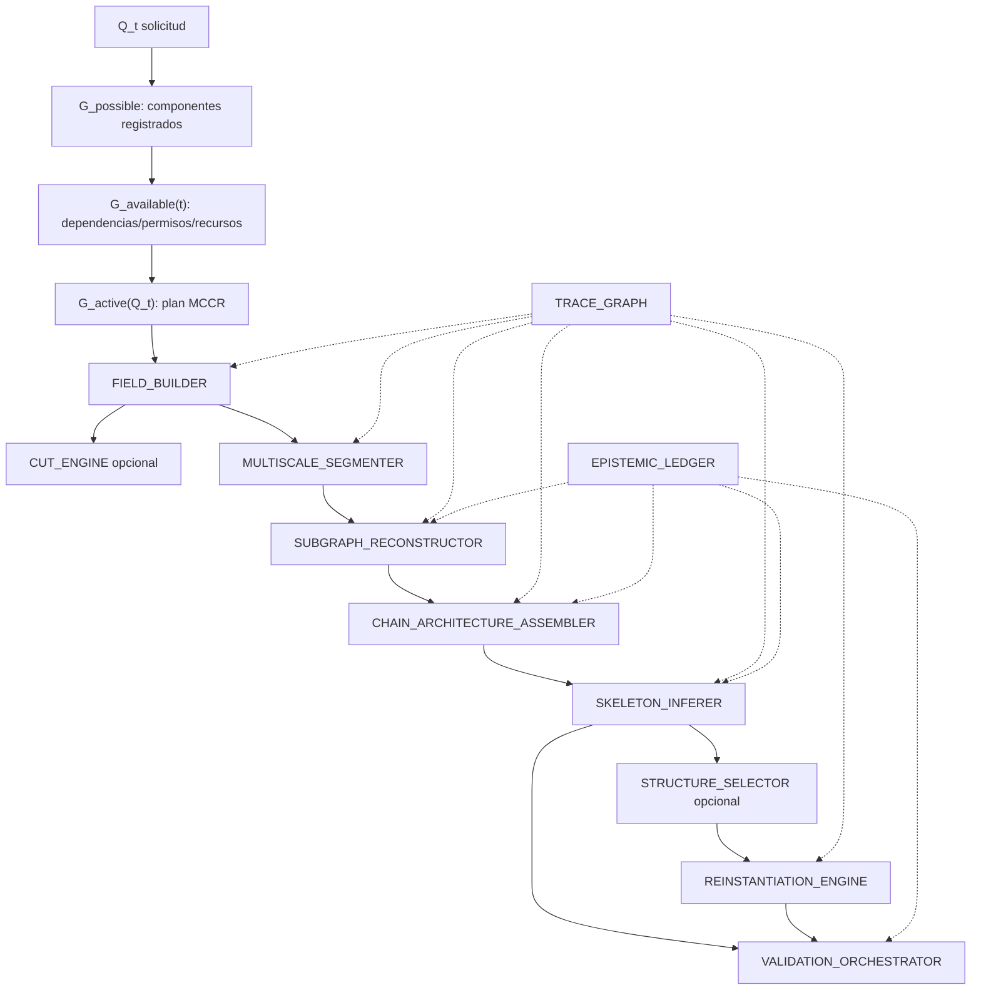

# Grafo de ejecución MRRE

## Estratos

`ARCHITECTURE → APPLICATION → CHAIN → EXECUTION → RESULT` (`PAT-COG-126`). La arquitectura define capacidades; una especialización restringe; MCCR activa una chain; el run produce resultado. Ninguna ejecución redefine el kernel.

## Rutas mínimas

| Operación | Chain mínima | Omitible/condición |
|---|---|---|
| navegar | field + trace + validate | segmentación si no hay portador |
| retroconstruir | field, segment, subgraph, chain/architecture, skeleton, trace, ledger, validate | cut si no se infiere orientación |
| comparar | selector/comparator, trace, validate | reinstantiation |
| triangular | field, segment por modalidad, subgraph, chain/architecture, trace, validate | skeleton si evidencia insuficiente |
| reinstanciar | field, selector, engine, trace, ledger, validate | segment si materiales ya tipados |

## Gates, ciclos y cut-sets

`TRACE_GRAPH`, `EPISTEMIC_LEDGER` y `VALIDATION_ORCHESTRATOR` son transversales. Perder trace crítico bloquea promoción; perder un observador MAANC opcional degrada cobertura. El ciclo `reinstantiation → segment/subgraph → diff` realiza reingreso. Fallos recuperables permiten replan con `G_available(t)` actualizado.

## Pre/postcondiciones

Cada nodo consume schemas declarados en `03_registro_de_componentes.yaml`; sólo se activa si dependencias, modalidad, autoridad y presupuesto están disponibles. Cada salida incluye trace refs y estado; ningún edge de este grafo representa por sí mismo causalidad cognitiva.

## Cómo construir el plan activo

1. toma capacidades requeridas del [MRRE_MANIFEST](../MRRE_MANIFEST.yaml);
2. resuelve componentes en [MRRE-COMPONENT-REGISTRY](03_registro_de_componentes.yaml);
3. elimina no disponibles y registra razón;
4. ordena dependencias y añade trace/ledger/validation transversales;
5. aplica gates, presupuesto y modalidad;
6. emite plan o `NO_FEASIBLE_PLAN`;
7. actualiza el grafo al fallar un componente.

La selección adapta [SRC-MCCR-GRAPHS](../../MOTOR_DE_CONFIGURACION_COGNITIVA_EN_RUNTIME/01_nucleo/06_grafos_possible_available_active.md) y el plan [SRC-MCCR-PLAN](../../MOTOR_DE_CONFIGURACION_COGNITIVA_EN_RUNTIME/01_nucleo/05_execution_plan_definicion_y_contrato.md). Los componentes no inventan capacidades fuera del registry.
