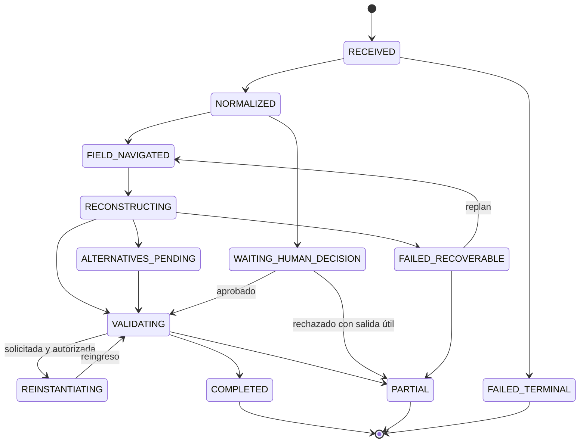

# Máquina de estados MRRE

## Estados y consecuencias

| Estado | Precondición | Artefactos permitidos | Salidas |
|---|---|---|---|
| `RECEIVED` | request registrada | request ref | normalize/reject |
| `NORMALIZED` | comando y autoridad tipados | case spec | navigate/wait |
| `FIELD_NAVIGATED` | campo parcial o completo | field/missing report | reconstruct/partial |
| `RECONSTRUCTING` | unidades/campo disponibles | segment/subgraphs | alternatives/validate/fail |
| `ALTERNATIVES_PENDING` | ≥2 modelos no discriminados | candidate set | evidence/validate/partial |
| `VALIDATING` | artefactos verificables | validator results | complete/rework/wait |
| `REINSTANTIATING` | skeleton + binding set | instance/diff | reingress/validate/fail |
| `WAITING_HUMAN_DECISION` | gate requerido | propuesta y evidencia | approve/reject/expire |
| `PARTIAL` | utilidad conservada y límites explícitos | result envelope | close/reenter |
| `COMPLETED` | criterios cumplidos | result + traces | persist/close |
| `FAILED_RECOVERABLE` | fallo local con ruta alterna | failure artifact | replan/partial |
| `FAILED_TERMINAL` | portador/autoridad/trace crítico irrecuperable | failure + trace | close |



Cada transición genera evento, actor, guard, input/output refs y timestamp en run log. Rollback crea versión nueva; no borra eventos previos. `COMPLETED` no implica `PROMOTED`.

## Registro de transición

```yaml
transition:
  from: FIELD_NAVIGATED
  to: SEGMENTED
  guard: units_reversible
  component: MRRE-MULTISCALE-SEGMENTER
  input_refs: [FIELD-01, MAN-01]
  output_refs: [SEG-01]
  validator_refs: [V_SPAN_REVERSIBILITY]
  event_ref: EVT-...
```

Una guard falsa mantiene estado o conduce a `WAITING/PARTIAL/FAILED_RECOVERABLE`; nunca salta al estado siguiente. El ciclo de vida adapta [SRC-MCCR-STATE](../../MOTOR_DE_CONFIGURACION_COGNITIVA_EN_RUNTIME/02_modelo_operativo/10_estados_y_maquina_de_estados_del_plan.md), y los eventos [SRC-MCCR-RUNLOG](../../MOTOR_DE_CONFIGURACION_COGNITIVA_EN_RUNTIME/03_contratos/06_trazabilidad_observabilidad_y_run_log.md). El run bloqueado [CASE-MRRE-BRIDGE](../09_casos_y_ejemplos/puente_del_valle/runs/run_v0_2_0.yaml) ejemplifica `WAITING_SOURCE`.
