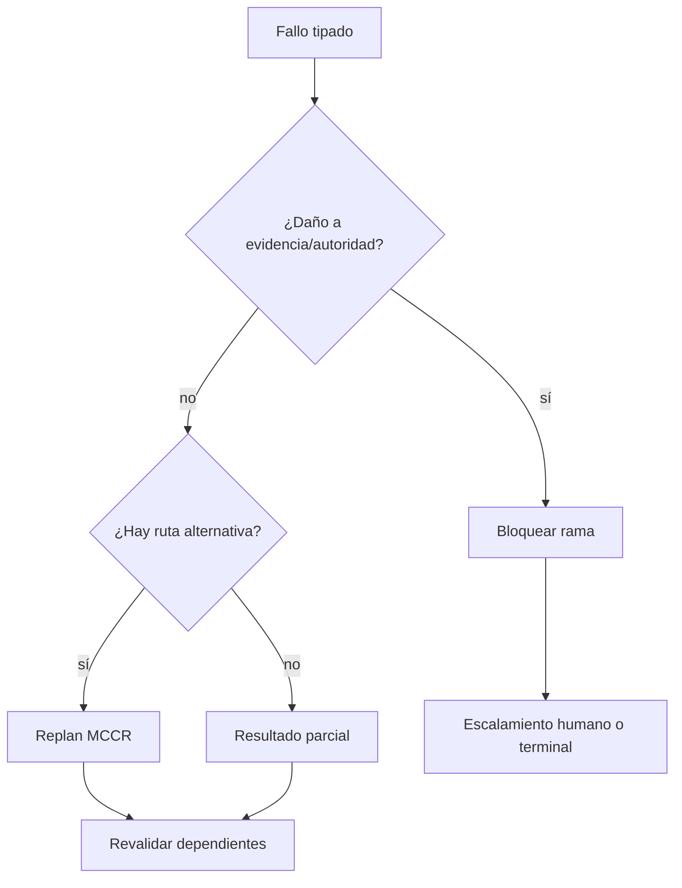

# Manejo de fallas y recuperación

## Taxonomía

| Fallo | Detector | Severidad/estado | Recuperación/degradación | Escalamiento/artefacto |
|---|---|---|---|---|
| `INVALID_CARRIER` | schema/hash/ref | terminal si irrecuperable | solicitar portador válido | failure report |
| `SOURCE_ABSENT` | source binding | recuperable | `MANIFESTATION_ONLY` o esperar | `HG-SOURCE` |
| `CONTEXT_CONFLICT` | context validator | recuperable | separar/federar con frontera | conflict report |
| `INCOMPLETE_NAVIGATION` | coverage | parcial | limitar firma y declarar hueco | missing report |
| `NO_FEASIBLE_PLAN` | MCCR | recuperable/terminal | replan, reducir profundidad o bloquear | plan report |
| `NO_VALID_BINDING` | equivalence tests | parcial | alternativa o `UNBOUND_GAP` | binding report |
| `FORBIDDEN_INVENTION` | diff/trace | crítico | rollback a bindings válidos | `HG-BINDING` |
| `UNSUPPORTED_CAUSALITY` | causal validator | parcial | degradar a asociación/hipótesis | epistemic correction |
| `BROKEN_TRACE` | forward/backward query | crítico | reconstruir trace; bloquear promoción | trace failure |
| `VALIDATOR_FAILED` | validator | según regla | corregir y rerun; no ocultar | validation report |
| `AUTHORIZATION_ABSENT` | gate | bloqueante | `WAITING_HUMAN_DECISION` | gate request |
| `CONSUMER_INCOMPATIBLE` | handoff contract | recuperable | adapter o resultado MRRE autónomo | compatibility report |

## Principios

Se prefiere parcial trazable o detención explícita a completar huecos. Un fallo local no implica falla total si existe ruta funcional válida (`PAT-COG-102/103/105/129`). Toda recuperación conserva evento previo, causa, versión, artefactos afectados y validadores reejecutados.

## Procedimiento de recuperación

1. tipa fallo, severidad, alcance y recuperabilidad;
2. congela artefactos dependientes;
3. identifica último artefacto válido;
4. elige `retry | alternate_component | reduce_scope | request_source | human_gate | partial | terminal`;
5. crea nueva rama/versión y conserva la fallida;
6. reejecuta dependientes y validadores;
7. registra pérdida de cobertura en el resultado.

El modelo adapta [SRC-MCCR-FAILURES](../../MOTOR_DE_CONFIGURACION_COGNITIVA_EN_RUNTIME/03_contratos/05_no_feasible_plan_fallos_y_degradacion.md). [CASE-MRRE-BRIDGE](../09_casos_y_ejemplos/puente_del_valle/DOSSIER_OPERATIVO.md) muestra `request_source`; [CASE-MRRE-MULTIMODAL](../09_casos_y_ejemplos/triangulacion_multimodal/DOSSIER_OPERATIVO.md) muestra degradación con alternativas preservadas.
