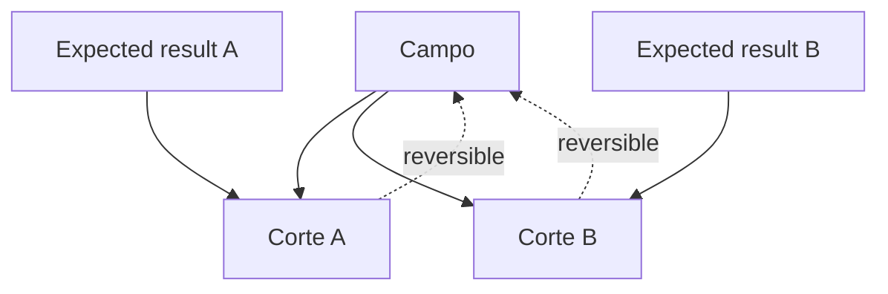

# CUT_ENGINE

**Capacidad:** `CUT_BUILD` · **Versión:** 0.1.0

## Contrato

Recibe `STRUCTURAL_FIELD` y `EXPECTED_RESULT`; produce uno o más `ORIENTED_CUT` reversibles. El resultado esperado se compila en target, prohibiciones, evidencia, tolerancias y perfil receptor; no es contenido ya seleccionado.

## Procedimiento

1. validar expected result y autoridad;
2. calcular necesidades funcionales;
3. seleccionar nodos/relaciones con razones;
4. registrar exclusiones y omisiones relevantes;
5. asignar prominencia e `IDENTITY_SELECTION` situada;
6. enlazar cada elemento al campo;
7. producir alternativas cuando varias selecciones satisfacen el contrato.



Validadores: reversibilidad, cobertura, omisiones justificadas, no mutación del campo y `ORIENTED_CUT ≠ CONTEXTUAL_INSTANCE`. Un expected result ambiguo produce alternativas o gate, nunca elección silenciosa.

## Instrucciones de ejecución

1. compila `EXPECTED_RESULT` en función, evidencia, restricciones y prohibiciones;
2. crea una puntuación explicable por necesidad, no por frecuencia;
3. registra inclusión, exclusión, prominencia y rol local por elemento;
4. crea `omission_record` cuando una región disponible se excluye y cambia el efecto;
5. enlaza cada selección al ID estable del campo;
6. prueba reversibilidad y no mutación;
7. emite cortes alternativos si dos orientaciones satisfacen el contrato.

Plantilla:

```yaml
selection: {element_ref: N-01, reason: "necesario para función X", evidence_refs: [OBS-01]}
omission: {region_ref: R-02, expected_effect: "pierde contexto", deliberate: true}
```

[CASE-MRRE-REUTERS](../../09_casos_y_ejemplos/reuters/DOSSIER_OPERATIVO.md) muestra dos cortes del mismo campo con prominencias y omisiones distintas. La salida se valida con [MRRE-SCHEMA-FIELD](../../02_contratos_y_schemas/structural_field_and_cut.schema.yaml); una lista de párrafos sin vínculo al campo falla.
