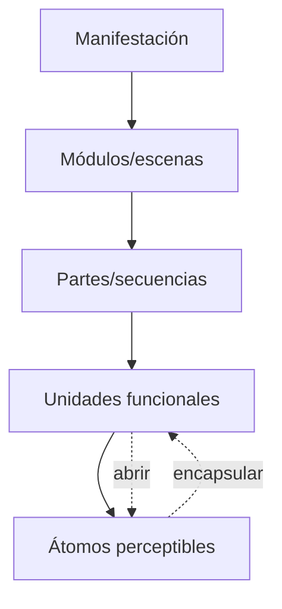

# MULTISCALE_SEGMENTER

**Capacidad:** `MULTISCALE_SEGMENT` · **Versión:** 0.1.0

## Contrato

Descompone una manifestación por resoluciones conservando carrier locator, orden, anidamiento, solapamiento y reversibilidad. En texto soporta palabra→oración→párrafo→parte→módulo→pieza; otras modalidades definen unidades propias.

## Procedimiento

Registrar resolución inicial; detectar límites candidatos; conservar alternativas de segmentación; asignar locators y parent/overlap refs; inferir función local sólo como hipótesis; abrir perezosamente hasta palabra/frame cuando cambia una prueba; emitir segmentation graph y trace.

Validadores: 100% de unidades recuperan el span/locator del portador; orden y jerarquía son consultables; no se fuerza división gramatical como unidad de efecto. Fallos: modalidad no soportada o frontera inestable; ambos permiten parcial explícito.

## Instrucciones de ejecución

1. parte del portador completo y asigna locator;
2. divide por cambios funcionales y marcas observables;
3. crea relaciones `PARENT_OF`, `PRECEDES` y `OVERLAPS`;
4. abre una unidad sólo si su interior cambia una prueba o función;
5. conserva segmentaciones rivales;
6. reconstruye cada unidad al portador y reporta cobertura.

El formato exacto está en [MRRE-WORKBOOK § Plantilla D](../../03_protocolos_operacionales/07_libro_de_trabajo_y_algoritmos.md#plantilla-d-segmentation_graph). La lógica de mNode se adapta de [SRC-MAANC-COMPOSITION](../../../../../04_conocimiento_y_contexto/memoria_conceptual/construccion_conceptual/modelo-composicion-cognitiva.md): encapsular no autoriza perder el interior.

**Ejemplos:** [Aspiradora § A3](../../09_casos_y_ejemplos/aspiradora/DOSSIER_OPERATIVO.md#a3-segmentación-multiescala) abre oraciones en cláusulas causales; [Multimodal § A3](../../09_casos_y_ejemplos/triangulacion_multimodal/DOSSIER_OPERATIVO.md#a3-segmentación-por-modalidad) conserva frames y features sin textualizarlos.
