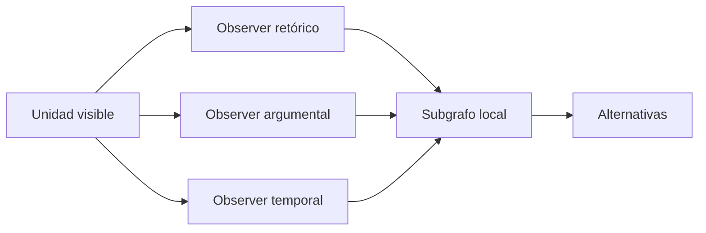

# SUBGRAPH_RECONSTRUCTOR

**Capacidad:** `SUBGRAPH_RECONSTRUCT` · **Versión:** 0.1.0

## Contrato

Convierte unidades segmentadas y evidencias de campo en `SUBGRAPH_OF_EFFECT`: foco, vecindario, aristas tipadas, dependencias, estados, trayectoria, contexto, funciones/efectos candidatos, observers y certainty.



## Procedimiento

Crear nodos; recuperar edges evidenciadas; añadir dependencias previas/simultáneas/subsecuentes/presupuestas; distinguir `G_D/G_R/G_P`; integrar observers sobre IDs compartidos; formular efecto emergente; buscar explicación rival y causalidad excesiva; emitir subgrafo anidable con trace.

Aceptación: el efecto se atribuye a configuración, no al foco aislado; función depende de vecindario/posición/contexto; cada arista tiene evidencia o estatus inferencial. Fallos producen `INSUFFICIENT_RELATIONAL_EVIDENCE`, `UNSUPPORTED_CAUSALITY` o alternativas pendientes.

## Instrucciones de ejecución

Para cada foco ejecuta [MRRE-WORKBOOK § Algoritmo C](../../03_protocolos_operacionales/07_libro_de_trabajo_y_algoritmos.md#algoritmo-c-reconstrucción-de-subgrafo): abre vecindad previa/simultánea/posterior/presupuesta, crea edges tipados, separa fuerza causal y formula alternativa. Después conecta subgrafos mediante [MRRE-WORKBOOK § Algoritmo D](../../03_protocolos_operacionales/07_libro_de_trabajo_y_algoritmos.md#algoritmo-d-detección-y-prueba-de-chains); una secuencia no se convierte automáticamente en chain.

```yaml
edge:
  source_ref: N-01
  relation_type: ENABLES
  target_ref: N-02
  evidence_refs: [LOC-03]
  epistemic_status: STRUCTURAL_INFERENCE
  falsifier: "N-02 ocurre sin N-01 bajo las condiciones declaradas"
```

Valida cada objeto con [MRRE-SCHEMA-SUBGRAPH](../../02_contratos_y_schemas/reconstructed_subgraph.schema.yaml). [CASE-MRRE-COLLAR](../../09_casos_y_ejemplos/caso_del_collar/DOSSIER_OPERATIVO.md) muestra subgrafos `I–EC`, `EC–A`, `A–V`, `V–K` y `K–M`, y cómo su composición explica más que el nodo “collar”.
