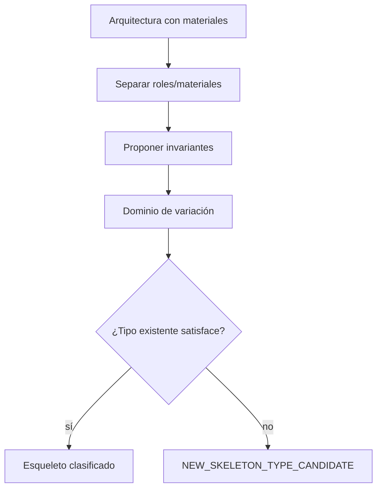

# SKELETON_INFERER

**Capacidad:** `SKELETON_INFER` · **Versión:** 0.1.0

## Contrato

Abstrae una o más arquitecturas candidatas en roles, relaciones, topología, rutas, invariantes, variación, huecos, alternativas, dominio y certeza. No presupone taxonomía cerrada.

Abstracción elimina detalles sólo si conserva función y trace. Cada relación se marca invariant/required/optional/contextual/hypothetical. Rutas y cut-sets sólo se incluyen si hay evidencia. Se prueban contraejemplos y sobreajuste a la forma editorial.

Validadores: procedencia de cada slot, dominio declarado, variación explícita, al menos un falsador y apertura a tipo nuevo. Un caso único sólo produce candidato; no invariante aprendido ni patrón.

## Instrucciones de ejecución

1. copia la candidata con todos sus materiales;
2. reemplaza uno por uno los materiales por roles funcionales;
3. prueba cada relación mediante remoción o sustitución;
4. clasifica `required/optional/contextual/hypothetical`;
5. registra cardinalidad, restricciones y bindings prohibidos;
6. construye ejemplo léxicamente distinto y contraejemplo léxicamente parecido;
7. declara el dominio exacto donde el esqueleto fue probado;
8. valida con [MRRE-SCHEMA-SKELETON](../../02_contratos_y_schemas/structural_skeleton.schema.yaml).

La plantilla y el algoritmo están en [MRRE-WORKBOOK § Plantilla G](../../03_protocolos_operacionales/07_libro_de_trabajo_y_algoritmos.md#plantilla-g-structural_skeleton). [CASE-MRRE-VACUUM § A7](../../09_casos_y_ejemplos/aspiradora/DOSSIER_OPERATIVO.md#a7-esqueleto) demuestra que “motor” no es el rol; el rol es `ENERGY_TO_MOTION`.
