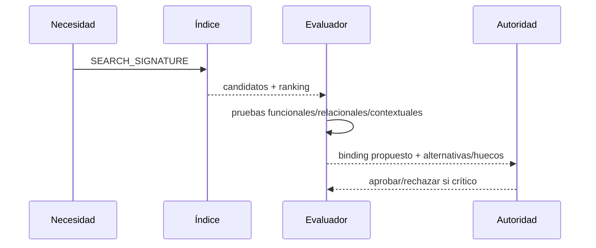

# STRUCTURE_SELECTOR

**Capacidad:** `STRUCTURE_SELECT` · **Versión:** 0.1.0

## Contrato

Consulta el acervo federado con firma de necesidad, recupera candidatos, evalúa equivalencia contractual y propone bindings. Los tres eventos permanecen separados (`PAT-COG-076…080/104/105`).



## Reglas

El ranking no vincula. La equivalencia declara tipo, alcance, invariantes, incompatibilidades y pruebas. El binding incluye material, rol, evidence refs, restricciones, alternativas y autoridad. Ausencia produce `UNBOUND_GAP`; semejanza léxica aislada produce rechazo.

Aceptación: toda consulta llega a definición original del patrón en un salto; cada binding apunta a un assessment que pasa; candidatos incompatibles conservan razón; no existe integración automática por búsqueda.

## Instrucciones de ejecución

1. recibe `SEARCH_SIGNATURE` producida antes de consultar el acervo;
2. busca por función, forces, relaciones, contexto y restricciones;
3. registra ranking como evento `RETRIEVAL`, nunca como binding;
4. abre la definición original desde [MRRE-PATTERN-INDEX](../../05_acervo_estructural/01_indice_federado_de_patrones_mrre.md);
5. ejecuta pruebas funcional, relacional, topológica y contextual;
6. marca incompatibilidades y huecos;
7. emite propuesta de binding sólo con assessment y autoridad.

```text
retrieval(candidate) ≠ equivalence(candidate, role) ≠ binding(candidate → role)
```

El algoritmo está en [MRRE-WORKBOOK § Algoritmo F](../../03_protocolos_operacionales/07_libro_de_trabajo_y_algoritmos.md#algoritmo-f-retrieval-equivalencia-y-binding). [CASE-MRRE-REUTERS § A8](../../09_casos_y_ejemplos/reuters/DOSSIER_OPERATIVO.md#a8-reinstanciación-ficticia-y-bindings) documenta assessment y binding por rol; cambiar nombres sin estas pruebas falla.
