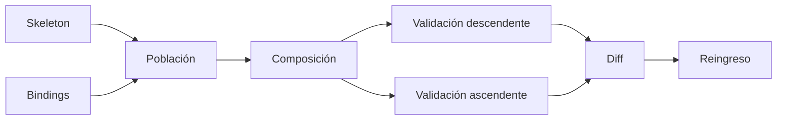

# REINSTANTIATION_ENGINE

**Capacidad:** `REINSTANTIATE` · **Versión:** 0.1.0

## Contrato

Puebla un `STRUCTURAL_SKELETON` con bindings válidos, compone la instancia, ejecuta validación descendente/ascendente, produce diff y reingresa la salida.

## Procedimiento

Validar skeleton/binding versions; bloquear bindings rechazados; poblar roles; componer relaciones y orden; conservar huecos; ejecutar restricciones; calcular contributions por nivel; producir `STRUCTURE_PRESERVATION_DIFF`; retroconstruir la nueva instancia; comparar esqueleto recuperado; entregar completa, parcial, múltiple o bloqueada.

`FORBIDDEN_INVENTION` o pérdida de invariante crítico bloquean. Toda adición debe ser `ADDED_JUSTIFIED`; cada modificación declara que está dentro del dominio. El producto final sin proceso/diff no es una reinstanciación válida.

## Instrucciones de ejecución

1. bloquea cualquier assignment `rejected/unbound` que alimente un rol obligatorio;
2. compone roles y edges según topología, no según fluidez textual;
3. conserva huecos visibles;
4. valida restricciones locales y contribución al propósito global;
5. calcula diff por rol, edge, chain e invariante;
6. trata la salida como manifestación nueva y reejecuta retroconstrucción;
7. compara el esqueleto recuperado con el objetivo;
8. entrega `PARTIAL` si una pérdida permitida reduce alcance.

Usa [MRRE-SCHEMA-BINDING](../../02_contratos_y_schemas/reinstantiation_binding.schema.yaml), [MRRE-WORKBOOK § Plantilla H](../../03_protocolos_operacionales/07_libro_de_trabajo_y_algoritmos.md#plantilla-h-binding_and_diff) y [MRRE-PROC-REINSTATE](../../03_protocolos_operacionales/04_reinstanciacion.md). El reingreso completo se ejemplifica en [CASE-MRRE-REUTERS § A9](../../09_casos_y_ejemplos/reuters/DOSSIER_OPERATIVO.md#a9-structure-preservation-diff).
