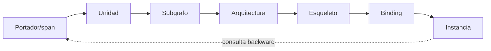

# TRACE_GRAPH

**Capacidad:** `TRACE` · **Versión:** 0.1.0 · **Transversal crítica**

## Responsabilidad

Mantener derivación reversible entre portador, unidades, campo, cortes, subgrafos, arquitecturas, esqueletos, candidatos, bindings, instancia, validadores y resultado.

## Enlaces

`derived_from`, `supports`, `contradicts`, `abstracts`, `binds`, `realizes`, `validates`, `supersedes`, `decided_by`, `generated_by`. Cada evento registra actor, tiempo, operación, input/output refs, spans, hashes y cambio de resolución.

Trace no sustituye `EPISTEMIC_LEDGER`: el primero dice de dónde/mediante qué deriva; el segundo qué clase de conocimiento y autoridad posee. Aceptación: consultas fuente→resultado y resultado→fuente/decisión completas para claims fuertes. `BROKEN_TRACE` bloquea promoción y puede bloquear resultado si afecta evidencia crítica.

## Instrucciones de ejecución

1. crea un nodo por portador, unidad, artefacto, claim, decisión, prueba y resultado;
2. asigna edge de procedencia en el momento de producir el objeto;
3. registra componente/versión/operación y no sólo archivo final;
4. prueba consultas forward y backward después de cada fase;
5. conserva supersesión sin borrar el nodo anterior;
6. serializa la vista conforme a [MRRE-SCHEMA-TRACE](../../02_contratos_y_schemas/epistemic_trace.schema.yaml).

La estructura de eventos adapta [SRC-MCCR-RUNLOG](../../../MOTOR_DE_CONFIGURACION_COGNITIVA_EN_RUNTIME/03_contratos/06_trazabilidad_observabilidad_y_run_log.md). [CASE-MRRE-COLLAR § A10](../../09_casos_y_ejemplos/caso_del_collar/DOSSIER_OPERATIVO.md#a10-proceso-trazabilidad-y-dictamen) muestra fuente→proceso→componente→artefacto→dictamen.
