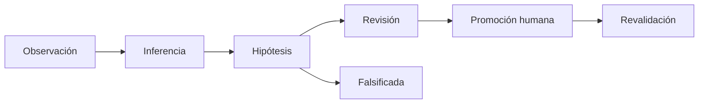

# EPISTEMIC_LEDGER

**Capacidad:** `EPISTEMIC_LEDGER` · **Versión:** 0.1.0 · **Transversal crítica**

## Responsabilidad

Registrar clase epistémica, evidencia, regla inferencial, confianza/calibración, alternativas, autoridad, versión, conflicto, promoción y supersesión.

| Clase | Requisito | Prohibición |
|---|---|---|
| observation | locator al portador | normalización como original |
| source assertion | source ref y vigencia | fuente como verdad |
| synthesis | componentes y regla | fusión opaca |
| inference | premisas y regla | serializar como observación |
| hypothesis | falsadores/alternativas | intención real |
| human decision | actor y gate | autoridad inferida |
| run result | run/plan/validación | canon automático |
| promoted knowledge | decisión de promoción | autopromoción |



Confidence nunca cambia la clase. Un output permanece `RUN_RESULT` aunque pase tests; promoción requiere gate independiente. Aceptación: ninguna hipótesis se serializa como observación y toda supersesión conserva la versión previa.

## Instrucciones de ejecución

Para cada claim registra proposición, clase, source refs, regla de derivación, alcance, alternativas, confidence method, falsadores y autoridad. Si no existe calibración, usa clases cualitativas de [MRRE-AGENT-MANUAL § Política de confianza](../../01_kernel_estable/09_manual_de_operacion_para_agentes.md#6-política-de-confianza).

```yaml
claim_id: CL-...
epistemic_status: STRUCTURAL_INFERENCE
source_refs: [OBS-01, SRC-02]
derivation_rule: "edge composition under context K"
alternatives: [HYP-02]
falsifiers: []
promotion_status: NOT_REQUESTED
```

La autoridad y los gates proceden de [SRC-MCCR-AUTH](../../../MOTOR_DE_CONFIGURACION_COGNITIVA_EN_RUNTIME/03_contratos/07_autoridad_permisos_validadores_y_gates.md) (`ADOPTADO`). La tabla de estatus aplicada puede verse en [CASE-MRRE-MULTIMODAL](../../09_casos_y_ejemplos/triangulacion_multimodal/DOSSIER_OPERATIVO.md), donde observación, source assertion e identity hypothesis no se fusionan.
