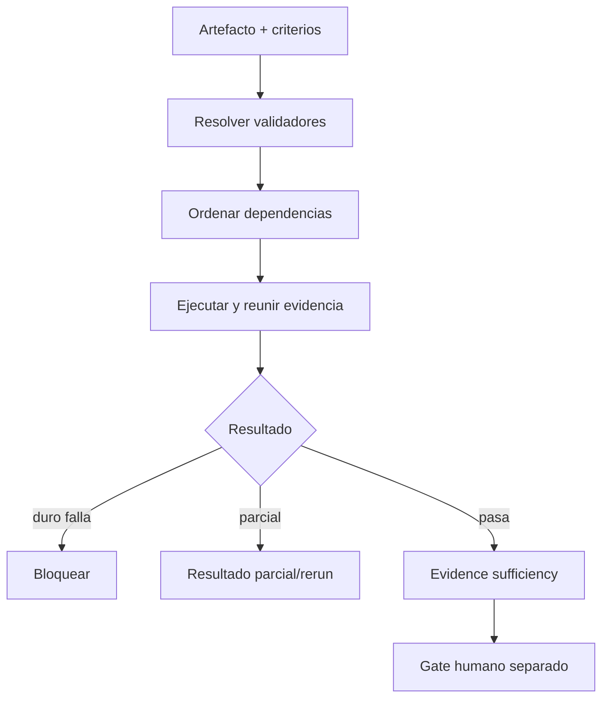

# VALIDATION_ORCHESTRATOR

**Capacidad:** `VALIDATE` · **Versión:** 0.1.0 · **Transversal crítica**

## Responsabilidad

Seleccionar validadores por artefacto/capa, ordenar dependencias, consolidar evidencia, bloquear invalidaciones y separar tres decisiones: prueba pasada, evidencia suficiente y autorización de promoción.

## Registro mínimo

Cada validator declara ID, versión, inputs, dependencia, severidad, regla/fórmula, tolerancia, evidence refs, falso positivo conocido, rerun trigger y acción. Los anillos cubren schema, componente, integración, especialización, epistemología, consumidor, adversarial y regression.

Los fallos no se promedian. Un invariante crítico roto domina métricas agregadas. Aceptación: el reporte distingue `verification_status`, `purpose_validation_status`, `evidence_sufficient` y `authorized_for_promotion`; este último es falso por defecto.

## Instrucciones de ejecución

1. deriva validadores desde tipo de artefacto, invariantes y propósito;
2. ordena schema → componente → integración → epistemología → propósito → adversarial;
3. ejecuta pruebas positivas, negativas, remoción y reingreso;
4. registra evidencia y falsos positivos conocidos;
5. detén agregación si falla un invariante crítico;
6. separa `PASS_TEST`, `EVIDENCE_SUFFICIENT` y `AUTHORIZED`;
7. emite triggers de rerun y alcance del dictamen.

El plan está en [MRRE-VAL-PLAN](../../08_validacion_y_pruebas/01_plan_de_verificacion_y_validacion.md) y la lógica de V&V se adapta de [SRC-KI-11](../../../../../04_conocimiento_y_contexto/memoria_conceptual/incubacion-conceptual/ingenieria/kernel-de-ingenieria-1-1.txt). [CASE-MRRE-VACUUM § A5](../../09_casos_y_ejemplos/aspiradora/DOSSIER_OPERATIVO.md#a5-chain-principal-y-pruebas) ofrece pruebas de remoción concretas; [CASE-MRRE-BRIDGE](../../09_casos_y_ejemplos/puente_del_valle/DOSSIER_OPERATIVO.md) muestra que un bloqueo esperado puede pasar su prueba de seguridad.
