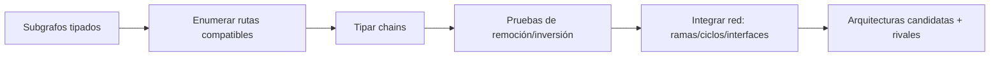

# CHAIN_ARCHITECTURE_ASSEMBLER

**Capacidad:** `CHAIN_DETECT` · **Versión:** `0.2.0` · **Responsabilidad:** convertir subgrafos locales en rutas probadas y arquitecturas candidatas sin reducir toda red a secuencia.

## Contrato

Recibe `RECONSTRUCTED_SUBGRAPH_SET`, campo/cortes y criterios del caso. Produce `CHAIN_SET` y `CANDIDATE_ARCHITECTURE_SET` conformes a [MRRE-SCHEMA-CHAIN-ARCH](../../02_contratos_y_schemas/chain_and_candidate_architecture.schema.yaml).

## Procedimiento

1. valida IDs, edges, tiempo, contexto y source bindings de entrada;
2. selecciona posibles estados/nodos de entrada y salida según propósito;
3. enumera rutas dirigidas compatibles, sin eliminar ramas ni ciclos;
4. clasifica cada ruta como causal, enabling, transductive, argumentative, identity, temporal, narrative, control o mixed;
5. registra condiciones necesarias/suficientes sin confundirlas;
6. ejecuta remoción, inversión, sustitución o retraso de edges/nodos críticos;
7. clasifica elementos `CRITICAL/SUPPORTING/REDUNDANT/SPURIOUS/UNDETERMINED`;
8. integra chains compatibles por interfaces y topología;
9. genera al menos una candidata rival material o justifica por qué no existe;
10. añade predicciones, falsadores, huecos, alternativas y trace.

## Reglas

- orden textual no basta para crear un chain;
- un chain causal exige más soporte que uno temporal o narrativo;
- una bifurcación no se aplana para facilitar prosa;
- paths con contextos incompatibles no se unen;
- una arquitectura se mantiene candidata aunque todas sus chains locales pasen;
- un score agregado no compensa un edge crítico falsificado.

## Ejemplos

- [CASE-MRRE-VACUUM](../../09_casos_y_ejemplos/aspiradora/DOSSIER_OPERATIVO.md): ruta mediada y mutaciones.
- [CASE-MRRE-COLLAR](../../09_casos_y_ejemplos/caso_del_collar/DOSSIER_OPERATIVO.md): cascada MTC con gate de verificación.
- [CASE-MRRE-MULTIMODAL](../../09_casos_y_ejemplos/triangulacion_multimodal/DOSSIER_OPERATIVO.md): paths por feature y claim-evaluation.

El algoritmo normativo es [MRRE-WORKBOOK-D](../../03_protocolos_operacionales/07_libro_de_trabajo_y_algoritmos.md#algoritmo-d-detección-y-prueba-de-chains). El contraste entre cadena rígida y red distribuida se usa como ejemplo desde [SRC-MRRE-READING](../../90_historial/antecedentes/lectura.md), no como taxonomía universal.

## Fallos y aceptación

Fallos: `NO_PATH_WITH_EVIDENCE`, `UNSUPPORTED_CHAIN_TYPE`, `CONTEXT_INCOMPATIBLE`, `SPURIOUS_SEQUENCE`, `NO_MATERIAL_ALTERNATIVE`, `CRITICAL_EDGE_FALSIFIED`. Se acepta cuando cada chain tiene edges/evidencia/condiciones/prueba y cada arquitectura conserva topology, rival, falsadores y source trace.
