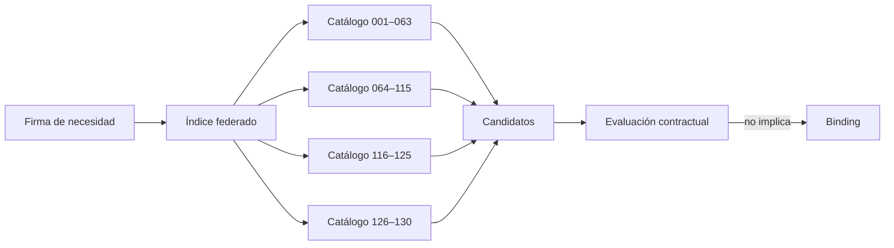

# Índice federado de patrones MRRE

**Versión:** 0.2.0  
**Cobertura:** `PAT-COG-001…130`  
**Regla:** este índice declara usos; las definiciones, invariantes y estados permanecen en su catálogo de origen.

## Catálogos federados

| Código | Catálogo | Cobertura |
|---|---|---|
| `CAT-CS-01` | `CONSCIENCIA_Y_SOBERANIA/CATALOGO_PATRONES_DE_DISENO_COGNITIVO_REUTILIZABLES_v0_1_0.md` | 001–063 |
| `CAT-MRRE-02` | `05_acervo_estructural/CATALOGO_COMPLEMENTARIO_DE_PATRONES_DE_DISENO_COGNITIVO_REUTILIZABLES_v0_2_0.md` | 064–115 |
| `CAT-MRRE-03` | `05_acervo_estructural/CATALOGO_DE_PATRONES_DE_DISENO_COGNITIVO_REUTILIZABLES_EXTENSION_v0_3_0.md` | 116–125 |
| `CAT-ASIOO-04` | `ARQUITECTURA DE SISTEMAS INTEGRADOS ORIENTADOS A OBJETIVOS/CATALOGO_DE_PATRONES_DE_DISENO_COGNITIVO_REUTILIZABLES_EXTENSION_v0_4_0.md` | 126–130 |

## Índices de recuperación

| Vista | Patrones prioritarios |
|---|---|
| fuentes/portador | 001–009, 028–029, 104 |
| redes, subgrafos, campo y cortes | 010–029, 070–075, 084–085, 093, 095 |
| gobierno y autoridad | 030–039, 106, 108, 115, 124–125 |
| aprendizaje, feedback y adaptación | 040–046, 051, 082, 094, 114 |
| generación, estado y sistemas | 047–063, 116–123, 127–130 |
| inducción y abstracción | 064–073, 080–081, 101 |
| reinstanciación | 076–086, 103–105 |
| configuración/runtime | 087–103, 118, 126, 129–130 |
| scaffolding/materialización | 109–115 |
| texto | 011–017, 026–029, 069–073, 084–085, 095 |
| multimodal | 002–005, 015–016, 024, 071–072, 090, 092, 095, 107 |
| riesgo causal/epistémico | 005–006, 036–043, 073, 080, 093, 097, 102–103, 108, 120 |

## Registro exhaustivo

| ID | Intención/nombre | Catálogo y ruta exacta | Firma | Uso MRRE | Contexto, estado y riesgo |
|---|---|---|---|---|---|
| `PAT-COG-001` | SEPARACIÓN FUENTE / MATERIAL / MEDIACIÓN / RECEPCIÓN | [`CAT-CS-01`](../../../../01_nucleo_cognitivo/teoria_tmc/CONSCIENCIA_Y_SOBERANIA/CATALOGO_PATRONES_DE_DISENO_COGNITIVO_REUTILIZABLES_v0_1_0.md) | firma/contratos de la definición original | selección, reconstrucción, reinstanciación o V&V según familia | conservar no-equivalencias y estado original |
| `PAT-COG-002` | CONVERGENCIA DE FUENTES HETEROGÉNEAS | [`CAT-CS-01`](../../../../01_nucleo_cognitivo/teoria_tmc/CONSCIENCIA_Y_SOBERANIA/CATALOGO_PATRONES_DE_DISENO_COGNITIVO_REUTILIZABLES_v0_1_0.md) | firma/contratos de la definición original | selección, reconstrucción, reinstanciación o V&V según familia | conservar no-equivalencias y estado original |
| `PAT-COG-003` | MATERIAL DE ORDEN 1 / MATERIAL DE ORDEN 2 | [`CAT-CS-01`](../../../../01_nucleo_cognitivo/teoria_tmc/CONSCIENCIA_Y_SOBERANIA/CATALOGO_PATRONES_DE_DISENO_COGNITIVO_REUTILIZABLES_v0_1_0.md) | firma/contratos de la definición original | selección, reconstrucción, reinstanciación o V&V según familia | conservar no-equivalencias y estado original |
| `PAT-COG-004` | FUENTE MIXTA | [`CAT-CS-01`](../../../../01_nucleo_cognitivo/teoria_tmc/CONSCIENCIA_Y_SOBERANIA/CATALOGO_PATRONES_DE_DISENO_COGNITIVO_REUTILIZABLES_v0_1_0.md) | firma/contratos de la definición original | selección, reconstrucción, reinstanciación o V&V según familia | conservar no-equivalencias y estado original |
| `PAT-COG-005` | DISTANCIA DE OBSERVABILIDAD | [`CAT-CS-01`](../../../../01_nucleo_cognitivo/teoria_tmc/CONSCIENCIA_Y_SOBERANIA/CATALOGO_PATRONES_DE_DISENO_COGNITIVO_REUTILIZABLES_v0_1_0.md) | firma/contratos de la definición original | selección, reconstrucción, reinstanciación o V&V según familia | conservar no-equivalencias y estado original |
| `PAT-COG-006` | VALIDACIÓN ANTES DE INTEGRACIÓN | [`CAT-CS-01`](../../../../01_nucleo_cognitivo/teoria_tmc/CONSCIENCIA_Y_SOBERANIA/CATALOGO_PATRONES_DE_DISENO_COGNITIVO_REUTILIZABLES_v0_1_0.md) | firma/contratos de la definición original | selección, reconstrucción, reinstanciación o V&V según familia | conservar no-equivalencias y estado original |
| `PAT-COG-007` | DISTRIBUCIÓN SELECTIVA DE INFORMACIÓN | [`CAT-CS-01`](../../../../01_nucleo_cognitivo/teoria_tmc/CONSCIENCIA_Y_SOBERANIA/CATALOGO_PATRONES_DE_DISENO_COGNITIVO_REUTILIZABLES_v0_1_0.md) | firma/contratos de la definición original | selección, reconstrucción, reinstanciación o V&V según familia | conservar no-equivalencias y estado original |
| `PAT-COG-008` | FUENTES COMPETIDORAS DE INTERPRETACIÓN | [`CAT-CS-01`](../../../../01_nucleo_cognitivo/teoria_tmc/CONSCIENCIA_Y_SOBERANIA/CATALOGO_PATRONES_DE_DISENO_COGNITIVO_REUTILIZABLES_v0_1_0.md) | firma/contratos de la definición original | selección, reconstrucción, reinstanciación o V&V según familia | conservar no-equivalencias y estado original |
| `PAT-COG-009` | FUENTE DE REALIDAD | [`CAT-CS-01`](../../../../01_nucleo_cognitivo/teoria_tmc/CONSCIENCIA_Y_SOBERANIA/CATALOGO_PATRONES_DE_DISENO_COGNITIVO_REUTILIZABLES_v0_1_0.md) | firma/contratos de la definición original | selección, reconstrucción, reinstanciación o V&V según familia | conservar no-equivalencias y estado original |
| `PAT-COG-010` | CONVERGENCIA ASOCIATIVA MULTICANAL | [`CAT-CS-01`](../../../../01_nucleo_cognitivo/teoria_tmc/CONSCIENCIA_Y_SOBERANIA/CATALOGO_PATRONES_DE_DISENO_COGNITIVO_REUTILIZABLES_v0_1_0.md) | firma/contratos de la definición original | selección, reconstrucción, reinstanciación o V&V según familia | conservar no-equivalencias y estado original |
| `PAT-COG-011` | NODO CENTRAL + SUBGRAFO SATÉLITE | [`CAT-CS-01`](../../../../01_nucleo_cognitivo/teoria_tmc/CONSCIENCIA_Y_SOBERANIA/CATALOGO_PATRONES_DE_DISENO_COGNITIVO_REUTILIZABLES_v0_1_0.md) | firma/contratos de la definición original | selección, reconstrucción, reinstanciación o V&V según familia | conservar no-equivalencias y estado original |
| `PAT-COG-012` | SUBGRAFO COMO UNIDAD DE EFECTO | [`CAT-CS-01`](../../../../01_nucleo_cognitivo/teoria_tmc/CONSCIENCIA_Y_SOBERANIA/CATALOGO_PATRONES_DE_DISENO_COGNITIVO_REUTILIZABLES_v0_1_0.md) | firma/contratos de la definición original | selección, reconstrucción, reinstanciación o V&V según familia | conservar no-equivalencias y estado original |
| `PAT-COG-013` | CHAIN COMO TRAYECTORIA DERIVADA DE RED | [`CAT-CS-01`](../../../../01_nucleo_cognitivo/teoria_tmc/CONSCIENCIA_Y_SOBERANIA/CATALOGO_PATRONES_DE_DISENO_COGNITIVO_REUTILIZABLES_v0_1_0.md) | firma/contratos de la definición original | selección, reconstrucción, reinstanciación o V&V según familia | conservar no-equivalencias y estado original |
| `PAT-COG-014` | CAPACIDAD REUTILIZABLE COMO NODO COMPUESTO | [`CAT-CS-01`](../../../../01_nucleo_cognitivo/teoria_tmc/CONSCIENCIA_Y_SOBERANIA/CATALOGO_PATRONES_DE_DISENO_COGNITIVO_REUTILIZABLES_v0_1_0.md) | firma/contratos de la definición original | selección, reconstrucción, reinstanciación o V&V según familia | conservar no-equivalencias y estado original |
| `PAT-COG-015` | MANIFESTACIÓN COMO CORTE DE UN GRAFO MAYOR | [`CAT-CS-01`](../../../../01_nucleo_cognitivo/teoria_tmc/CONSCIENCIA_Y_SOBERANIA/CATALOGO_PATRONES_DE_DISENO_COGNITIVO_REUTILIZABLES_v0_1_0.md) | firma/contratos de la definición original | selección, reconstrucción, reinstanciación o V&V según familia | conservar no-equivalencias y estado original |
| `PAT-COG-016` | TRIPLE RED: PROYECTADA / REALIZADA / ACTIVADA | [`CAT-CS-01`](../../../../01_nucleo_cognitivo/teoria_tmc/CONSCIENCIA_Y_SOBERANIA/CATALOGO_PATRONES_DE_DISENO_COGNITIVO_REUTILIZABLES_v0_1_0.md) | firma/contratos de la definición original | selección, reconstrucción, reinstanciación o V&V según familia | conservar no-equivalencias y estado original |
| `PAT-COG-017` | RED DE EFECTOS COGNITIVOS | [`CAT-CS-01`](../../../../01_nucleo_cognitivo/teoria_tmc/CONSCIENCIA_Y_SOBERANIA/CATALOGO_PATRONES_DE_DISENO_COGNITIVO_REUTILIZABLES_v0_1_0.md) | firma/contratos de la definición original | selección, reconstrucción, reinstanciación o V&V según familia | conservar no-equivalencias y estado original |
| `PAT-COG-018` | RED DE EFECTOS CON GOBIERNO REFLEXIVO | [`CAT-CS-01`](../../../../01_nucleo_cognitivo/teoria_tmc/CONSCIENCIA_Y_SOBERANIA/CATALOGO_PATRONES_DE_DISENO_COGNITIVO_REUTILIZABLES_v0_1_0.md) | firma/contratos de la definición original | selección, reconstrucción, reinstanciación o V&V según familia | conservar no-equivalencias y estado original |
| `PAT-COG-019` | RECEPTOR QUE SE CONVIERTE EN FUENTE | [`CAT-CS-01`](../../../../01_nucleo_cognitivo/teoria_tmc/CONSCIENCIA_Y_SOBERANIA/CATALOGO_PATRONES_DE_DISENO_COGNITIVO_REUTILIZABLES_v0_1_0.md) | firma/contratos de la definición original | selección, reconstrucción, reinstanciación o V&V según familia | conservar no-equivalencias y estado original |
| `PAT-COG-020` | RECONFIGURACIÓN DE GRAFO COMO OPERACIÓN | [`CAT-CS-01`](../../../../01_nucleo_cognitivo/teoria_tmc/CONSCIENCIA_Y_SOBERANIA/CATALOGO_PATRONES_DE_DISENO_COGNITIVO_REUTILIZABLES_v0_1_0.md) | firma/contratos de la definición original | selección, reconstrucción, reinstanciación o V&V según familia | conservar no-equivalencias y estado original |
| `PAT-COG-021` | CAMBIO DE FUENTE DOMINANTE | [`CAT-CS-01`](../../../../01_nucleo_cognitivo/teoria_tmc/CONSCIENCIA_Y_SOBERANIA/CATALOGO_PATRONES_DE_DISENO_COGNITIVO_REUTILIZABLES_v0_1_0.md) | firma/contratos de la definición original | selección, reconstrucción, reinstanciación o V&V según familia | conservar no-equivalencias y estado original |
| `PAT-COG-022` | AUTOSIMILITUD ESTRUCTURAL MULTIESCALA | [`CAT-CS-01`](../../../../01_nucleo_cognitivo/teoria_tmc/CONSCIENCIA_Y_SOBERANIA/CATALOGO_PATRONES_DE_DISENO_COGNITIVO_REUTILIZABLES_v0_1_0.md) | firma/contratos de la definición original | selección, reconstrucción, reinstanciación o V&V según familia | conservar no-equivalencias y estado original |
| `PAT-COG-023` | GRAFOS ACOPLADOS POR ESCALA | [`CAT-CS-01`](../../../../01_nucleo_cognitivo/teoria_tmc/CONSCIENCIA_Y_SOBERANIA/CATALOGO_PATRONES_DE_DISENO_COGNITIVO_REUTILIZABLES_v0_1_0.md) | firma/contratos de la definición original | selección, reconstrucción, reinstanciación o V&V según familia | conservar no-equivalencias y estado original |
| `PAT-COG-024` | CAMPO → CORTE → PROYECCIÓN → MANIFESTACIÓN | [`CAT-CS-01`](../../../../01_nucleo_cognitivo/teoria_tmc/CONSCIENCIA_Y_SOBERANIA/CATALOGO_PATRONES_DE_DISENO_COGNITIVO_REUTILIZABLES_v0_1_0.md) | firma/contratos de la definición original | selección, reconstrucción, reinstanciación o V&V según familia | conservar no-equivalencias y estado original |
| `PAT-COG-025` | RESULTADO ESPERADO COMO SELECTOR DE SUBGRAFO | [`CAT-CS-01`](../../../../01_nucleo_cognitivo/teoria_tmc/CONSCIENCIA_Y_SOBERANIA/CATALOGO_PATRONES_DE_DISENO_COGNITIVO_REUTILIZABLES_v0_1_0.md) | firma/contratos de la definición original | selección, reconstrucción, reinstanciación o V&V según familia | conservar no-equivalencias y estado original |
| `PAT-COG-026` | RETROCONSTRUCCIÓN DESDE MANIFESTACIÓN | [`CAT-CS-01`](../../../../01_nucleo_cognitivo/teoria_tmc/CONSCIENCIA_Y_SOBERANIA/CATALOGO_PATRONES_DE_DISENO_COGNITIVO_REUTILIZABLES_v0_1_0.md) | firma/contratos de la definición original | selección, reconstrucción, reinstanciación o V&V según familia | conservar no-equivalencias y estado original |
| `PAT-COG-027` | ESTRUCTURA SEMÁNTICA ≠ REALIZACIÓN | [`CAT-CS-01`](../../../../01_nucleo_cognitivo/teoria_tmc/CONSCIENCIA_Y_SOBERANIA/CATALOGO_PATRONES_DE_DISENO_COGNITIVO_REUTILIZABLES_v0_1_0.md) | firma/contratos de la definición original | selección, reconstrucción, reinstanciación o V&V según familia | conservar no-equivalencias y estado original |
| `PAT-COG-028` | TRAZABILIDAD DE MANIFESTACIÓN | [`CAT-CS-01`](../../../../01_nucleo_cognitivo/teoria_tmc/CONSCIENCIA_Y_SOBERANIA/CATALOGO_PATRONES_DE_DISENO_COGNITIVO_REUTILIZABLES_v0_1_0.md) | firma/contratos de la definición original | selección, reconstrucción, reinstanciación o V&V según familia | conservar no-equivalencias y estado original |
| `PAT-COG-029` | MANIFESTACIÓN COMO INTERFAZ VISIBLE DE SISTEMA | [`CAT-CS-01`](../../../../01_nucleo_cognitivo/teoria_tmc/CONSCIENCIA_Y_SOBERANIA/CATALOGO_PATRONES_DE_DISENO_COGNITIVO_REUTILIZABLES_v0_1_0.md) | firma/contratos de la definición original | selección, reconstrucción, reinstanciación o V&V según familia | conservar no-equivalencias y estado original |
| `PAT-COG-030` | LOCUS DE GOBIERNO | [`CAT-CS-01`](../../../../01_nucleo_cognitivo/teoria_tmc/CONSCIENCIA_Y_SOBERANIA/CATALOGO_PATRONES_DE_DISENO_COGNITIVO_REUTILIZABLES_v0_1_0.md) | firma/contratos de la definición original | selección, reconstrucción, reinstanciación o V&V según familia | conservar no-equivalencias y estado original |
| `PAT-COG-031` | RESPONSABILIDAD ≠ EJECUCIÓN | [`CAT-CS-01`](../../../../01_nucleo_cognitivo/teoria_tmc/CONSCIENCIA_Y_SOBERANIA/CATALOGO_PATRONES_DE_DISENO_COGNITIVO_REUTILIZABLES_v0_1_0.md) | firma/contratos de la definición original | selección, reconstrucción, reinstanciación o V&V según familia | conservar no-equivalencias y estado original |
| `PAT-COG-032` | GOBIERNO SIN INTROSPECCIÓN TOTAL | [`CAT-CS-01`](../../../../01_nucleo_cognitivo/teoria_tmc/CONSCIENCIA_Y_SOBERANIA/CATALOGO_PATRONES_DE_DISENO_COGNITIVO_REUTILIZABLES_v0_1_0.md) | firma/contratos de la definición original | selección, reconstrucción, reinstanciación o V&V según familia | conservar no-equivalencias y estado original |
| `PAT-COG-033` | SOBERANÍA ≠ MICROMANAGEMENT | [`CAT-CS-01`](../../../../01_nucleo_cognitivo/teoria_tmc/CONSCIENCIA_Y_SOBERANIA/CATALOGO_PATRONES_DE_DISENO_COGNITIVO_REUTILIZABLES_v0_1_0.md) | firma/contratos de la definición original | selección, reconstrucción, reinstanciación o V&V según familia | conservar no-equivalencias y estado original |
| `PAT-COG-034` | AUTORIDAD ≠ CAPACIDAD | [`CAT-CS-01`](../../../../01_nucleo_cognitivo/teoria_tmc/CONSCIENCIA_Y_SOBERANIA/CATALOGO_PATRONES_DE_DISENO_COGNITIVO_REUTILIZABLES_v0_1_0.md) | firma/contratos de la definición original | selección, reconstrucción, reinstanciación o V&V según familia | conservar no-equivalencias y estado original |
| `PAT-COG-035` | OPACIDAD MICROGENERATIVA ≠ OPACIDAD DE GOBIERNO | [`CAT-CS-01`](../../../../01_nucleo_cognitivo/teoria_tmc/CONSCIENCIA_Y_SOBERANIA/CATALOGO_PATRONES_DE_DISENO_COGNITIVO_REUTILIZABLES_v0_1_0.md) | firma/contratos de la definición original | selección, reconstrucción, reinstanciación o V&V según familia | conservar no-equivalencias y estado original |
| `PAT-COG-036` | NODOS DE RESISTENCIA / VETO / VALIDACIÓN | [`CAT-CS-01`](../../../../01_nucleo_cognitivo/teoria_tmc/CONSCIENCIA_Y_SOBERANIA/CATALOGO_PATRONES_DE_DISENO_COGNITIVO_REUTILIZABLES_v0_1_0.md) | firma/contratos de la definición original | selección, reconstrucción, reinstanciación o V&V según familia | conservar no-equivalencias y estado original |
| `PAT-COG-037` | PROTECCIÓN TELEOLÓGICA | [`CAT-CS-01`](../../../../01_nucleo_cognitivo/teoria_tmc/CONSCIENCIA_Y_SOBERANIA/CATALOGO_PATRONES_DE_DISENO_COGNITIVO_REUTILIZABLES_v0_1_0.md) | firma/contratos de la definición original | selección, reconstrucción, reinstanciación o V&V según familia | conservar no-equivalencias y estado original |
| `PAT-COG-038` | TOPOLOGÍA SOBERANA | [`CAT-CS-01`](../../../../01_nucleo_cognitivo/teoria_tmc/CONSCIENCIA_Y_SOBERANIA/CATALOGO_PATRONES_DE_DISENO_COGNITIVO_REUTILIZABLES_v0_1_0.md) | firma/contratos de la definición original | selección, reconstrucción, reinstanciación o V&V según familia | conservar no-equivalencias y estado original |
| `PAT-COG-039` | SOBERANÍA SOBRE EL CIERRE COGNITIVO | [`CAT-CS-01`](../../../../01_nucleo_cognitivo/teoria_tmc/CONSCIENCIA_Y_SOBERANIA/CATALOGO_PATRONES_DE_DISENO_COGNITIVO_REUTILIZABLES_v0_1_0.md) | firma/contratos de la definición original | selección, reconstrucción, reinstanciación o V&V según familia | conservar no-equivalencias y estado original |
| `PAT-COG-040` | PERMEABILIDAD EPISTÉMICA REGULADA | [`CAT-CS-01`](../../../../01_nucleo_cognitivo/teoria_tmc/CONSCIENCIA_Y_SOBERANIA/CATALOGO_PATRONES_DE_DISENO_COGNITIVO_REUTILIZABLES_v0_1_0.md) | firma/contratos de la definición original | selección, reconstrucción, reinstanciación o V&V según familia | conservar no-equivalencias y estado original |
| `PAT-COG-041` | EXPERIENCIA COMO ACTUALIZACIÓN | [`CAT-CS-01`](../../../../01_nucleo_cognitivo/teoria_tmc/CONSCIENCIA_Y_SOBERANIA/CATALOGO_PATRONES_DE_DISENO_COGNITIVO_REUTILIZABLES_v0_1_0.md) | firma/contratos de la definición original | selección, reconstrucción, reinstanciación o V&V según familia | conservar no-equivalencias y estado original |
| `PAT-COG-042` | FEEDBACK ES EVIDENCIA, NO VERDAD | [`CAT-CS-01`](../../../../01_nucleo_cognitivo/teoria_tmc/CONSCIENCIA_Y_SOBERANIA/CATALOGO_PATRONES_DE_DISENO_COGNITIVO_REUTILIZABLES_v0_1_0.md) | firma/contratos de la definición original | selección, reconstrucción, reinstanciación o V&V según familia | conservar no-equivalencias y estado original |
| `PAT-COG-043` | PREMISA REVISABLE VS BUCLE AUTOCERRADO | [`CAT-CS-01`](../../../../01_nucleo_cognitivo/teoria_tmc/CONSCIENCIA_Y_SOBERANIA/CATALOGO_PATRONES_DE_DISENO_COGNITIVO_REUTILIZABLES_v0_1_0.md) | firma/contratos de la definición original | selección, reconstrucción, reinstanciación o V&V según familia | conservar no-equivalencias y estado original |
| `PAT-COG-044` | FÁBRICA DE ADAPTACIONES CONTEXTUALES | [`CAT-CS-01`](../../../../01_nucleo_cognitivo/teoria_tmc/CONSCIENCIA_Y_SOBERANIA/CATALOGO_PATRONES_DE_DISENO_COGNITIVO_REUTILIZABLES_v0_1_0.md) | firma/contratos de la definición original | selección, reconstrucción, reinstanciación o V&V según familia | conservar no-equivalencias y estado original |
| `PAT-COG-045` | ADAPTACIÓN SIN PÉRDIDA DE IDENTIDAD | [`CAT-CS-01`](../../../../01_nucleo_cognitivo/teoria_tmc/CONSCIENCIA_Y_SOBERANIA/CATALOGO_PATRONES_DE_DISENO_COGNITIVO_REUTILIZABLES_v0_1_0.md) | firma/contratos de la definición original | selección, reconstrucción, reinstanciación o V&V según familia | conservar no-equivalencias y estado original |
| `PAT-COG-046` | RECOMPOSICIÓN FUNCIONAL | [`CAT-CS-01`](../../../../01_nucleo_cognitivo/teoria_tmc/CONSCIENCIA_Y_SOBERANIA/CATALOGO_PATRONES_DE_DISENO_COGNITIVO_REUTILIZABLES_v0_1_0.md) | firma/contratos de la definición original | selección, reconstrucción, reinstanciación o V&V según familia | conservar no-equivalencias y estado original |
| `PAT-COG-047` | HEURÍSTICA GOBERNADA | [`CAT-CS-01`](../../../../01_nucleo_cognitivo/teoria_tmc/CONSCIENCIA_Y_SOBERANIA/CATALOGO_PATRONES_DE_DISENO_COGNITIVO_REUTILIZABLES_v0_1_0.md) | firma/contratos de la definición original | selección, reconstrucción, reinstanciación o V&V según familia | conservar no-equivalencias y estado original |
| `PAT-COG-048` | GENERACIÓN ESTRUCTURALMENTE GUIADA | [`CAT-CS-01`](../../../../01_nucleo_cognitivo/teoria_tmc/CONSCIENCIA_Y_SOBERANIA/CATALOGO_PATRONES_DE_DISENO_COGNITIVO_REUTILIZABLES_v0_1_0.md) | firma/contratos de la definición original | selección, reconstrucción, reinstanciación o V&V según familia | conservar no-equivalencias y estado original |
| `PAT-COG-049` | ESTADO → CHAIN → ACCIÓN | [`CAT-CS-01`](../../../../01_nucleo_cognitivo/teoria_tmc/CONSCIENCIA_Y_SOBERANIA/CATALOGO_PATRONES_DE_DISENO_COGNITIVO_REUTILIZABLES_v0_1_0.md) | firma/contratos de la definición original | selección, reconstrucción, reinstanciación o V&V según familia | conservar no-equivalencias y estado original |
| `PAT-COG-050` | TRAYECTORIA DE ESTADOS | [`CAT-CS-01`](../../../../01_nucleo_cognitivo/teoria_tmc/CONSCIENCIA_Y_SOBERANIA/CATALOGO_PATRONES_DE_DISENO_COGNITIVO_REUTILIZABLES_v0_1_0.md) | firma/contratos de la definición original | selección, reconstrucción, reinstanciación o V&V según familia | conservar no-equivalencias y estado original |
| `PAT-COG-051` | INTEGRACIÓN ESTRUCTURAL ACUMULATIVA | [`CAT-CS-01`](../../../../01_nucleo_cognitivo/teoria_tmc/CONSCIENCIA_Y_SOBERANIA/CATALOGO_PATRONES_DE_DISENO_COGNITIVO_REUTILIZABLES_v0_1_0.md) | firma/contratos de la definición original | selección, reconstrucción, reinstanciación o V&V según familia | conservar no-equivalencias y estado original |
| `PAT-COG-052` | HECHO → SIGNIFICADO → REALIDAD OPERATIVA | [`CAT-CS-01`](../../../../01_nucleo_cognitivo/teoria_tmc/CONSCIENCIA_Y_SOBERANIA/CATALOGO_PATRONES_DE_DISENO_COGNITIVO_REUTILIZABLES_v0_1_0.md) | firma/contratos de la definición original | selección, reconstrucción, reinstanciación o V&V según familia | conservar no-equivalencias y estado original |
| `PAT-COG-053` | APROVISIONAMIENTO COGNITIVO | [`CAT-CS-01`](../../../../01_nucleo_cognitivo/teoria_tmc/CONSCIENCIA_Y_SOBERANIA/CATALOGO_PATRONES_DE_DISENO_COGNITIVO_REUTILIZABLES_v0_1_0.md) | firma/contratos de la definición original | selección, reconstrucción, reinstanciación o V&V según familia | conservar no-equivalencias y estado original |
| `PAT-COG-054` | APROVISIONAMIENTO CON GOBIERNO REFLEXIVO | [`CAT-CS-01`](../../../../01_nucleo_cognitivo/teoria_tmc/CONSCIENCIA_Y_SOBERANIA/CATALOGO_PATRONES_DE_DISENO_COGNITIVO_REUTILIZABLES_v0_1_0.md) | firma/contratos de la definición original | selección, reconstrucción, reinstanciación o V&V según familia | conservar no-equivalencias y estado original |
| `PAT-COG-055` | ORQUESTADOR DE MATERIAL COGNITIVO | [`CAT-CS-01`](../../../../01_nucleo_cognitivo/teoria_tmc/CONSCIENCIA_Y_SOBERANIA/CATALOGO_PATRONES_DE_DISENO_COGNITIVO_REUTILIZABLES_v0_1_0.md) | firma/contratos de la definición original | selección, reconstrucción, reinstanciación o V&V según familia | conservar no-equivalencias y estado original |
| `PAT-COG-056` | DESCOMPOSICIÓN FUNCIONAL POR ESCALA | [`CAT-CS-01`](../../../../01_nucleo_cognitivo/teoria_tmc/CONSCIENCIA_Y_SOBERANIA/CATALOGO_PATRONES_DE_DISENO_COGNITIVO_REUTILIZABLES_v0_1_0.md) | firma/contratos de la definición original | selección, reconstrucción, reinstanciación o V&V según familia | conservar no-equivalencias y estado original |
| `PAT-COG-057` | SISTEMA DE EFECTOS MULTICAPA | [`CAT-CS-01`](../../../../01_nucleo_cognitivo/teoria_tmc/CONSCIENCIA_Y_SOBERANIA/CATALOGO_PATRONES_DE_DISENO_COGNITIVO_REUTILIZABLES_v0_1_0.md) | firma/contratos de la definición original | selección, reconstrucción, reinstanciación o V&V según familia | conservar no-equivalencias y estado original |
| `PAT-COG-058` | NECESIDAD DE SENTIDO COMO DEMANDA DEL SISTEMA | [`CAT-CS-01`](../../../../01_nucleo_cognitivo/teoria_tmc/CONSCIENCIA_Y_SOBERANIA/CATALOGO_PATRONES_DE_DISENO_COGNITIVO_REUTILIZABLES_v0_1_0.md) | firma/contratos de la definición original | selección, reconstrucción, reinstanciación o V&V según familia | conservar no-equivalencias y estado original |
| `PAT-COG-059` | INTERVENCIÓN FUNCIONAL-ESTRUCTURAL | [`CAT-CS-01`](../../../../01_nucleo_cognitivo/teoria_tmc/CONSCIENCIA_Y_SOBERANIA/CATALOGO_PATRONES_DE_DISENO_COGNITIVO_REUTILIZABLES_v0_1_0.md) | firma/contratos de la definición original | selección, reconstrucción, reinstanciación o V&V según familia | conservar no-equivalencias y estado original |
| `PAT-COG-060` | MISMA LÓGICA / DISTINTO SISTEMA OBJETIVO | [`CAT-CS-01`](../../../../01_nucleo_cognitivo/teoria_tmc/CONSCIENCIA_Y_SOBERANIA/CATALOGO_PATRONES_DE_DISENO_COGNITIVO_REUTILIZABLES_v0_1_0.md) | firma/contratos de la definición original | selección, reconstrucción, reinstanciación o V&V según familia | conservar no-equivalencias y estado original |
| `PAT-COG-061` | REPRESENTACIÓN OPERABLE COMO CUELLO DE BOTELLA | [`CAT-CS-01`](../../../../01_nucleo_cognitivo/teoria_tmc/CONSCIENCIA_Y_SOBERANIA/CATALOGO_PATRONES_DE_DISENO_COGNITIVO_REUTILIZABLES_v0_1_0.md) | firma/contratos de la definición original | selección, reconstrucción, reinstanciación o V&V según familia | conservar no-equivalencias y estado original |
| `PAT-COG-062` | GOBIERNO MACRO + EJECUCIÓN DISTRIBUIDA | [`CAT-CS-01`](../../../../01_nucleo_cognitivo/teoria_tmc/CONSCIENCIA_Y_SOBERANIA/CATALOGO_PATRONES_DE_DISENO_COGNITIVO_REUTILIZABLES_v0_1_0.md) | firma/contratos de la definición original | selección, reconstrucción, reinstanciación o V&V según familia | conservar no-equivalencias y estado original |
| `PAT-COG-063` | CICLO GENERAL DE SISTEMA ORIENTADO A OBJETIVOS | [`CAT-CS-01`](../../../../01_nucleo_cognitivo/teoria_tmc/CONSCIENCIA_Y_SOBERANIA/CATALOGO_PATRONES_DE_DISENO_COGNITIVO_REUTILIZABLES_v0_1_0.md) | firma/contratos de la definición original | selección, reconstrucción, reinstanciación o V&V según familia | conservar no-equivalencias y estado original |
| `PAT-COG-064` | APARATO ESTABLE / CONFIGURACIÓN DINÁMICA | [`CAT-MRRE-02`](../../../../01_nucleo_cognitivo/teoria_tmc/MOTOR_DE_RETROCONSTRUCCIÓN_Y_REINSTANCIACIÓN_ESTRUCTURAL/05_acervo_estructural/CATALOGO_COMPLEMENTARIO_DE_PATRONES_DE_DISENO_COGNITIVO_REUTILIZABLES_v0_2_0.md) | firma/contratos de la definición original | selección, reconstrucción, reinstanciación o V&V según familia | conservar no-equivalencias y estado original |
| `PAT-COG-065` | RETROCONSTRUCCIÓN EN DOS TRANSFORMACIONES | [`CAT-MRRE-02`](../../../../01_nucleo_cognitivo/teoria_tmc/MOTOR_DE_RETROCONSTRUCCIÓN_Y_REINSTANCIACIÓN_ESTRUCTURAL/05_acervo_estructural/CATALOGO_COMPLEMENTARIO_DE_PATRONES_DE_DISENO_COGNITIVO_REUTILIZABLES_v0_2_0.md) | firma/contratos de la definición original | selección, reconstrucción, reinstanciación o V&V según familia | conservar no-equivalencias y estado original |
| `PAT-COG-066` | INDUCCIÓN ANTES DE GENERACIÓN | [`CAT-MRRE-02`](../../../../01_nucleo_cognitivo/teoria_tmc/MOTOR_DE_RETROCONSTRUCCIÓN_Y_REINSTANCIACIÓN_ESTRUCTURAL/05_acervo_estructural/CATALOGO_COMPLEMENTARIO_DE_PATRONES_DE_DISENO_COGNITIVO_REUTILIZABLES_v0_2_0.md) | firma/contratos de la definición original | selección, reconstrucción, reinstanciación o V&V según familia | conservar no-equivalencias y estado original |
| `PAT-COG-067` | ESQUEMA INDUCIDO POR EJEMPLAR | [`CAT-MRRE-02`](../../../../01_nucleo_cognitivo/teoria_tmc/MOTOR_DE_RETROCONSTRUCCIÓN_Y_REINSTANCIACIÓN_ESTRUCTURAL/05_acervo_estructural/CATALOGO_COMPLEMENTARIO_DE_PATRONES_DE_DISENO_COGNITIVO_REUTILIZABLES_v0_2_0.md) | firma/contratos de la definición original | selección, reconstrucción, reinstanciación o V&V según familia | conservar no-equivalencias y estado original |
| `PAT-COG-068` | TIPOLOGÍA DE VARIABILIDAD ESTRUCTURAL | [`CAT-MRRE-02`](../../../../01_nucleo_cognitivo/teoria_tmc/MOTOR_DE_RETROCONSTRUCCIÓN_Y_REINSTANCIACIÓN_ESTRUCTURAL/05_acervo_estructural/CATALOGO_COMPLEMENTARIO_DE_PATRONES_DE_DISENO_COGNITIVO_REUTILIZABLES_v0_2_0.md) | firma/contratos de la definición original | selección, reconstrucción, reinstanciación o V&V según familia | conservar no-equivalencias y estado original |
| `PAT-COG-069` | CONTRATO MULTIDIMENSIONAL DE POSICIÓN VARIABLE | [`CAT-MRRE-02`](../../../../01_nucleo_cognitivo/teoria_tmc/MOTOR_DE_RETROCONSTRUCCIÓN_Y_REINSTANCIACIÓN_ESTRUCTURAL/05_acervo_estructural/CATALOGO_COMPLEMENTARIO_DE_PATRONES_DE_DISENO_COGNITIVO_REUTILIZABLES_v0_2_0.md) | firma/contratos de la definición original | selección, reconstrucción, reinstanciación o V&V según familia | conservar no-equivalencias y estado original |
| `PAT-COG-070` | FUNCIÓN RELACIONALMENTE SITUADA | [`CAT-MRRE-02`](../../../../01_nucleo_cognitivo/teoria_tmc/MOTOR_DE_RETROCONSTRUCCIÓN_Y_REINSTANCIACIÓN_ESTRUCTURAL/05_acervo_estructural/CATALOGO_COMPLEMENTARIO_DE_PATRONES_DE_DISENO_COGNITIVO_REUTILIZABLES_v0_2_0.md) | firma/contratos de la definición original | selección, reconstrucción, reinstanciación o V&V según familia | conservar no-equivalencias y estado original |
| `PAT-COG-071` | LINEARIZACIÓN Y DESLINEALIZACIÓN ESTRUCTURAL | [`CAT-MRRE-02`](../../../../01_nucleo_cognitivo/teoria_tmc/MOTOR_DE_RETROCONSTRUCCIÓN_Y_REINSTANCIACIÓN_ESTRUCTURAL/05_acervo_estructural/CATALOGO_COMPLEMENTARIO_DE_PATRONES_DE_DISENO_COGNITIVO_REUTILIZABLES_v0_2_0.md) | firma/contratos de la definición original | selección, reconstrucción, reinstanciación o V&V según familia | conservar no-equivalencias y estado original |
| `PAT-COG-072` | TRAZABILIDAD BIDIRECCIONAL MULTIESCALA | [`CAT-MRRE-02`](../../../../01_nucleo_cognitivo/teoria_tmc/MOTOR_DE_RETROCONSTRUCCIÓN_Y_REINSTANCIACIÓN_ESTRUCTURAL/05_acervo_estructural/CATALOGO_COMPLEMENTARIO_DE_PATRONES_DE_DISENO_COGNITIVO_REUTILIZABLES_v0_2_0.md) | firma/contratos de la definición original | selección, reconstrucción, reinstanciación o V&V según familia | conservar no-equivalencias y estado original |
| `PAT-COG-073` | GRADIENTE ABDUCTIVO DE CERTEZA | [`CAT-MRRE-02`](../../../../01_nucleo_cognitivo/teoria_tmc/MOTOR_DE_RETROCONSTRUCCIÓN_Y_REINSTANCIACIÓN_ESTRUCTURAL/05_acervo_estructural/CATALOGO_COMPLEMENTARIO_DE_PATRONES_DE_DISENO_COGNITIVO_REUTILIZABLES_v0_2_0.md) | firma/contratos de la definición original | selección, reconstrucción, reinstanciación o V&V según familia | conservar no-equivalencias y estado original |
| `PAT-COG-074` | CAMPO FOCAL Y FEDERACIÓN EXPLÍCITA | [`CAT-MRRE-02`](../../../../01_nucleo_cognitivo/teoria_tmc/MOTOR_DE_RETROCONSTRUCCIÓN_Y_REINSTANCIACIÓN_ESTRUCTURAL/05_acervo_estructural/CATALOGO_COMPLEMENTARIO_DE_PATRONES_DE_DISENO_COGNITIVO_REUTILIZABLES_v0_2_0.md) | firma/contratos de la definición original | selección, reconstrucción, reinstanciación o V&V según familia | conservar no-equivalencias y estado original |
| `PAT-COG-075` | CAMPO MULTIPLEXADO CON IDENTIDAD COMPARTIDA | [`CAT-MRRE-02`](../../../../01_nucleo_cognitivo/teoria_tmc/MOTOR_DE_RETROCONSTRUCCIÓN_Y_REINSTANCIACIÓN_ESTRUCTURAL/05_acervo_estructural/CATALOGO_COMPLEMENTARIO_DE_PATRONES_DE_DISENO_COGNITIVO_REUTILIZABLES_v0_2_0.md) | firma/contratos de la definición original | selección, reconstrucción, reinstanciación o V&V según familia | conservar no-equivalencias y estado original |
| `PAT-COG-076` | NAVEGACIÓN ESTRUCTURAL ANTES DE MATCHING | [`CAT-MRRE-02`](../../../../01_nucleo_cognitivo/teoria_tmc/MOTOR_DE_RETROCONSTRUCCIÓN_Y_REINSTANCIACIÓN_ESTRUCTURAL/05_acervo_estructural/CATALOGO_COMPLEMENTARIO_DE_PATRONES_DE_DISENO_COGNITIVO_REUTILIZABLES_v0_2_0.md) | firma/contratos de la definición original | selección, reconstrucción, reinstanciación o V&V según familia | conservar no-equivalencias y estado original |
| `PAT-COG-077` | RECUPERACIÓN, EQUIVALENCIA Y BINDING NO COLAPSABLES | [`CAT-MRRE-02`](../../../../01_nucleo_cognitivo/teoria_tmc/MOTOR_DE_RETROCONSTRUCCIÓN_Y_REINSTANCIACIÓN_ESTRUCTURAL/05_acervo_estructural/CATALOGO_COMPLEMENTARIO_DE_PATRONES_DE_DISENO_COGNITIVO_REUTILIZABLES_v0_2_0.md) | firma/contratos de la definición original | selección, reconstrucción, reinstanciación o V&V según familia | conservar no-equivalencias y estado original |
| `PAT-COG-078` | EQUIVALENCIA FUNCIONAL-RELACIONAL CONTRACTUAL | [`CAT-MRRE-02`](../../../../01_nucleo_cognitivo/teoria_tmc/MOTOR_DE_RETROCONSTRUCCIÓN_Y_REINSTANCIACIÓN_ESTRUCTURAL/05_acervo_estructural/CATALOGO_COMPLEMENTARIO_DE_PATRONES_DE_DISENO_COGNITIVO_REUTILIZABLES_v0_2_0.md) | firma/contratos de la definición original | selección, reconstrucción, reinstanciación o V&V según familia | conservar no-equivalencias y estado original |
| `PAT-COG-079` | POBLACIÓN RESPALDADA Y HUECO EXPLÍCITO | [`CAT-MRRE-02`](../../../../01_nucleo_cognitivo/teoria_tmc/MOTOR_DE_RETROCONSTRUCCIÓN_Y_REINSTANCIACIÓN_ESTRUCTURAL/05_acervo_estructural/CATALOGO_COMPLEMENTARIO_DE_PATRONES_DE_DISENO_COGNITIVO_REUTILIZABLES_v0_2_0.md) | firma/contratos de la definición original | selección, reconstrucción, reinstanciación o V&V según familia | conservar no-equivalencias y estado original |
| `PAT-COG-080` | ALTERNATIVAS SOBREVIVIENTES COMO RESULTADO | [`CAT-MRRE-02`](../../../../01_nucleo_cognitivo/teoria_tmc/MOTOR_DE_RETROCONSTRUCCIÓN_Y_REINSTANCIACIÓN_ESTRUCTURAL/05_acervo_estructural/CATALOGO_COMPLEMENTARIO_DE_PATRONES_DE_DISENO_COGNITIVO_REUTILIZABLES_v0_2_0.md) | firma/contratos de la definición original | selección, reconstrucción, reinstanciación o V&V según familia | conservar no-equivalencias y estado original |
| `PAT-COG-081` | DIFF DE PRESERVACIÓN ESTRUCTURAL | [`CAT-MRRE-02`](../../../../01_nucleo_cognitivo/teoria_tmc/MOTOR_DE_RETROCONSTRUCCIÓN_Y_REINSTANCIACIÓN_ESTRUCTURAL/05_acervo_estructural/CATALOGO_COMPLEMENTARIO_DE_PATRONES_DE_DISENO_COGNITIVO_REUTILIZABLES_v0_2_0.md) | firma/contratos de la definición original | selección, reconstrucción, reinstanciación o V&V según familia | conservar no-equivalencias y estado original |
| `PAT-COG-082` | VALIDACIÓN CIRCULAR POR REINGRESO | [`CAT-MRRE-02`](../../../../01_nucleo_cognitivo/teoria_tmc/MOTOR_DE_RETROCONSTRUCCIÓN_Y_REINSTANCIACIÓN_ESTRUCTURAL/05_acervo_estructural/CATALOGO_COMPLEMENTARIO_DE_PATRONES_DE_DISENO_COGNITIVO_REUTILIZABLES_v0_2_0.md) | firma/contratos de la definición original | selección, reconstrucción, reinstanciación o V&V según familia | conservar no-equivalencias y estado original |
| `PAT-COG-083` | SELECCIÓN IDENTITARIA SITUADA | [`CAT-MRRE-02`](../../../../01_nucleo_cognitivo/teoria_tmc/MOTOR_DE_RETROCONSTRUCCIÓN_Y_REINSTANCIACIÓN_ESTRUCTURAL/05_acervo_estructural/CATALOGO_COMPLEMENTARIO_DE_PATRONES_DE_DISENO_COGNITIVO_REUTILIZABLES_v0_2_0.md) | firma/contratos de la definición original | selección, reconstrucción, reinstanciación o V&V según familia | conservar no-equivalencias y estado original |
| `PAT-COG-084` | ALINEACIÓN DESCENDENTE Y ASCENDENTE DEL EFECTO | [`CAT-MRRE-02`](../../../../01_nucleo_cognitivo/teoria_tmc/MOTOR_DE_RETROCONSTRUCCIÓN_Y_REINSTANCIACIÓN_ESTRUCTURAL/05_acervo_estructural/CATALOGO_COMPLEMENTARIO_DE_PATRONES_DE_DISENO_COGNITIVO_REUTILIZABLES_v0_2_0.md) | firma/contratos de la definición original | selección, reconstrucción, reinstanciación o V&V según familia | conservar no-equivalencias y estado original |
| `PAT-COG-085` | COMPOSICIÓN MEDIANTE OPERADORES TIPADOS | [`CAT-MRRE-02`](../../../../01_nucleo_cognitivo/teoria_tmc/MOTOR_DE_RETROCONSTRUCCIÓN_Y_REINSTANCIACIÓN_ESTRUCTURAL/05_acervo_estructural/CATALOGO_COMPLEMENTARIO_DE_PATRONES_DE_DISENO_COGNITIVO_REUTILIZABLES_v0_2_0.md) | firma/contratos de la definición original | selección, reconstrucción, reinstanciación o V&V según familia | conservar no-equivalencias y estado original |
| `PAT-COG-086` | CONTRATOS FRONTERIZOS ENTRE CAPAS | [`CAT-MRRE-02`](../../../../01_nucleo_cognitivo/teoria_tmc/MOTOR_DE_RETROCONSTRUCCIÓN_Y_REINSTANCIACIÓN_ESTRUCTURAL/05_acervo_estructural/CATALOGO_COMPLEMENTARIO_DE_PATRONES_DE_DISENO_COGNITIVO_REUTILIZABLES_v0_2_0.md) | firma/contratos de la definición original | selección, reconstrucción, reinstanciación o V&V según familia | conservar no-equivalencias y estado original |
| `PAT-COG-087` | ESPACIO DE DECISIÓN ANTES DE CONFIGURACIÓN | [`CAT-MRRE-02`](../../../../01_nucleo_cognitivo/teoria_tmc/MOTOR_DE_RETROCONSTRUCCIÓN_Y_REINSTANCIACIÓN_ESTRUCTURAL/05_acervo_estructural/CATALOGO_COMPLEMENTARIO_DE_PATRONES_DE_DISENO_COGNITIVO_REUTILIZABLES_v0_2_0.md) | firma/contratos de la definición original | selección, reconstrucción, reinstanciación o V&V según familia | conservar no-equivalencias y estado original |
| `PAT-COG-088` | CONFIGURADOR TRANSVERSAL / EJECUTOR SEMÁNTICO | [`CAT-MRRE-02`](../../../../01_nucleo_cognitivo/teoria_tmc/MOTOR_DE_RETROCONSTRUCCIÓN_Y_REINSTANCIACIÓN_ESTRUCTURAL/05_acervo_estructural/CATALOGO_COMPLEMENTARIO_DE_PATRONES_DE_DISENO_COGNITIVO_REUTILIZABLES_v0_2_0.md) | firma/contratos de la definición original | selección, reconstrucción, reinstanciación o V&V según familia | conservar no-equivalencias y estado original |
| `PAT-COG-089` | NÚCLEO INDEPENDIENTE DEL CONSUMIDOR | [`CAT-MRRE-02`](../../../../01_nucleo_cognitivo/teoria_tmc/MOTOR_DE_RETROCONSTRUCCIÓN_Y_REINSTANCIACIÓN_ESTRUCTURAL/05_acervo_estructural/CATALOGO_COMPLEMENTARIO_DE_PATRONES_DE_DISENO_COGNITIVO_REUTILIZABLES_v0_2_0.md) | firma/contratos de la definición original | selección, reconstrucción, reinstanciación o V&V según familia | conservar no-equivalencias y estado original |
| `PAT-COG-090` | REGISTRO DE ADAPTADORES Y ROUTING POR MODALIDAD | [`CAT-MRRE-02`](../../../../01_nucleo_cognitivo/teoria_tmc/MOTOR_DE_RETROCONSTRUCCIÓN_Y_REINSTANCIACIÓN_ESTRUCTURAL/05_acervo_estructural/CATALOGO_COMPLEMENTARIO_DE_PATRONES_DE_DISENO_COGNITIVO_REUTILIZABLES_v0_2_0.md) | firma/contratos de la definición original | selección, reconstrucción, reinstanciación o V&V según familia | conservar no-equivalencias y estado original |
| `PAT-COG-091` | ESPECIALIZACIÓN POR RESTRICCIONES AÑADIDAS | [`CAT-MRRE-02`](../../../../01_nucleo_cognitivo/teoria_tmc/MOTOR_DE_RETROCONSTRUCCIÓN_Y_REINSTANCIACIÓN_ESTRUCTURAL/05_acervo_estructural/CATALOGO_COMPLEMENTARIO_DE_PATRONES_DE_DISENO_COGNITIVO_REUTILIZABLES_v0_2_0.md) | firma/contratos de la definición original | selección, reconstrucción, reinstanciación o V&V según familia | conservar no-equivalencias y estado original |
| `PAT-COG-092` | CONTEXTOS TIPADOS NO INTERCAMBIABLES | [`CAT-MRRE-02`](../../../../01_nucleo_cognitivo/teoria_tmc/MOTOR_DE_RETROCONSTRUCCIÓN_Y_REINSTANCIACIÓN_ESTRUCTURAL/05_acervo_estructural/CATALOGO_COMPLEMENTARIO_DE_PATRONES_DE_DISENO_COGNITIVO_REUTILIZABLES_v0_2_0.md) | firma/contratos de la definición original | selección, reconstrucción, reinstanciación o V&V según familia | conservar no-equivalencias y estado original |
| `PAT-COG-093` | VALIDACIÓN POR FRONTERAS CAUSALES | [`CAT-MRRE-02`](../../../../01_nucleo_cognitivo/teoria_tmc/MOTOR_DE_RETROCONSTRUCCIÓN_Y_REINSTANCIACIÓN_ESTRUCTURAL/05_acervo_estructural/CATALOGO_COMPLEMENTARIO_DE_PATRONES_DE_DISENO_COGNITIVO_REUTILIZABLES_v0_2_0.md) | firma/contratos de la definición original | selección, reconstrucción, reinstanciación o V&V según familia | conservar no-equivalencias y estado original |
| `PAT-COG-094` | ACTIVACIÓN, EVALUACIÓN E INTEGRACIÓN | [`CAT-MRRE-02`](../../../../01_nucleo_cognitivo/teoria_tmc/MOTOR_DE_RETROCONSTRUCCIÓN_Y_REINSTANCIACIÓN_ESTRUCTURAL/05_acervo_estructural/CATALOGO_COMPLEMENTARIO_DE_PATRONES_DE_DISENO_COGNITIVO_REUTILIZABLES_v0_2_0.md) | firma/contratos de la definición original | selección, reconstrucción, reinstanciación o V&V según familia | conservar no-equivalencias y estado original |
| `PAT-COG-095` | REPRESENTACIÓN DE RED MULTIRRESOLUCIÓN | [`CAT-MRRE-02`](../../../../01_nucleo_cognitivo/teoria_tmc/MOTOR_DE_RETROCONSTRUCCIÓN_Y_REINSTANCIACIÓN_ESTRUCTURAL/05_acervo_estructural/CATALOGO_COMPLEMENTARIO_DE_PATRONES_DE_DISENO_COGNITIVO_REUTILIZABLES_v0_2_0.md) | firma/contratos de la definición original | selección, reconstrucción, reinstanciación o V&V según familia | conservar no-equivalencias y estado original |
| `PAT-COG-096` | DE LISTA NOMINAL A PROTOCOLO OPERATIVO | [`CAT-MRRE-02`](../../../../01_nucleo_cognitivo/teoria_tmc/MOTOR_DE_RETROCONSTRUCCIÓN_Y_REINSTANCIACIÓN_ESTRUCTURAL/05_acervo_estructural/CATALOGO_COMPLEMENTARIO_DE_PATRONES_DE_DISENO_COGNITIVO_REUTILIZABLES_v0_2_0.md) | firma/contratos de la definición original | selección, reconstrucción, reinstanciación o V&V según familia | conservar no-equivalencias y estado original |
| `PAT-COG-097` | ESTADO PROTOCOLARIO | [`CAT-MRRE-02`](../../../../01_nucleo_cognitivo/teoria_tmc/MOTOR_DE_RETROCONSTRUCCIÓN_Y_REINSTANCIACIÓN_ESTRUCTURAL/05_acervo_estructural/CATALOGO_COMPLEMENTARIO_DE_PATRONES_DE_DISENO_COGNITIVO_REUTILIZABLES_v0_2_0.md) | firma/contratos de la definición original | selección, reconstrucción, reinstanciación o V&V según familia | conservar no-equivalencias y estado original |
| `PAT-COG-098` | CIERRE LÉXICO Y REFERENCIA RESPONSABLE | [`CAT-MRRE-02`](../../../../01_nucleo_cognitivo/teoria_tmc/MOTOR_DE_RETROCONSTRUCCIÓN_Y_REINSTANCIACIÓN_ESTRUCTURAL/05_acervo_estructural/CATALOGO_COMPLEMENTARIO_DE_PATRONES_DE_DISENO_COGNITIVO_REUTILIZABLES_v0_2_0.md) | firma/contratos de la definición original | selección, reconstrucción, reinstanciación o V&V según familia | conservar no-equivalencias y estado original |
| `PAT-COG-099` | EJEMPLO COMO FIXTURE DE CONOCIMIENTO | [`CAT-MRRE-02`](../../../../01_nucleo_cognitivo/teoria_tmc/MOTOR_DE_RETROCONSTRUCCIÓN_Y_REINSTANCIACIÓN_ESTRUCTURAL/05_acervo_estructural/CATALOGO_COMPLEMENTARIO_DE_PATRONES_DE_DISENO_COGNITIVO_REUTILIZABLES_v0_2_0.md) | firma/contratos de la definición original | selección, reconstrucción, reinstanciación o V&V según familia | conservar no-equivalencias y estado original |
| `PAT-COG-100` | EL EJEMPLO TENSIONA, NO DEFINE, EL NÚCLEO | [`CAT-MRRE-02`](../../../../01_nucleo_cognitivo/teoria_tmc/MOTOR_DE_RETROCONSTRUCCIÓN_Y_REINSTANCIACIÓN_ESTRUCTURAL/05_acervo_estructural/CATALOGO_COMPLEMENTARIO_DE_PATRONES_DE_DISENO_COGNITIVO_REUTILIZABLES_v0_2_0.md) | firma/contratos de la definición original | selección, reconstrucción, reinstanciación o V&V según familia | conservar no-equivalencias y estado original |
| `PAT-COG-101` | CALIBRACIÓN ESTRATIFICADA MULTICORPUS | [`CAT-MRRE-02`](../../../../01_nucleo_cognitivo/teoria_tmc/MOTOR_DE_RETROCONSTRUCCIÓN_Y_REINSTANCIACIÓN_ESTRUCTURAL/05_acervo_estructural/CATALOGO_COMPLEMENTARIO_DE_PATRONES_DE_DISENO_COGNITIVO_REUTILIZABLES_v0_2_0.md) | firma/contratos de la definición original | selección, reconstrucción, reinstanciación o V&V según familia | conservar no-equivalencias y estado original |
| `PAT-COG-102` | FALLO TIPADO COMO CONTROL DE FLUJO | [`CAT-MRRE-02`](../../../../01_nucleo_cognitivo/teoria_tmc/MOTOR_DE_RETROCONSTRUCCIÓN_Y_REINSTANCIACIÓN_ESTRUCTURAL/05_acervo_estructural/CATALOGO_COMPLEMENTARIO_DE_PATRONES_DE_DISENO_COGNITIVO_REUTILIZABLES_v0_2_0.md) | firma/contratos de la definición original | selección, reconstrucción, reinstanciación o V&V según familia | conservar no-equivalencias y estado original |
| `PAT-COG-103` | RESOLUCIÓN PARCIAL SIN INVENCIÓN | [`CAT-MRRE-02`](../../../../01_nucleo_cognitivo/teoria_tmc/MOTOR_DE_RETROCONSTRUCCIÓN_Y_REINSTANCIACIÓN_ESTRUCTURAL/05_acervo_estructural/CATALOGO_COMPLEMENTARIO_DE_PATRONES_DE_DISENO_COGNITIVO_REUTILIZABLES_v0_2_0.md) | firma/contratos de la definición original | selección, reconstrucción, reinstanciación o V&V según familia | conservar no-equivalencias y estado original |
| `PAT-COG-104` | GRAFO DE FUENTES / GRAFO COGNITIVO / BINDINGS | [`CAT-MRRE-02`](../../../../01_nucleo_cognitivo/teoria_tmc/MOTOR_DE_RETROCONSTRUCCIÓN_Y_REINSTANCIACIÓN_ESTRUCTURAL/05_acervo_estructural/CATALOGO_COMPLEMENTARIO_DE_PATRONES_DE_DISENO_COGNITIVO_REUTILIZABLES_v0_2_0.md) | firma/contratos de la definición original | selección, reconstrucción, reinstanciación o V&V según familia | conservar no-equivalencias y estado original |
| `PAT-COG-105` | RECUPERACIÓN COGNITIVA MÍNIMA SUFICIENTE | [`CAT-MRRE-02`](../../../../01_nucleo_cognitivo/teoria_tmc/MOTOR_DE_RETROCONSTRUCCIÓN_Y_REINSTANCIACIÓN_ESTRUCTURAL/05_acervo_estructural/CATALOGO_COMPLEMENTARIO_DE_PATRONES_DE_DISENO_COGNITIVO_REUTILIZABLES_v0_2_0.md) | firma/contratos de la definición original | selección, reconstrucción, reinstanciación o V&V según familia | conservar no-equivalencias y estado original |
| `PAT-COG-106` | ESPACIOS TIPADOS DE AUTORIDAD Y TRABAJO | [`CAT-MRRE-02`](../../../../01_nucleo_cognitivo/teoria_tmc/MOTOR_DE_RETROCONSTRUCCIÓN_Y_REINSTANCIACIÓN_ESTRUCTURAL/05_acervo_estructural/CATALOGO_COMPLEMENTARIO_DE_PATRONES_DE_DISENO_COGNITIVO_REUTILIZABLES_v0_2_0.md) | firma/contratos de la definición original | selección, reconstrucción, reinstanciación o V&V según familia | conservar no-equivalencias y estado original |
| `PAT-COG-107` | ACUMULACIONES NO FUSIONABLES | [`CAT-MRRE-02`](../../../../01_nucleo_cognitivo/teoria_tmc/MOTOR_DE_RETROCONSTRUCCIÓN_Y_REINSTANCIACIÓN_ESTRUCTURAL/05_acervo_estructural/CATALOGO_COMPLEMENTARIO_DE_PATRONES_DE_DISENO_COGNITIVO_REUTILIZABLES_v0_2_0.md) | firma/contratos de la definición original | selección, reconstrucción, reinstanciación o V&V según familia | conservar no-equivalencias y estado original |
| `PAT-COG-108` | PRECEDENCIA EPISTEMOLÓGICA Y PROMOCIÓN EXPLÍCITA | [`CAT-MRRE-02`](../../../../01_nucleo_cognitivo/teoria_tmc/MOTOR_DE_RETROCONSTRUCCIÓN_Y_REINSTANCIACIÓN_ESTRUCTURAL/05_acervo_estructural/CATALOGO_COMPLEMENTARIO_DE_PATRONES_DE_DISENO_COGNITIVO_REUTILIZABLES_v0_2_0.md) | firma/contratos de la definición original | selección, reconstrucción, reinstanciación o V&V según familia | conservar no-equivalencias y estado original |
| `PAT-COG-109` | SCAFFOLDING ESTRUCTURAL + CONTEXTUAL | [`CAT-MRRE-02`](../../../../01_nucleo_cognitivo/teoria_tmc/MOTOR_DE_RETROCONSTRUCCIÓN_Y_REINSTANCIACIÓN_ESTRUCTURAL/05_acervo_estructural/CATALOGO_COMPLEMENTARIO_DE_PATRONES_DE_DISENO_COGNITIVO_REUTILIZABLES_v0_2_0.md) | firma/contratos de la definición original | selección, reconstrucción, reinstanciación o V&V según familia | conservar no-equivalencias y estado original |
| `PAT-COG-110` | MATERIALIZACIÓN DIFERIDA | [`CAT-MRRE-02`](../../../../01_nucleo_cognitivo/teoria_tmc/MOTOR_DE_RETROCONSTRUCCIÓN_Y_REINSTANCIACIÓN_ESTRUCTURAL/05_acervo_estructural/CATALOGO_COMPLEMENTARIO_DE_PATRONES_DE_DISENO_COGNITIVO_REUTILIZABLES_v0_2_0.md) | firma/contratos de la definición original | selección, reconstrucción, reinstanciación o V&V según familia | conservar no-equivalencias y estado original |
| `PAT-COG-111` | GUÍA ACCIONABLE POR UNIDAD FUTURA | [`CAT-MRRE-02`](../../../../01_nucleo_cognitivo/teoria_tmc/MOTOR_DE_RETROCONSTRUCCIÓN_Y_REINSTANCIACIÓN_ESTRUCTURAL/05_acervo_estructural/CATALOGO_COMPLEMENTARIO_DE_PATRONES_DE_DISENO_COGNITIVO_REUTILIZABLES_v0_2_0.md) | firma/contratos de la definición original | selección, reconstrucción, reinstanciación o V&V según familia | conservar no-equivalencias y estado original |
| `PAT-COG-112` | MATERIALIZACIÓN ORDENADA POR DEPENDENCIAS | [`CAT-MRRE-02`](../../../../01_nucleo_cognitivo/teoria_tmc/MOTOR_DE_RETROCONSTRUCCIÓN_Y_REINSTANCIACIÓN_ESTRUCTURAL/05_acervo_estructural/CATALOGO_COMPLEMENTARIO_DE_PATRONES_DE_DISENO_COGNITIVO_REUTILIZABLES_v0_2_0.md) | firma/contratos de la definición original | selección, reconstrucción, reinstanciación o V&V según familia | conservar no-equivalencias y estado original |
| `PAT-COG-113` | MODOS DE CONSTRUCCIÓN CON IDENTIDAD INVARIANTE | [`CAT-MRRE-02`](../../../../01_nucleo_cognitivo/teoria_tmc/MOTOR_DE_RETROCONSTRUCCIÓN_Y_REINSTANCIACIÓN_ESTRUCTURAL/05_acervo_estructural/CATALOGO_COMPLEMENTARIO_DE_PATRONES_DE_DISENO_COGNITIVO_REUTILIZABLES_v0_2_0.md) | firma/contratos de la definición original | selección, reconstrucción, reinstanciación o V&V según familia | conservar no-equivalencias y estado original |
| `PAT-COG-114` | REVALIDACIÓN RETROACTIVA INCREMENTAL | [`CAT-MRRE-02`](../../../../01_nucleo_cognitivo/teoria_tmc/MOTOR_DE_RETROCONSTRUCCIÓN_Y_REINSTANCIACIÓN_ESTRUCTURAL/05_acervo_estructural/CATALOGO_COMPLEMENTARIO_DE_PATRONES_DE_DISENO_COGNITIVO_REUTILIZABLES_v0_2_0.md) | firma/contratos de la definición original | selección, reconstrucción, reinstanciación o V&V según familia | conservar no-equivalencias y estado original |
| `PAT-COG-115` | CANDIDATO → REVISIÓN → PROMOCIÓN | [`CAT-MRRE-02`](../../../../01_nucleo_cognitivo/teoria_tmc/MOTOR_DE_RETROCONSTRUCCIÓN_Y_REINSTANCIACIÓN_ESTRUCTURAL/05_acervo_estructural/CATALOGO_COMPLEMENTARIO_DE_PATRONES_DE_DISENO_COGNITIVO_REUTILIZABLES_v0_2_0.md) | firma/contratos de la definición original | selección, reconstrucción, reinstanciación o V&V según familia | conservar no-equivalencias y estado original |
| `PAT-COG-116` | ALINEACIÓN FUNCIÓN–INFORMACIÓN–COORDINACIÓN | [`CAT-MRRE-03`](../../../../01_nucleo_cognitivo/teoria_tmc/MOTOR_DE_RETROCONSTRUCCIÓN_Y_REINSTANCIACIÓN_ESTRUCTURAL/05_acervo_estructural/CATALOGO_DE_PATRONES_DE_DISENO_COGNITIVO_REUTILIZABLES_EXTENSION_v0_3_0.md) | firma/contratos de la definición original | selección, reconstrucción, reinstanciación o V&V según familia | conservar no-equivalencias y estado original |
| `PAT-COG-117` | GRADIENTE SITUADO DE INTEGRACIÓN | [`CAT-MRRE-03`](../../../../01_nucleo_cognitivo/teoria_tmc/MOTOR_DE_RETROCONSTRUCCIÓN_Y_REINSTANCIACIÓN_ESTRUCTURAL/05_acervo_estructural/CATALOGO_DE_PATRONES_DE_DISENO_COGNITIVO_REUTILIZABLES_EXTENSION_v0_3_0.md) | firma/contratos de la definición original | selección, reconstrucción, reinstanciación o V&V según familia | conservar no-equivalencias y estado original |
| `PAT-COG-118` | REDUCCIÓN PROGRESIVA DEL ESPACIO DE CAPACIDADES | [`CAT-MRRE-03`](../../../../01_nucleo_cognitivo/teoria_tmc/MOTOR_DE_RETROCONSTRUCCIÓN_Y_REINSTANCIACIÓN_ESTRUCTURAL/05_acervo_estructural/CATALOGO_DE_PATRONES_DE_DISENO_COGNITIVO_REUTILIZABLES_EXTENSION_v0_3_0.md) | firma/contratos de la definición original | selección, reconstrucción, reinstanciación o V&V según familia | conservar no-equivalencias y estado original |
| `PAT-COG-119` | ESTADO COMPARTIDO CON VISTAS SITUADAS | [`CAT-MRRE-03`](../../../../01_nucleo_cognitivo/teoria_tmc/MOTOR_DE_RETROCONSTRUCCIÓN_Y_REINSTANCIACIÓN_ESTRUCTURAL/05_acervo_estructural/CATALOGO_DE_PATRONES_DE_DISENO_COGNITIVO_REUTILIZABLES_EXTENSION_v0_3_0.md) | firma/contratos de la definición original | selección, reconstrucción, reinstanciación o V&V según familia | conservar no-equivalencias y estado original |
| `PAT-COG-120` | REPRESENTACIÓN OPERABLE COMO COMPRESIÓN TRAZABLE | [`CAT-MRRE-03`](../../../../01_nucleo_cognitivo/teoria_tmc/MOTOR_DE_RETROCONSTRUCCIÓN_Y_REINSTANCIACIÓN_ESTRUCTURAL/05_acervo_estructural/CATALOGO_DE_PATRONES_DE_DISENO_COGNITIVO_REUTILIZABLES_EXTENSION_v0_3_0.md) | firma/contratos de la definición original | selección, reconstrucción, reinstanciación o V&V según familia | conservar no-equivalencias y estado original |
| `PAT-COG-121` | CAPAS FUNCIONALES CON CAPACIDADES TRANSVERSALES | [`CAT-MRRE-03`](../../../../01_nucleo_cognitivo/teoria_tmc/MOTOR_DE_RETROCONSTRUCCIÓN_Y_REINSTANCIACIÓN_ESTRUCTURAL/05_acervo_estructural/CATALOGO_DE_PATRONES_DE_DISENO_COGNITIVO_REUTILIZABLES_EXTENSION_v0_3_0.md) | firma/contratos de la definición original | selección, reconstrucción, reinstanciación o V&V según familia | conservar no-equivalencias y estado original |
| `PAT-COG-122` | TEJIDO DE COORDINACIÓN | [`CAT-MRRE-03`](../../../../01_nucleo_cognitivo/teoria_tmc/MOTOR_DE_RETROCONSTRUCCIÓN_Y_REINSTANCIACIÓN_ESTRUCTURAL/05_acervo_estructural/CATALOGO_DE_PATRONES_DE_DISENO_COGNITIVO_REUTILIZABLES_EXTENSION_v0_3_0.md) | firma/contratos de la definición original | selección, reconstrucción, reinstanciación o V&V según familia | conservar no-equivalencias y estado original |
| `PAT-COG-123` | TRANSFORMACIÓN SEMÁNTICA TOPOLÓGICAMENTE DISTRIBUIDA | [`CAT-MRRE-03`](../../../../01_nucleo_cognitivo/teoria_tmc/MOTOR_DE_RETROCONSTRUCCIÓN_Y_REINSTANCIACIÓN_ESTRUCTURAL/05_acervo_estructural/CATALOGO_DE_PATRONES_DE_DISENO_COGNITIVO_REUTILIZABLES_EXTENSION_v0_3_0.md) | firma/contratos de la definición original | selección, reconstrucción, reinstanciación o V&V según familia | conservar no-equivalencias y estado original |
| `PAT-COG-124` | INTENSIDAD DE GOBIERNO INDEPENDIENTE DEL PROCESAMIENTO | [`CAT-MRRE-03`](../../../../01_nucleo_cognitivo/teoria_tmc/MOTOR_DE_RETROCONSTRUCCIÓN_Y_REINSTANCIACIÓN_ESTRUCTURAL/05_acervo_estructural/CATALOGO_DE_PATRONES_DE_DISENO_COGNITIVO_REUTILIZABLES_EXTENSION_v0_3_0.md) | firma/contratos de la definición original | selección, reconstrucción, reinstanciación o V&V según familia | conservar no-equivalencias y estado original |
| `PAT-COG-125` | PLANO DE GOBIERNO FUNCIONALMENTE DESCOMPUESTO | [`CAT-MRRE-03`](../../../../01_nucleo_cognitivo/teoria_tmc/MOTOR_DE_RETROCONSTRUCCIÓN_Y_REINSTANCIACIÓN_ESTRUCTURAL/05_acervo_estructural/CATALOGO_DE_PATRONES_DE_DISENO_COGNITIVO_REUTILIZABLES_EXTENSION_v0_3_0.md) | firma/contratos de la definición original | selección, reconstrucción, reinstanciación o V&V según familia | conservar no-equivalencias y estado original |
| `PAT-COG-126` | ESTRATIFICACIÓN ARQUITECTURA → APLICACIÓN → CHAIN → EJECUCIÓN | [`CAT-ASIOO-04`](../../../../01_nucleo_cognitivo/teoria_tmc/ARQUITECTURA%20DE%20SISTEMAS%20INTEGRADOS%20ORIENTADOS%20A%20OBJETIVOS/CATALOGO_DE_PATRONES_DE_DISENO_COGNITIVO_REUTILIZABLES_EXTENSION_v0_4_0.md) | firma/contratos de la definición original | selección, reconstrucción, reinstanciación o V&V según familia | conservar no-equivalencias y estado original |
| `PAT-COG-127` | OBJETIVO COMO TRANSICIÓN DE ESTADO MULTIDOMINIO | [`CAT-ASIOO-04`](../../../../01_nucleo_cognitivo/teoria_tmc/ARQUITECTURA%20DE%20SISTEMAS%20INTEGRADOS%20ORIENTADOS%20A%20OBJETIVOS/CATALOGO_DE_PATRONES_DE_DISENO_COGNITIVO_REUTILIZABLES_EXTENSION_v0_4_0.md) | firma/contratos de la definición original | selección, reconstrucción, reinstanciación o V&V según familia | conservar no-equivalencias y estado original |
| `PAT-COG-128` | COMPOSICIÓN DE CAPACIDAD DEPENDIENTE DE TOPOLOGÍA | [`CAT-ASIOO-04`](../../../../01_nucleo_cognitivo/teoria_tmc/ARQUITECTURA%20DE%20SISTEMAS%20INTEGRADOS%20ORIENTADOS%20A%20OBJETIVOS/CATALOGO_DE_PATRONES_DE_DISENO_COGNITIVO_REUTILIZABLES_EXTENSION_v0_4_0.md) | firma/contratos de la definición original | selección, reconstrucción, reinstanciación o V&V según familia | conservar no-equivalencias y estado original |
| `PAT-COG-129` | DUALIDAD RUTAS FUNCIONALES / CORTES FUNCIONALES | [`CAT-ASIOO-04`](../../../../01_nucleo_cognitivo/teoria_tmc/ARQUITECTURA%20DE%20SISTEMAS%20INTEGRADOS%20ORIENTADOS%20A%20OBJETIVOS/CATALOGO_DE_PATRONES_DE_DISENO_COGNITIVO_REUTILIZABLES_EXTENSION_v0_4_0.md) | firma/contratos de la definición original | selección, reconstrucción, reinstanciación o V&V según familia | conservar no-equivalencias y estado original |
| `PAT-COG-130` | PRECOORDINACIÓN MEDIANTE PROCEDIMIENTO REUSABLE | [`CAT-ASIOO-04`](../../../../01_nucleo_cognitivo/teoria_tmc/ARQUITECTURA%20DE%20SISTEMAS%20INTEGRADOS%20ORIENTADOS%20A%20OBJETIVOS/CATALOGO_DE_PATRONES_DE_DISENO_COGNITIVO_REUTILIZABLES_EXTENSION_v0_4_0.md) | firma/contratos de la definición original | selección, reconstrucción, reinstanciación o V&V según familia | conservar no-equivalencias y estado original |

## Regla de aplicación

Un patrón recuperado sólo es candidato. El consumidor debe abrir la definición original, comprobar invariantes y dominio, registrar `MRRE_APPLICATION_NOTE`, ejecutar tests asociados y conservar fuente/estado. La búsqueda no autoriza equivalencia ni binding. Si no existe patrón apto, se produce `NEW_SKELETON_TYPE_CANDIDATE` o resultado parcial; no se fuerza la clasificación.

## Tests

Las familias 001–063 alimentan tests 01–10; 064–115, tests 11–27; 116–125, tests 28–37; y 126–130, tests 38–46. La matriz concreta está en `08_validacion_y_pruebas/03_matriz_de_cobertura.md`.

## Procedimiento de recuperación

1. construye `SEARCH_SIGNATURE` con [MRRE-PROC-NAVIGATE](../03_protocolos_operacionales/01_navegacion_estructural.md);
2. filtra patrones por problema/fuerzas/solución/invariantes;
3. abre la definición original desde el enlace de la tabla;
4. registra candidatos e incompatibles;
5. ejecuta [MRRE-WORKBOOK § Algoritmo F](../03_protocolos_operacionales/07_libro_de_trabajo_y_algoritmos.md#algoritmo-f-retrieval-equivalencia-y-binding);
6. crea binding sólo después de equivalencia y autoridad.

La cobertura verificable está en [MRRE-COVERAGE-MATRIX](../08_validacion_y_pruebas/03_matriz_de_cobertura.md). Los catálogos locales completos son [SRC-CAT-MRRE-02](CATALOGO_COMPLEMENTARIO_DE_PATRONES_DE_DISENO_COGNITIVO_REUTILIZABLES_v0_2_0.md) y [SRC-CAT-MRRE-03](CATALOGO_DE_PATRONES_DE_DISENO_COGNITIVO_REUTILIZABLES_EXTENSION_v0_3_0.md).
