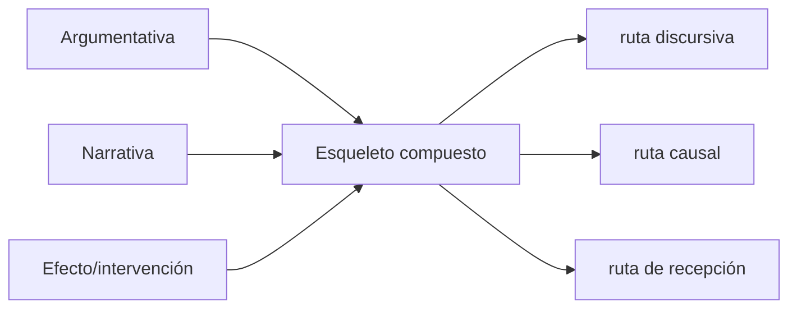

# Taxonomía abierta de esqueletos estructurales

La taxonomía describe candidatos recuperables; no obliga pertenencia única. Un esqueleto puede componer familias o declarar `NEW_SKELETON_TYPE_CANDIDATE` (`PAT-COG-067/068/073/080`).

## Familias

| ID | Familia | Firma de pertenencia | Variantes/combinaciones | Ejemplo | Contraejemplo/límite |
|---|---|---|---|---|---|
| `SK-FAM-CAUSAL` | causal | estados diferenciados, mecanismo, condiciones y evidencia de dependencia | cadena, red, mediación, control | presión→flujo→transporte en aspiradora | mera secuencia temporal |
| `SK-FAM-TEMPORAL` | temporal/procesual | orden, estados, transiciones, duración o sincronía | lineal, ramificada, iterativa | trayectoria de fases | lista sin transición |
| `SK-FAM-FUNCTIONAL` | funcional | entradas, transformación, salida, función y criterios | parte–todo, medio–fin | función del ventilador | nombre del componente |
| `SK-FAM-SYSTEMIC` | sistémica/topológica | capacidades emergen de subgrafo, rutas y cut-sets | capas, red, chain, federación | sistema con rutas redundantes | organigrama sin flujo |
| `SK-FAM-ARGUMENT` | argumentativa | claims, evidencia, garantías, objeciones y modalidad | deductiva, abductiva, dialéctica | evidencia→claim bajo garantía | orden retórico sin soporte |
| `SK-FAM-NARRATIVE` | narrativa/expositiva | recorrido, foco, revelación, transición y cierre | problema-solución, contraste, espiral | norma→contradicción→reinterpretación | intro/desarrollo/conclusión aislados |
| `SK-FAM-TRANSFORM` | transformacional | estado inicial/final, operadores y restricciones | adaptación, recomposición, reconfiguración | cambio de fuente dominante | antes/después sin operador |
| `SK-FAM-INSTRUCTION` | instructiva | perfil inicial, puentes, discriminación, práctica y transferencia | demostración, andamiaje, contraste | reconstruir y transferir mecanismo | exposición sin prueba |
| `SK-FAM-EFFECT` | efecto/intervención | intervención, receptor, trayectoria, acción/capacidad/contexto y observación | MTC, persuasión, control | caso del collar | afirmar estado mental desde texto |

## Firma formal de clase

```text
SKELETON_FAMILY_SIGNATURE = {
  required_roles,
  required_relations,
  topological_constraints,
  functional_tests,
  forbidden_collapses,
  valid_contexts,
  counterexamples
}
```

La clasificación requiere contrato satisfecho, no vocabulario. `SK-FAM-SYSTEMIC` usa `PAT-COG-128/129`; narrativa y temporal usan `PAT-COG-013/050/069/071`; todas declaran variación según `068`.

## Composición



La composición declara interfaces y precedencia. Compartir un nodo no fusiona familias. Si ninguna firma cubre el caso sin pérdida, `skeleton_inferer` crea candidato nuevo con ejemplos, contraejemplos y tests; la taxonomía sólo cambia mediante revisión humana.

## Cómo clasificar sin forzar

1. deriva primero el esqueleto con [MRRE-COMP-SKELETON](../04_runtime/componentes/05_skeleton_inferer.md);
2. compara su firma con cada familia en función, topología, rutas e invariantes;
3. registra matches parciales y relaciones incompatibles;
4. usa una familia sólo si no oculta pérdida crítica;
5. crea `NEW_SKELETON_TYPE_CANDIDATE` con caso positivo, contraejemplo y dominio si ninguna aplica;
6. no modifica esta taxonomía sin [MRRE-AUTHORITY](../00_gobierno/02_autoridad_soberania_y_limites.md).

Ejemplos: [SK-RTR](../09_casos_y_ejemplos/reuters/DOSSIER_OPERATIVO.md#a7-esqueleto-estructural) combina acontecimiento/identidad; [SK-COL](../09_casos_y_ejemplos/caso_del_collar/DOSSIER_OPERATIVO.md#a7-esqueleto-estructural-transferible) combina transformación/transducción/contexto.
