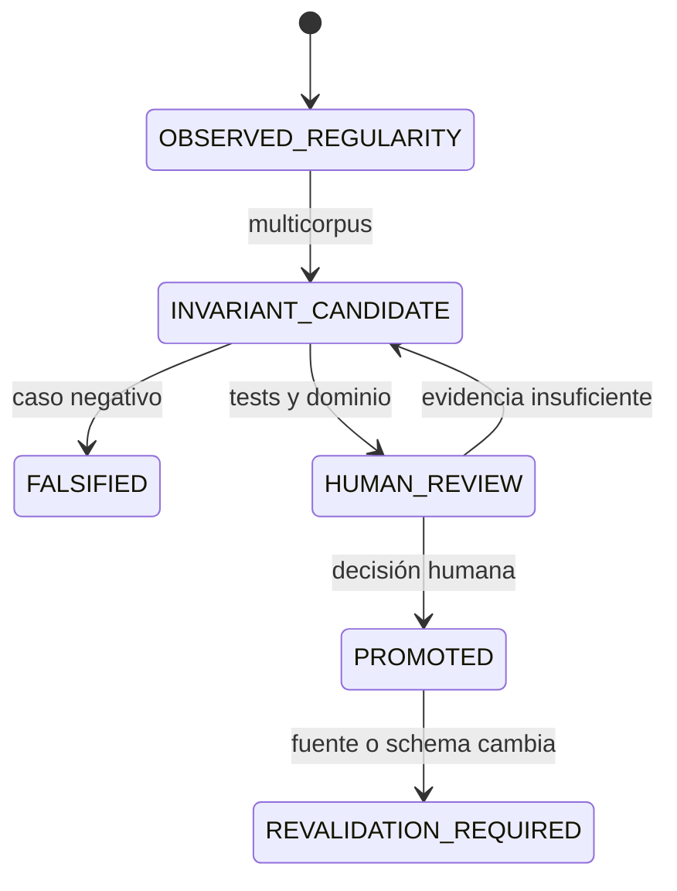

# Registro de invariantes aprendidos

Este registro está materializado pero vacío de invariantes promovidos. Una regularidad de ejecución permanece candidata hasta superar inducción multicorpus, falsación y revisión humana (`PAT-COG-041/042/045/066/067/068/101/108/114/115`).

## Contrato de entrada

| Campo | Obligatorio | Regla |
|---|---:|---|
| `candidate_id` | sí | identidad estable |
| formulación | sí | refutable y sin universalidad implícita |
| dominio | sí | contextos/modalidades donde aplica |
| casos de apoyo | sí | al menos dos fuentes no duplicadas para promoción candidata |
| casos negativos | sí | incluye contrapruebas o ausencia justificada |
| método inductivo | sí | pasos, observadores y sesgos |
| confianza | sí | valor, calibración y alcance |
| alternativas/excepciones | sí | no se borran por ranking |
| falsadores | sí | evidencia que obligaría a revisar |
| dependientes/tests | sí | revalidación transitiva |
| estado/promoción | sí | autoridad explícita |

## Estados

## Entradas

No hay invariantes aprendidos promovidos en la revisión `0.2.0`. Los invariantes del kernel son decisiones de diseño trazadas, no “aprendidos” por este registro. Los primeros candidatos sólo pueden añadirse después de ejecutar fixtures y regresión reproducible.

## Procedimiento para un candidato

1. identifica regularidad en varios runs independientes;
2. registra casos positivos, negativos y dominio;
3. demuestra que su remoción rompe función;
4. intenta falsarla en corpus distinto;
5. calcula dependientes y riesgo de sobreajuste;
6. crea `INVARIANT_CANDIDATE`, nunca `PROMOTED`;
7. ejecuta [MRRE-VAL-PLAN](../08_validacion_y_pruebas/01_plan_de_verificacion_y_validacion.md) y solicita gate humano.

La actualización sigue [MRRE-PROC-FEEDBACK](../03_protocolos_operacionales/06_feedback_y_actualizacion.md). Los invariantes de un único caso, como [CASE-MRRE-VACUUM](../09_casos_y_ejemplos/aspiradora/DOSSIER_OPERATIVO.md), permanecen locales hasta superar evidencia multicorpus.
