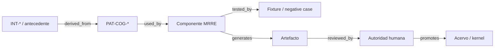

# Mapa de procedencia estructural

## Tipos de enlace

`derived_from`, `specializes`, `adapts`, `contrasts_with`, `supersedes`, `tested_by`, `used_by`, `decided_by` y `pending_source`.

## Mapeos prioritarios

| Antecedente/intuición | Relación | Patrón o contrato | Destino MRRE | Prueba |
|---|---|---|---|---|
| `INT-MRRE-UNIDAD-RETROCONSTRUIBLE-COMO-SUBGRAFO-DE-EFECTO-001` | `derived_from` | `011/012/026` | subgraph schema/reconstructor | texto y aspiradora |
| `INT-TRIPLE-RED-PROYECTADA-REALIZADA-ACTIVADA-001` | `derived_from` | `016/093` | ontología/no-colapso | negative NC-07 |
| `INT-EXPECTED-RESULT-SELECCION-001` | `adapts` | `025/083` | cut engine | Reuters |
| `INT-CORTE-CONTEXTUAL-COMO-PROYECCION-DE-GRAFO-MAYOR-001` | `contrasts_with` | `015/024` | field/cut + ACCD handoff | NC-03 |
| `INT-ALINEACION-FRACTAL-DEL-EFECTO-001` | `derived_from` | `022/084` | mechanism specialization | aspiradora |
| `INT-RED-ASOCIATIVA-MULTIESCALA-001` | `adapts` | `072/084/095` | segmenter/redes | palabra “succión” |
| scaffolding AC-HIA | `specializes` | `109…115` | arquitectura documental MRRE | SC-V1…SC-V7 |
| Kernel de Ingeniería F1–F7 | `adapts` | procedimiento/V&V | kernel/protocol/runtime | matriz de cobertura |
| MAANC mNode/observadores | `adapts` | `070…072/085` | segmenter/subgraph | textual multicorpus |
| MCCR possible/available/active | `adapts` | `118/126/129` | registry/runtime | plan factible/no factible |
| MTC capacidad-contexto-manifestación | `contrasts_with` | causal boundary | integración MTC | collar |
| ACCD campo/regiones/codominio | `adapts` | handoff fronterizo | integración ACCD | ejecución con y sin ACCD |

## Absorción de antecedentes

`90_historial/antecedentes/REGISTRO_DE_ABSORCION.md` enumera archivo por archivo qué materialización activa absorbió su contenido. El historial conserva evidencia, pero los archivos activos tienen precedencia operacional.

## Huecos

Las fuentes adjuntas sin ruta se marcan `pending_source`; no pueden aparecer como `derived_from` confirmado. Una correspondencia estructural no equivale a identidad ontológica ni autoridad canónica.

## Cómo registrar una arista

Cada arista de procedencia incluye `[ID](ruta-relativa)`, locator, relación (`adopts/adapts/derives/contrasts/examples`), transformación, claims/artefactos dependientes y trigger de revalidación. La sintaxis obligatoria es [MRRE-REF-NORM-01](../00_gobierno/06_norma_de_referencias_y_citacion.md); el catálogo completo de fuentes está en [MRRE-BIB-CC](../00_gobierno/07_bibliografia_cognicion_central.md).

El registro de absorción se consulta como [MRRE-ABSORPTION](../90_historial/antecedentes/REGISTRO_DE_ABSORCION.md), y las huellas de lectura como [MRRE-AUDIT-0.1](../90_historial/decisiones_historicas/COBERTURA_DE_FUENTES_MATERIALIZACION_v0_1_0.md). Ninguno sustituye source bindings a nivel de claim.
