https://chatgpt.com/g/g-p-6a777363d7108191b2cafddb3fd424f0/c/6a7ce27c-e3a0-83e8-a4c6-ea876a04fce1

# CATÁLOGO DE PATRONES DE DISEÑO COGNITIVO REUTILIZABLES — EXTENSIÓN

**ID:** `INT-EXTENSION-CATALOGO-PATRONES-COGNITIVOS-TRANSFERIBLES-003`  
**Versión:** `0.3.0`  
**Fecha:** `2026-08-16`  
**Estado:** `EXPLORATORY / CROSS_CUTTING / NON_CANONICAL`  
**Tipo:** extensión deduplicada de catálogo de patrones de diseño cognitivo  
**Cobertura nueva:** `PAT-COG-116` a `PAT-COG-125`

## Documentos de precedencia para la deduplicación

1. `CATALOGO_PATRONES_DE_DISENO_COGNITIVO_REUTILIZABLES_v0_1_0(2).md`  
   Cobertura: `PAT-COG-001` a `PAT-COG-063`.
2. `CATALOGO_COMPLEMENTARIO_DE_PATRONES_DE_DISENO_COGNITIVO_REUTILIZABLES_v0_2_0(1).md`  
   Cobertura: `PAT-COG-064` a `PAT-COG-115`.

Este documento no sustituye ni reproduce esos catálogos. Cuando una estructura resaltada ya está cubierta por ellos, se conserva únicamente como referencia en las secciones de correspondencias y deduplicación.

---

# 0. PROPÓSITO

Formalizar como patrones de diseño únicamente las estructuras cuya intención, topología o responsabilidad no estaba ya representada por `PAT-COG-001…115`.

Los patrones se presentan de manera independiente del dominio en el que fueron reconocidos. Por tanto, términos como sensor, empresa, consciencia, combate, texto, IA, fuente o receptor sólo deben entenderse como posibles instancias.

La unidad de comparación usada es:

```text
INTENCIÓN
+ PROBLEMA
+ COMPONENTES
+ RELACIONES
+ FLUJO
+ INVARIANTES
+ DOMINIO DE VARIACIÓN
+ CONDICIONES DE FALLO
```

Regla de deduplicación:

```text
MISMA INTENCIÓN
+ MISMOS INVARIANTES
+ MISMA TOPOLOGÍA FUNCIONAL
= MISMO PATRÓN
```

Una aplicación, una especialización o una arquitectura compuesta no recibe un nuevo identificador de patrón si puede explicarse mediante patrones ya existentes.

## 0.1. Resultado de la depuración

| Clase                                                                       | Tratamiento en este documento                                       |
| --------------------------------------------------------------------------- | ------------------------------------------------------------------- |
| Patrón no cubierto por `PAT-COG-001…115`                                    | Se formaliza como `PAT-COG-116…125`.                                |
| Extensión que añade una responsabilidad nueva                               | Se formaliza y se explica su diferencia respecto del patrón vecino. |
| Combinación de patrones existentes                                          | Se registra como arquitectura compuesta, no como patrón nuevo.      |
| Aplicación a AISOO, MRRE, cognición humana, empresa, combate o comunicación | Se registra como especialización.                                   |
| Estructura ya presente en los documentos base                               | Sólo se referencia en el ledger de deduplicación.                   |
| Hipótesis todavía insuficientemente definida                                | Se conserva como pregunta abierta, no como patrón.                  |

---

# 1. ÍNDICE DE PATRONES NUEVOS

| ID            | Nombre                                                 | Responsabilidad diferencial                                                                      |
| ------------- | ------------------------------------------------------ | ------------------------------------------------------------------------------------------------ |
| `PAT-COG-116` | Alineación función–información–coordinación            | Exige tres grafos co-requeridos para producir capacidad.                                         |
| `PAT-COG-117` | Gradiente situado de integración                       | Sustituye la integración binaria por un perfil multidimensional, local y temporal.               |
| `PAT-COG-118` | Reducción progresiva del espacio de capacidades        | Distingue posibilidad estructural, disponibilidad temporal y activación situada.                 |
| `PAT-COG-119` | Estado compartido con vistas situadas                  | Coordina múltiples actores mediante un núcleo común sin imponer una vista idéntica.              |
| `PAT-COG-120` | Representación operable como compresión trazable       | Declara qué se conserva, pierde, agrega e infiere al representar el mundo.                       |
| `PAT-COG-121` | Capas funcionales con capacidades transversales        | Modela dos ejes ortogonales: flujo por capas y soporte transversal.                              |
| `PAT-COG-122` | Tejido de coordinación                                 | Convierte conectividad, sincronización y handoff en capacidad arquitectónica.                    |
| `PAT-COG-123` | Transformación semántica topológicamente distribuida   | Permite que el significado se construya en fuente, mediación o receptor.                         |
| `PAT-COG-124` | Intensidad de gobierno independiente del procesamiento | Separa complejidad de procesamiento y grado de gobierno reflexivo.                               |
| `PAT-COG-125` | Plano de gobierno funcionalmente descompuesto          | Distribuye responsabilidades de gobierno sin hacerlas desaparecer ni confundirlas con ejecución. |

---

# FAMILIA N — CAPACIDAD, INTEGRACIÓN Y COORDINACIÓN

---

# PAT-COG-116 — ALINEACIÓN FUNCIÓN–INFORMACIÓN–COORDINACIÓN

## Intención

Evitar diseñar una capacidad como simple inventario de componentes. Para que un objetivo pueda cumplirse deben alinearse simultáneamente:

- las transformaciones que deben realizarse;
- la información que hace posibles esas transformaciones;
- las relaciones de coordinación que conectan y sincronizan a los responsables.

## Firma estructural

```text
OBJETIVO
→ GRAFO FUNCIONAL
+ GRAFO DE INFORMACIÓN
+ GRAFO DE COORDINACIÓN
→ ALINEACIÓN / BINDING
→ SUBGRAFO ACTIVO
→ EFECTO
```

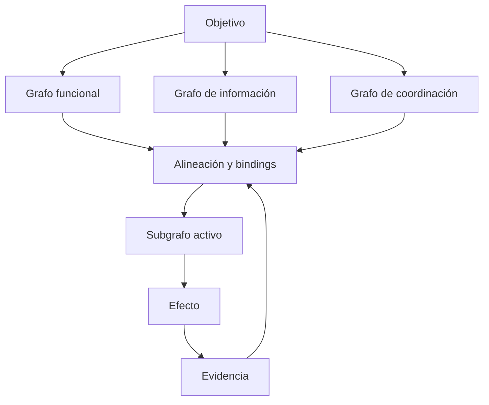

## Contratos mínimos

| Proyección            | Pregunta que debe responder                                               | Contenido mínimo                                                      |
| --------------------- | ------------------------------------------------------------------------- | --------------------------------------------------------------------- |
| Grafo funcional       | ¿Qué debe transformarse y en qué orden lógico?                            | funciones, dependencias, entradas, salidas y criterios de terminación |
| Grafo de información  | ¿Qué debe saber cada función para operar?                                 | estados, señales, evidencia, procedencia, resolución y latencia       |
| Grafo de coordinación | ¿Cómo se relacionan los responsables?                                     | autoridad, handoffs, sincronización, prioridad, veto y escalamiento   |
| Binding               | ¿Qué nodo realiza qué función usando qué información y bajo qué relación? | asignación trazable y validable                                       |

## Invariantes

- una función sin información suficiente no constituye capacidad operable;
- información sin consumidor, decisión o transformación prevista no constituye capacidad;
- varios componentes funcionales sin coordinación pueden permanecer como capacidades aisladas;
- cada binding declara compatibilidad de entradas, salidas, autoridad y tiempo;
- el efecto debe poder trazarse hacia contribuciones de las tres proyecciones.

## Dominio de variación

- número y naturaleza de nodos;
- coordinación centralizada, federada o distribuida;
- información sincrónica o asincrónica;
- funciones humanas, técnicas o híbridas;
- subgrafo fijo, configurado en runtime o recompuesto durante ejecución.

## Anti-patrones

```text
LISTA DE COMPONENTES = SISTEMA INTEGRADO
```

```text
MÁS INFORMACIÓN = MEJOR COORDINACIÓN
```

```text
TODOS CONECTADOS = OBJETIVO CUMPLIDO
```

## Diferencia respecto de patrones anteriores

- `PAT-COG-002` integra fuentes, pero no exige un grafo funcional y otro de coordinación.
- `PAT-COG-012` sitúa capacidad en un subgrafo, pero no especifica las tres proyecciones que deben alinearse.
- `PAT-COG-063` contiene el ciclo global de un sistema orientado a objetivos; el presente patrón aporta un test interno para verificar si la capacidad existe realmente.

## Procedencia conceptual

Estructura reconocida en la formulación `FUNCIÓN–INFORMACIÓN–COLABORACIÓN/COORDINACIÓN` y abstraída para cualquier sistema orientado a objetivos.

---

# PAT-COG-117 — GRADIENTE SITUADO DE INTEGRACIÓN

## Intención

Representar la integración como una propiedad graduada, localizada, multidimensional y dependiente de misión y tiempo, en lugar de una etiqueta binaria aplicada al sistema completo.

## Firma estructural

```text
COMPONENTE / RELACIÓN CANDIDATA
+ OBJETIVO
+ CONTEXTO
+ TIEMPO
→ PERFIL DE INTEGRACIÓN
→ ALCANCE DE ACTIVACIÓN
→ MONITOREO
→ CONSERVACIÓN / DEGRADACIÓN / RECONFIGURACIÓN
```

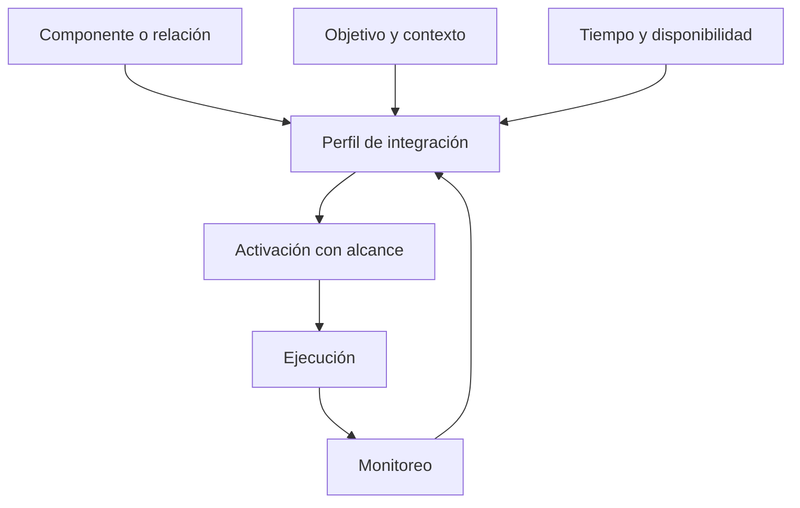

## Dimensiones del perfil

```yaml
integration_profile:
  functional_compatibility:
  informational_interoperability:
  coordination_readiness:
  authority_clearance:
  temporal_availability:
  mission_scope:
  observability:
  resilience:
  current_degradation:
```

## Estados descriptivos posibles

Los estados no forman necesariamente una secuencia rígida:

| Estado          | Significado operativo                                                              |
| --------------- | ---------------------------------------------------------------------------------- |
| `VISIBLE`       | El componente puede ser localizado, pero todavía no existe compatibilidad probada. |
| `INTEROPERABLE` | Puede intercambiar objetos o estados bajo un contrato.                             |
| `AVAILABLE`     | Está utilizable en el momento y contexto evaluados.                                |
| `COORDINATED`   | Tiene relaciones, autoridad y sincronización suficientes.                          |
| `ACTIVE`        | Participa en una chain o subgrafo concreto.                                        |
| `DEGRADED`      | Conserva una parte explícita de su contribución bajo pérdida o restricción.        |
| `EXCLUDED`      | No debe participar y existe una razón registrada.                                  |

## Invariantes

- integración en una función no implica integración en todas las funciones;
- integración en una misión no implica disponibilidad permanente;
- conectividad no prueba coordinación;
- disponibilidad no prueba activación;
- activación no prueba contribución efectiva;
- el perfil debe poder cambiar sin redefinir silenciosamente la identidad del componente.

## Diferencia respecto de patrones anteriores

`PAT-COG-094` separa activación, evaluación e integración. `PAT-COG-117` añade que la integración misma es un vector situado, no un estado homogéneo y definitivo.

---

# PAT-COG-118 — REDUCCIÓN PROGRESIVA DEL ESPACIO DE CAPACIDADES

## Intención

Distinguir lo estructuralmente posible, lo actualmente disponible y lo específicamente activado para una situación, conservando las exclusiones y sus motivos.

## Firma estructural

```text
G_possible
→ G_available(t)
→ G_active(Q_t)
→ Π_t
→ EJECUCIÓN
→ EVIDENCIA
→ ACTUALIZACIÓN DE DISPONIBILIDAD
```

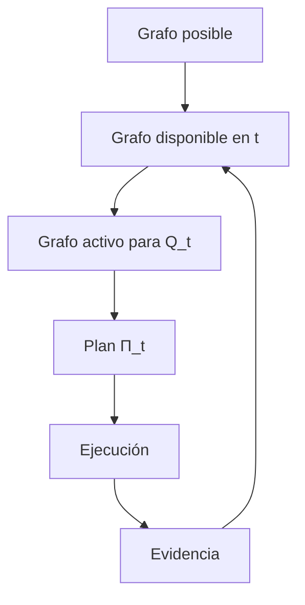

## Transformaciones

### `G_possible → G_available(t)`

Filtra por:

- existencia y localización;
- versión y compatibilidad;
- permisos y autoridad;
- salud y capacidad;
- latencia y horizonte temporal;
- recursos y dependencias.

### `G_available(t) → G_active(Q_t)`

Selecciona por:

- objetivo;
- restricciones;
- estado actual;
- riesgo;
- costo;
- cobertura mínima suficiente;
- rutas alternativas y exclusiones.

### `G_active(Q_t) → Π_t`

Ordena transformaciones, bindings, gates, validaciones y recuperación.

## Artefacto obligatorio

```yaml
selection_ledger:
  included_nodes: []
  included_edges: []
  excluded_candidates: []
  exclusion_reasons: []
  unresolved_dependencies: []
  alternatives: []
  validity_window:
```

## Invariantes

- el grafo posible no se confunde con la capacidad realmente disponible;
- el grafo activo es un corte situado, no la identidad completa del sistema;
- las exclusiones son parte del resultado;
- cambios de tiempo, permisos o salud pueden alterar `G_available(t)`;
- un plan no puede utilizar silenciosamente nodos fuera de `G_active(Q_t)`.

## Diferencia respecto de patrones anteriores

- `PAT-COG-025` usa el resultado esperado para seleccionar un subgrafo.
- `PAT-COG-087` define el espacio de decisiones autorizado antes de configurar.
- `PAT-COG-118` añade la reducción temporal y trazable `posible → disponible → activo → plan`.

---

# PAT-COG-119 — ESTADO COMPARTIDO CON VISTAS SITUADAS

## Intención

Coordinar múltiples nodos mediante un núcleo común de estado sin obligarlos a consumir una visualización idéntica ni permitir que cada vista se convierta en una realidad inconexa.

## Firma estructural

```text
FUENTES HETEROGÉNEAS
→ NORMALIZACIÓN / FUSIÓN
→ NÚCLEO DE ESTADO COMPARTIDO
→ VISTAS SITUADAS POR FUNCIÓN
→ DECISIONES LOCALES COORDINABLES
→ ACTUALIZACIONES / CONFLICTOS
→ RECONCILIACIÓN DEL NÚCLEO
```

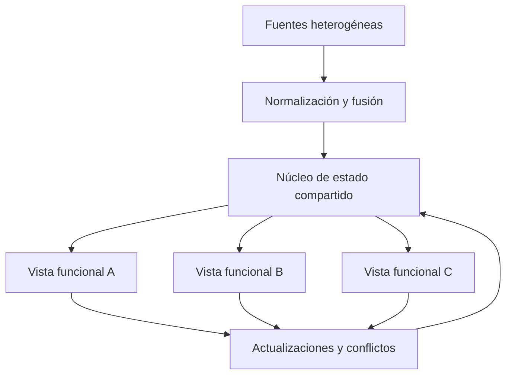

## Contenido mínimo del núcleo

- identificadores estables;
- hechos y observaciones;
- inferencias e hipótesis tipadas;
- incertidumbre;
- procedencia;
- marcas temporales y caducidad;
- conflictos;
- relaciones y dependencias;
- cambios y responsables.

## Contrato de una vista

```yaml
situated_view:
  consumer_role:
  purpose:
  included_region:
  omitted_region:
  resolution:
  ordering:
  permissions:
  freshness_requirement:
  provenance_links:
  writeback_contract:
```

## Invariantes

- el núcleo compartido no equivale a una pantalla única;
- una vista puede seleccionar, resumir y reordenar, pero no modificar silenciosamente el estado fuente;
- las omisiones deben ser compatibles con la función de la vista;
- divergencias y conflictos se registran, no se borran por promedio;
- toda actualización local declara cómo puede reingresar al núcleo.

## Diferencia respecto de patrones anteriores

- `PAT-COG-061` exige una representación operable.
- `PAT-COG-007` distribuye información selectivamente.
- `PAT-COG-095` permite varias resoluciones de una red.
- `PAT-COG-119` añade el contrato de coordinación entre un núcleo compartido y múltiples vistas operativas.

---

# PAT-COG-120 — REPRESENTACIÓN OPERABLE COMO COMPRESIÓN TRAZABLE

## Intención

Hacer explícito que toda representación operable selecciona, agrega, transforma y omite partes del mundo; su utilidad exige declarar tanto lo preservado como lo perdido.

## Firma estructural

```text
MUNDO / CAMPO
→ CAPTACIÓN
→ SELECCIÓN
→ TRANSFORMACIÓN / AGREGACIÓN
→ REPRESENTACIÓN OPERABLE
+ REGISTRO DE PRESERVACIÓN
+ REGISTRO DE PÉRDIDA
+ INCERTIDUMBRE
→ DECISIÓN
→ ACCIÓN
→ EVIDENCIA
→ REVISIÓN
```

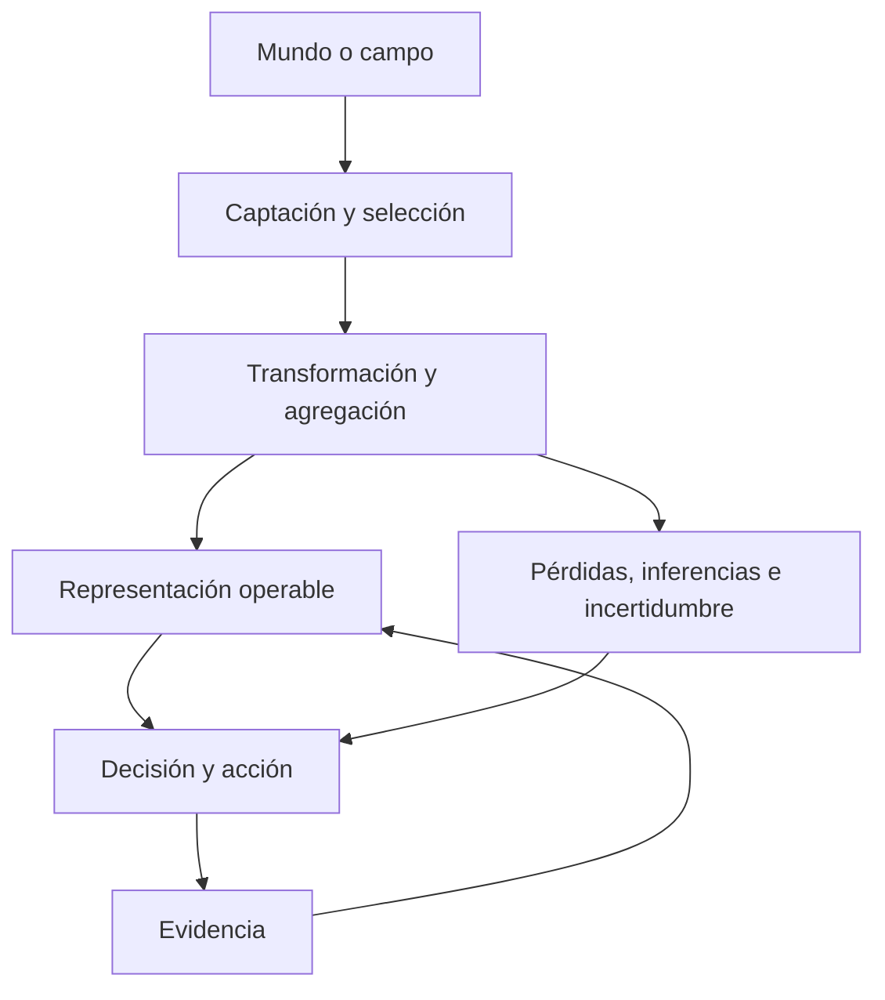

## Contrato de representación

| Campo               | Pregunta                                                    |
| ------------------- | ----------------------------------------------------------- |
| `preserved`         | ¿Qué propiedades o relaciones se conservan?                 |
| `omitted`           | ¿Qué se excluyó deliberadamente?                            |
| `aggregated`        | ¿Qué unidades se fusionaron o resumieron?                   |
| `inferred`          | ¿Qué no fue observado directamente?                         |
| `uncertainty`       | ¿Qué confianza, rango o alternativas permanecen?            |
| `provenance`        | ¿De qué fuentes y transformaciones procede cada elemento?   |
| `temporal_validity` | ¿Durante cuánto tiempo puede tratarse como vigente?         |
| `decision_scope`    | ¿Para qué decisiones es suficiente y para cuáles no?        |
| `known_unknowns`    | ¿Qué ausencias relevantes están explícitamente registradas? |

## Invariantes

- `REPRESENTACIÓN ≠ MUNDO`;
- operabilidad no equivale a exhaustividad;
- una simplificación útil en una decisión puede ser peligrosa en otra;
- incertidumbre y pérdida forman parte del producto, no de una nota opcional;
- la representación debe poder revisarse cuando aparece evidencia incompatible.

## Diferencia respecto de patrones anteriores

`PAT-COG-061` identifica la representación operable como cuello de botella. `PAT-COG-120` define su contrato de compresión, pérdida y suficiencia decisional. Se apoya además en `PAT-COG-042` y `PAT-COG-073`, pero no se reduce a feedback o certeza abductiva.

---

# PAT-COG-121 — CAPAS FUNCIONALES CON CAPACIDADES TRANSVERSALES

## Intención

Modelar sistemas que contienen una secuencia principal de capas y, simultáneamente, capacidades que atraviesan varias capas sin pertenecer exclusivamente a ninguna.

## Firma estructural

```text
EJE VERTICAL
= CAPAS FUNCIONALES DEL FLUJO

EJE TRANSVERSAL
= CAPACIDADES QUE SOPORTAN VARIAS CAPAS

SISTEMA
= INTERSECCIONES ENTRE AMBOS EJES
```

## Matriz abstracta

| Capa funcional          | Responsabilidad principal                    | Capacidades transversales que pueden atravesarla  |
| ----------------------- | -------------------------------------------- | ------------------------------------------------- |
| Orientación             | doctrina, política, objetivos, entrenamiento | identidad, seguridad, auditoría                   |
| Percepción              | captar señales y estados                     | comunicaciones, tiempo, procedencia, resiliencia  |
| Información             | normalizar, fusionar, clasificar             | interoperabilidad, validación, observabilidad     |
| Gobierno / coordinación | priorizar, autorizar, configurar             | autoridad, trazabilidad, escalamiento             |
| Ejecución               | producir una acción o cambio                 | sincronización, seguridad, recursos, recuperación |
| Evaluación              | observar efecto y producir evidencia         | métricas, memoria, aprendizaje, versionado        |

## Invariantes

- una capa declara entradas, salidas y criterio de terminación;
- una capacidad transversal sirve a dos o más capas;
- la falla transversal puede degradar varias capas a la vez;
- las capacidades transversales no sustituyen las responsabilidades propias de cada capa;
- cada intersección declara qué servicio recibe la capa y qué dependencia introduce.

## Anti-patrón

Tratar comunicación, seguridad, resiliencia o trazabilidad como una última capa del pipeline cuando en realidad condicionan varias etapas.

## Diferencia respecto de patrones anteriores

- `PAT-COG-056` descompone una función global por escala.
- `PAT-COG-086` gobierna la frontera entre dos capas.
- `PAT-COG-121` añade el eje ortogonal de capacidades transversales y permite analizar fallas de intersección.

---

# PAT-COG-122 — TEJIDO DE COORDINACIÓN

## Intención

Representar la infraestructura relacional que permite que componentes especializados funcionen como sistema, en vez de confundir conectividad física con coordinación efectiva.

## Firma estructural

```text
NODOS ESPECIALIZADOS
↔ TEJIDO DE COORDINACIÓN
↔ NODOS ESPECIALIZADOS
→ ESTADO COMPARTIDO / HANDOFFS / SINCRONIZACIÓN
→ ACCIÓN COORDINADA
```

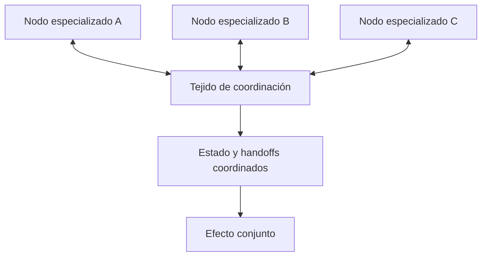

## Servicios posibles

- direccionamiento e identidad;
- contratos semánticos;
- routing y prioridad;
- sincronización temporal;
- publicación y suscripción de estado;
- handoff y confirmación;
- procedencia y trazabilidad;
- control de acceso y autoridad;
- detección de salud y degradación;
- rutas alternativas y recuperación.

## Invariantes

- transportar bits o mensajes no garantiza coordinación;
- el tejido debe declarar semántica, tiempo, autoridad y respuesta esperada;
- no todos los nodos reciben toda la información;
- una falla del tejido puede destruir capacidad sin destruir los nodos finales;
- deben existir modos explícitos de degradación y recomposición.

## Diferencia respecto de patrones anteriores

- `PAT-COG-007` describe distribución selectiva de información.
- `PAT-COG-086` define contratos de handoff entre capas.
- `PAT-COG-122` representa el sustrato persistente, potencialmente muchos-a-muchos, que mantiene coordinación, estado y sincronización entre nodos.

## Procedencia conceptual

Generalización de la observación de que un enlace o datalink no sólo transmite: puede constituir el mecanismo mediante el cual los componentes coordinan funciones y estados.

---

# FAMILIA O — SIGNIFICADO, INTEGRACIÓN Y GOBIERNO

---

# PAT-COG-123 — TRANSFORMACIÓN SEMÁNTICA TOPOLÓGICAMENTE DISTRIBUIDA

## Intención

Evitar que interpretación o material de Orden 2 se modele como producto de una única caja fija. El significado puede construirse, modificarse o reforzarse en distintos puntos de la trayectoria.

## Firma estructural

```text
ORDEN 1
→ [TRANSFORMACIÓN EN FUENTE]
→ [TRANSFORMACIÓN EN MEDIACIÓN]
→ [TRANSFORMACIÓN EN RECEPTOR]
→ ORDEN 2 INTEGRADO
```

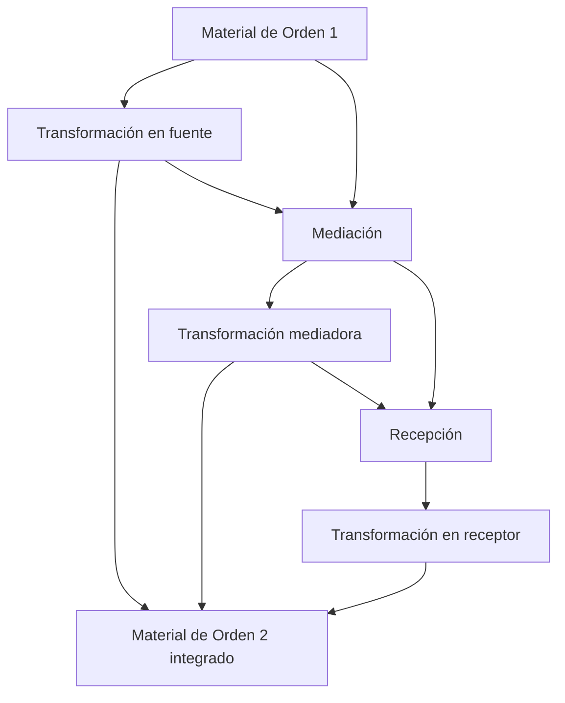

## Registro mínimo por transformación

```yaml
semantic_transformation:
  actor_or_component:
  input:
  output:
  operation:
  added_relations: []
  removed_or_suppressed_relations: []
  frame_or_criteria:
  evidence:
  uncertainty:
  downstream_consumers: []
```

## Invariantes

- Orden 2 no se atribuye automáticamente a la fuente original;
- una mediación puede transportar y transformar en grados distintos;
- el receptor puede aceptar, combinar, reponderar, rechazar o reconstruir significado;
- varias transformaciones semánticas pueden acumularse;
- cada transformación conserva procedencia y posibilidad de revisión.

## Diferencia respecto de patrones anteriores

- `PAT-COG-003` distingue Orden 1 y Orden 2.
- `PAT-COG-001` separa fuente, material, canal, mediación y recepción.
- `PAT-COG-123` especifica que la producción de Orden 2 puede distribuirse topológicamente entre esas posiciones.

---

# PAT-COG-124 — INTENSIDAD DE GOBIERNO INDEPENDIENTE DEL PROCESAMIENTO

## Intención

Evitar que “integración pasiva” se interprete como ausencia de procesamiento. Un sistema puede procesar de forma compleja y, sin embargo, ejercer poco gobierno explícito sobre fuentes, criterios, marcos, actualización o veto.

## Firma estructural

```text
ENTRADA
→ PROCESAMIENTO
→ PERFIL DE GOBIERNO
→ INTEGRACIÓN
→ ESTADO
```

El perfil de gobierno se evalúa de manera independiente de la complejidad computacional o cognitiva del procesamiento.

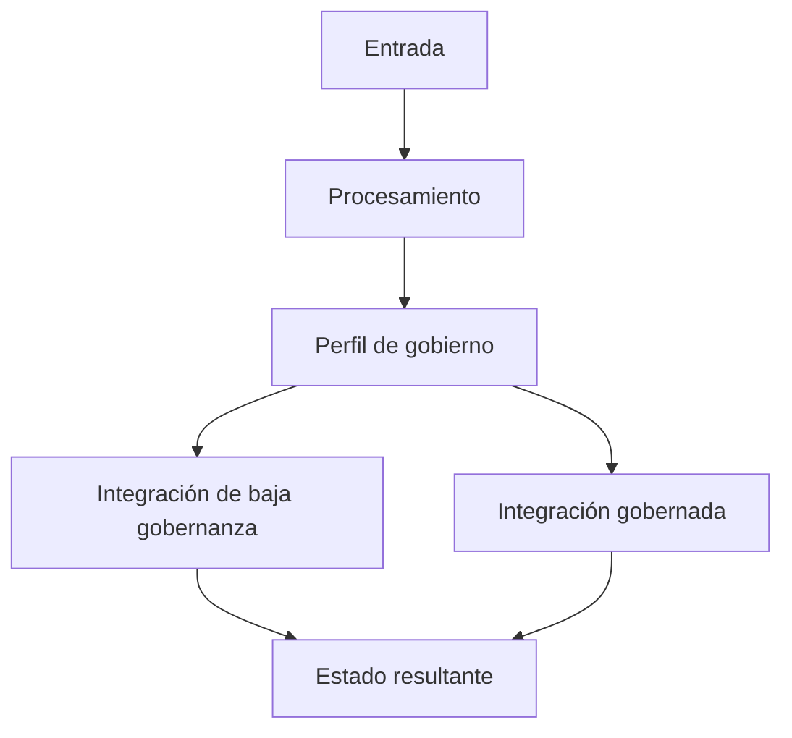

## Dimensiones del perfil de gobierno

| Dimensión     | Baja gobernanza explícita                  | Gobernanza alta o explícita               |
| ------------- | ------------------------------------------ | ----------------------------------------- |
| Fuentes       | ingreso por defecto                        | selección, procedencia y contraste        |
| Marcos        | adopción implícita                         | identificación y comparación              |
| Criterios     | no declarados                              | explícitos y revisables                   |
| Validación    | aceptación por fluidez o autoridad externa | evidencia y pruebas pertinentes           |
| Veto          | ausente o inaccesible                      | mecanismo de inhibición operativo         |
| Actualización | inducida por exposición o hábito           | política de cambio regulada               |
| Trazabilidad  | difícil de reconstruir                     | decisiones y transformaciones registradas |

## Invariantes

- procesamiento intenso no implica soberanía;
- gobierno reflexivo no exige introspección microscópica completa;
- la gobernanza puede ser desigual entre dimensiones;
- una integración puede ser parcial, provisional o rechazada;
- el sistema debe declarar quién puede cambiar criterios, fines e invariantes.

## Diferencia respecto de patrones anteriores

`PAT-COG-054` describe aprovisionamiento con gobierno reflexivo. `PAT-COG-124` añade un perfil comparativo que permite reconocer procesamiento sofisticado con baja gobernanza y evita el falso contraste “procesamiento versus no procesamiento”.

---

# PAT-COG-125 — PLANO DE GOBIERNO FUNCIONALMENTE DESCOMPUESTO

## Intención

Distribuir las funciones de gobierno entre personas, módulos o instituciones sin hacer desaparecer ninguna responsabilidad ni confundir gobierno con ejecución microscópica.

## Firma estructural

```text
FINES + INVARIANTES + AUTORIDAD
→ MAPA DE RESPONSABILIDADES DE GOBIERNO
→ FUNCIONES DE GOBIERNO ESPECIALIZADAS
→ OPERACIÓN GOBERNADA
→ EVIDENCIA
→ REVISIÓN / RECONFIGURACIÓN
```

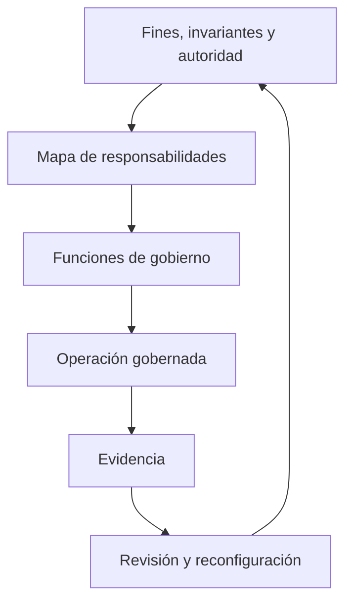

## Funciones que deben asignarse

1. gobierno de percepción: qué observar;
2. gobierno de integración: cómo fusionar y normalizar;
3. interpretación: cómo se construye significado operativo;
4. curaduría y routing: qué llega a cada nodo, cuándo y con qué prioridad;
5. legitimación y validación: qué fuente, modelo o solución es admisible;
6. representación compartida: cómo se mantiene un estado coordinable;
7. teleología: quién preserva fines, prioridades e invariantes;
8. orquestación: cómo se coordinan nodos especializados;
9. configuración de chains: quién selecciona caminos funcionales;
10. autorización, veto y escalamiento: qué puede ejecutarse y bajo qué límite;
11. monitoreo y feedback: cómo se observa el resultado;
12. aprendizaje y reconfiguración: qué puede cambiar y con qué autoridad.

## Contrato de asignación

```yaml
governance_assignment:
  responsibility:
  accountable_locus:
  executing_nodes: []
  delegated_authority:
  inputs: []
  outputs: []
  gates: []
  escalation:
  evidence_required:
  audit_trace:
```

## Invariantes

- distribuir una función no elimina la responsabilidad de gobierno;
- el locus puede ser una entidad, una coalición o una capacidad funcional;
- autoridad, responsabilidad, capacidad y ejecución permanecen diferenciadas;
- conflictos entre funciones de gobierno deben tener resolución y escalamiento;
- los cambios de fines o invariantes requieren la autoridad correspondiente;
- el mapa debe permitir identificar vacíos, solapamientos y concentraciones peligrosas.

## Diferencia respecto de patrones anteriores

- `PAT-COG-030` define el locus de gobierno.
- `PAT-COG-031` separa responsabilidad y ejecución.
- `PAT-COG-056` descompone una función global entre nodos.
- `PAT-COG-062` combina gobierno macro y ejecución distribuida.
- `PAT-COG-125` integra esas distinciones en un plano completo de responsabilidades asignables y auditables.

---

# 2. ARQUITECTURAS COMPUESTAS DERIVADAS

Las estructuras de esta sección son combinaciones. No reciben un identificador `PAT-COG` porque sus componentes ya están formalizados.

## 2.1. Percepción distribuida → efecto concentrado

```text
PAT-COG-002  convergencia de fuentes
+ PAT-COG-061  representación operable
+ PAT-COG-116  función–información–coordinación
+ PAT-COG-119  estado compartido y vistas
+ PAT-COG-122  tejido de coordinación
+ PAT-COG-063  ciclo orientado a objetivos
= PERCEPCIÓN DISTRIBUIDA CON EFECTO COORDINADO
```

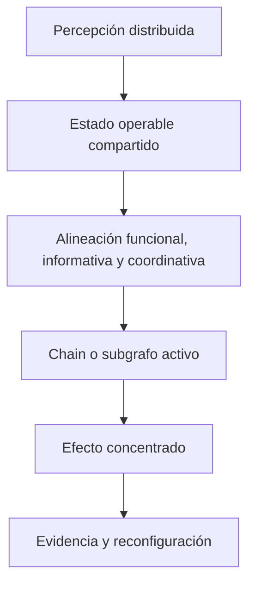

Esta arquitectura no exige centralizar todos los datos o ejecutores. “Concentrado” significa convergencia funcional del efecto, no necesariamente concentración física ni jerárquica.

## 2.2. Integración dinámica y resiliente

```text
PAT-COG-117  gradiente de integración
+ PAT-COG-118  posible/disponible/activo
+ PAT-COG-122  tejido de coordinación
+ PAT-COG-046  recomposición funcional
+ PAT-COG-042  feedback como evidencia
= CAPACIDAD RECONFIGURABLE BAJO DEGRADACIÓN
```

Principio:

```text
CAPACIDAD DEL SISTEMA
>
CAPACIDAD DE UNA CHAIN ESPECÍFICA
```

La desigualdad expresa que la arquitectura puede conservar alternativas, no que siempre posea mayor rendimiento efectivo.

## 2.3. Aprovisionamiento cognitivo con soberanía de creación de realidad

```text
PAT-COG-053  aprovisionamiento cognitivo
+ PAT-COG-054  gobierno reflexivo
+ PAT-COG-038  topología soberana
+ PAT-COG-123  transformación semántica distribuida
+ PAT-COG-124  perfil de gobierno
+ PAT-COG-125  plano de gobierno
+ PAT-COG-063  acción, evidencia y reconfiguración
= CONSTRUCCIÓN GOBERNADA DE REALIDAD OPERATIVA
```

La arquitectura preserva autoridad sobre:

- selección y verificación de fuentes;
- marcos interpretativos;
- criterios de evaluación;
- políticas de actualización;
- objetivos y restricciones;
- autorización de acciones;
- interpretación de la evidencia de retorno.

No supone ausencia de influencias externas. Supone que la influencia atraviesa gates de inspección, comparación, veto y revisión antes de adquirir autoridad sobre fines o criterios.

## 2.4. De la manifestación observable a la intervención estructural

```text
PAT-COG-015  manifestación como corte
+ PAT-COG-026  retroconstrucción
+ PAT-COG-120  pérdidas e incertidumbre de representación
+ PAT-COG-059  intervención funcional-estructural
+ PAT-COG-057  efectos multicapa
= INTERVENCIÓN SOBRE LA ARQUITECTURA GENERATIVA
```

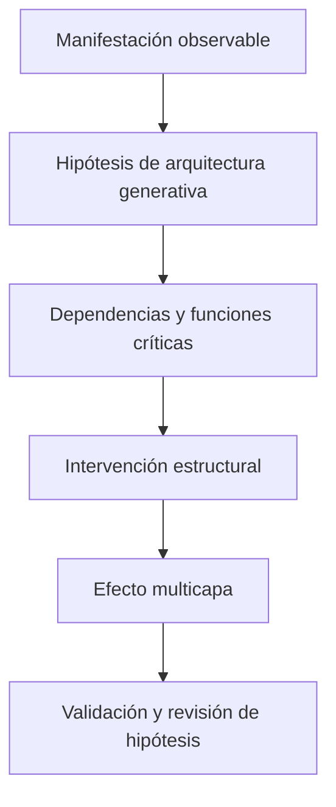

Corolario de diseño: no confundir la superficie visible con el sistema que la produce. La retroconstrucción conserva alternativas porque una misma manifestación puede ser compatible con varias arquitecturas.

## 2.5. Provisión colectiva de sentido

```text
PAT-COG-053  aprovisionamiento
+ PAT-COG-054  gobierno reflexivo
+ PAT-COG-055  orquestación de material cognitivo
+ PAT-COG-058  necesidad de sentido
+ PAT-COG-119  estado compartido y vistas
+ PAT-COG-123  transformación semántica distribuida
+ PAT-COG-124  intensidad de gobierno
= SISTEMA DE PRODUCCIÓN, DISTRIBUCIÓN Y REVISIÓN DE SIGNIFICADO
```

La arquitectura permite analizar cómo un colectivo obtiene explicaciones, marcos, identidad y orientación sin convertir automáticamente la provisión de sentido en manipulación ni asumir que los receptores son pasivos.

---

# 3. ESPECIALIZACIONES Y APLICACIONES SIN DUPLICACIÓN

## 3.1. Especializaciones reconocidas en sistemas integrados

| Estructura observada                                                                                          | Tratamiento correcto                                                   | Referencia                                                                |
| ------------------------------------------------------------------------------------------------------------- | ---------------------------------------------------------------------- | ------------------------------------------------------------------------- |
| `CHAIN_DE_REALIDAD` transforma percepción, material y estado interno en conclusión, hábito, decisión o acción | Especialización de chain y trayectoria de estado                       | `PAT-COG-013`, `PAT-COG-049`, `PAT-COG-050`                               |
| Consciencia reflexiva hace visibles, selecciona, inhibe, revisa y reconfigura chains                          | Especialización funcional de gobierno; no equivalencia neurocientífica | `PAT-COG-030`, `PAT-COG-032`, `PAT-COG-036`, `PAT-COG-124`, `PAT-COG-125` |
| Administrador o comandante gobierna sin ejecutar cada microproceso                                            | Aplicación de gobierno macro y ejecución distribuida                   | `PAT-COG-031`, `PAT-COG-062`, `PAT-COG-125`                               |
| Integración graduada por misión y tiempo                                                                      | Patrón nuevo                                                           | `PAT-COG-117`                                                             |
| `G_possible → G_available(t) → G_active(Q_t) → Π_t`                                                           | Patrón nuevo, conectado con configuración runtime                      | `PAT-COG-118`, `PAT-COG-087`                                              |
| Datalink, bus o infraestructura de intercambio como mecanismo de coordinación                                 | Patrón nuevo                                                           | `PAT-COG-122`                                                             |
| Capas funcionales más comunicaciones, resiliencia, seguridad u observabilidad transversales                   | Patrón nuevo                                                           | `PAT-COG-121`                                                             |
| Cuadro operacional común con vistas por función                                                               | Patrón nuevo                                                           | `PAT-COG-119`, `PAT-COG-120`                                              |
| Capacidad situada en un subgrafo y no en un nodo aislado                                                      | Aplicación ya cubierta                                                 | `PAT-COG-012`                                                             |
| Chain como camino concreto dentro de una red mayor                                                            | Aplicación ya cubierta                                                 | `PAT-COG-013`                                                             |
| cApp como capacidad reutilizable distinta de la chain activa                                                  | Aplicación ya cubierta                                                 | `PAT-COG-014`, `PAT-COG-013`                                              |
| Pérdida de nodos y reconstrucción de rutas                                                                    | Aplicación de recomposición                                            | `PAT-COG-046`, `PAT-COG-117`, `PAT-COG-118`                               |

## 3.2. Aplicaciones relacionadas con el scaffolding del MRRE

El documento adjunto `CATALOGO_COMPLEMENTARIO_DE_PATRONES_DE_DISENO_COGNITIVO_REUTILIZABLES_v0_2_0(1).md` ya formaliza las estructuras provenientes del `SCAFFOLDING_MOTOR_DE_RETROCONSTRUCCION_Y_REINSTANCIACION_ESTRUCTURAL`. Por ello, aquí sólo se conservan correspondencias:

| Estructura resaltada                                             | Referencia, sin repetición                                                |
| ---------------------------------------------------------------- | ------------------------------------------------------------------------- |
| Aparato estable que produce estructuras particulares variables   | `PAT-COG-064`                                                             |
| Manifestación → arquitectura conceptual → esqueleto              | `PAT-COG-065`                                                             |
| Inducir antes de generar                                         | `PAT-COG-066`                                                             |
| Modelo base extraído de ejemplares                               | `PAT-COG-067`, `PAT-COG-100`                                              |
| Partes de una proyección con reglas propias                      | `PAT-COG-069`, `PAT-COG-070`, `PAT-COG-071`, `PAT-COG-084`, `PAT-COG-085` |
| Contextos de fuente, corte, proyección, realización y recepción  | `PAT-COG-092`                                                             |
| Navegar el campo antes de declarar matching                      | `PAT-COG-076`                                                             |
| Recuperación, equivalencia y binding como objetos distintos      | `PAT-COG-077`, `PAT-COG-078`                                              |
| Hueco estructural explícito y alternativas sobrevivientes        | `PAT-COG-079`, `PAT-COG-080`, `PAT-COG-103`                               |
| Diff de preservación y reingreso de validación                   | `PAT-COG-081`, `PAT-COG-082`                                              |
| `identity_selection` como vista situada                          | `PAT-COG-083`                                                             |
| Alineación del efecto desde unidad hasta totalidad               | `PAT-COG-084`                                                             |
| Estructuras cognitivas como operadores que relacionan nodos      | `PAT-COG-085`                                                             |
| Contratos entre análisis, proyección, realización y consumidores | `PAT-COG-086`, `PAT-COG-089`, `PAT-COG-090`                               |
| Configurador transversal distinto del ejecutor semántico         | `PAT-COG-087`, `PAT-COG-088`                                              |
| Red asociativa navegable hasta parte, span o palabra             | `PAT-COG-072`, `PAT-COG-095`                                              |
| Scaffolding estructural y contextual transferible                | `PAT-COG-109…115`                                                         |

---

# 4. LEDGER EXHAUSTIVO DE ESTRUCTURAS RESALTADAS Y SU DISPOSICIÓN

Esta sección demuestra cobertura sin reproducir definiciones ya existentes.

| Estructura resaltada o manifestada                                                                                          | Disposición                                           | Referencia                                                 |
| --------------------------------------------------------------------------------------------------------------------------- | ----------------------------------------------------- | ---------------------------------------------------------- |
| `MENSAJE → MEMORIA`, `MENSAJE → EMOCIÓN`, `EVENTO → IDENTIDAD` convergen en interpretación y decisión                       | Ya catalogada                                         | `PAT-COG-010`                                              |
| Fuentes múltiples → inspección de evidencia/marco/interés → criterio humano → interpretación revisable → acción → evidencia | Arquitectura compuesta ya catalogada                  | `PAT-COG-002`, `PAT-COG-038`, `PAT-COG-054`                |
| Fuente ≠ material ≠ canal ≠ mediación ≠ representación integrada                                                            | Ya catalogada                                         | `PAT-COG-001`                                              |
| Material de Orden 1 ≠ material de Orden 2                                                                                   | Ya catalogada                                         | `PAT-COG-003`                                              |
| Una fuente puede suministrar hecho y marco en un paquete mixto                                                              | Ya catalogada                                         | `PAT-COG-004`, `PAT-COG-009`                               |
| Orden 2 puede construirse en fuente, mediación o receptor                                                                   | Patrón nuevo                                          | `PAT-COG-123`                                              |
| Canal transporta; mediador puede transformar                                                                                | Precisión de una separación existente                 | `PAT-COG-001`, `PAT-COG-123`                               |
| Receptor generalizado a individuo, organización, IA, equipo o módulo                                                        | Vocabulario y patrón ya existentes                    | `SISTEMA_RECEPTOR`, `PAT-COG-053`                          |
| Integración pasiva ≠ ausencia de procesamiento                                                                              | Patrón nuevo                                          | `PAT-COG-124`                                              |
| Gobierno reflexivo mediante inspección, comparación, validación, veto y actualización                                       | Ya catalogada; perfil ampliado                        | `PAT-COG-036`, `PAT-COG-054`, `PAT-COG-124`                |
| Locus de gobierno como entidad, conjunto o capacidad funcional                                                              | Ya catalogada                                         | `PAT-COG-030`                                              |
| Responsabilidad de gobierno ≠ ejecución microscópica                                                                        | Ya catalogada                                         | `PAT-COG-031`                                              |
| Gobierno efectivo ≠ introspección total                                                                                     | Ya catalogada                                         | `PAT-COG-032`                                              |
| Soberanía ≠ micromanagement                                                                                                 | Ya catalogada                                         | `PAT-COG-033`                                              |
| Capacidad ≠ autoridad                                                                                                       | Ya catalogada                                         | `PAT-COG-034`                                              |
| Opacidad microgenerativa ≠ opacidad de gobierno                                                                             | Ya catalogada                                         | `PAT-COG-035`                                              |
| Gobierno como haz de responsabilidades asignables                                                                           | Patrón nuevo                                          | `PAT-COG-125`                                              |
| Autoridad local bajo límites, gates y escalamiento                                                                          | Composición existente                                 | `PAT-COG-036`, `PAT-COG-062`, `PAT-COG-087`                |
| Cambio local / cambio de configuración / cambio de invariante requieren niveles distintos de autoridad                      | Composición existente                                 | `PAT-COG-045`, `PAT-COG-087`, `PAT-COG-115`                |
| Protección del fin frente a optimización local                                                                              | Ya catalogada                                         | `PAT-COG-037`                                              |
| Consciencia como gobierno de chains de realidad                                                                             | Especialización                                       | `PAT-COG-013`, `PAT-COG-030`, `PAT-COG-124`, `PAT-COG-125` |
| Heurística con generación interna parcialmente opaca                                                                        | Ya catalogada                                         | `PAT-COG-047`, `PAT-COG-035`                               |
| Permeabilidad epistémica                                                                                                    | Ya catalogada                                         | `PAT-COG-040`                                              |
| Evento sólo se vuelve experiencia si cambia conducta o configuración futura                                                 | Ya catalogada                                         | `PAT-COG-041`                                              |
| Feedback ≠ verdad                                                                                                           | Ya catalogada                                         | `PAT-COG-042`                                              |
| Premisa revisable vs bucle autocerrado                                                                                      | Ya catalogada                                         | `PAT-COG-043`                                              |
| Adaptación dentro del dominio de variación sin pérdida de identidad                                                         | Ya catalogada                                         | `PAT-COG-044`, `PAT-COG-045`                               |
| Necesidad de sentido como demanda del receptor                                                                              | Ya catalogada                                         | `PAT-COG-058`                                              |
| Fuente de realidad                                                                                                          | Ya catalogada                                         | `PAT-COG-009`                                              |
| Orquestador de material cognitivo                                                                                           | Ya catalogada                                         | `PAT-COG-055`                                              |
| Aprovisionamiento cognitivo colectivo                                                                                       | Arquitectura compuesta                                | `PAT-COG-053`, `PAT-COG-054`, sección 2.5                  |
| Soberanía humana de creación de realidad                                                                                    | Arquitectura compuesta                                | sección 2.3                                                |
| Humano/administrador conserva fines; red distribuida ejecuta                                                                | Ya catalogada                                         | `PAT-COG-062`                                              |
| IA como nodo interno ≠ IA como autoridad soberana                                                                           | Aplicación de separación capacidad/autoridad          | `PAT-COG-034`, `PAT-COG-062`                               |
| Función–información–colaboración/coordinación                                                                               | Patrón nuevo                                          | `PAT-COG-116`                                              |
| Percepción distribuida → efecto coordinado/concentrado                                                                      | Arquitectura compuesta                                | sección 2.1                                                |
| Integración no binaria, localizada, temporal y dependiente de objetivo                                                      | Patrón nuevo                                          | `PAT-COG-117`                                              |
| Posible → disponible → activo → plan                                                                                        | Patrón nuevo                                          | `PAT-COG-118`                                              |
| Estado común más vistas por función                                                                                         | Patrón nuevo                                          | `PAT-COG-119`                                              |
| Representación operable conserva y pierde partes del mundo                                                                  | Patrón nuevo                                          | `PAT-COG-120`                                              |
| Representación incompleta + confianza + riesgo + tiempo + objetivo                                                          | Extensión del contrato de representación y heurística | `PAT-COG-047`, `PAT-COG-073`, `PAT-COG-120`                |
| Capas funcionales con comunicaciones, resiliencia y otras capacidades transversales                                         | Patrón nuevo                                          | `PAT-COG-121`                                              |
| Datalink, bus o protocolo como mecanismo de coordinación                                                                    | Patrón nuevo                                          | `PAT-COG-122`                                              |
| Información correcta → nodo correcto → momento y resolución correctos                                                       | Ya catalogada                                         | `PAT-COG-007`                                              |
| Validación antes de integración                                                                                             | Ya catalogada                                         | `PAT-COG-006`                                              |
| Observación, inferencia, hipótesis, recomendación, decisión, orden y resultado como estados distintos                       | Ya catalogada                                         | `PAT-COG-097`, `PAT-COG-108`                               |
| Chain como camino funcional concreto                                                                                        | Ya catalogada                                         | `PAT-COG-013`                                              |
| Capacidad emergente reside en un subgrafo                                                                                   | Ya catalogada                                         | `PAT-COG-012`                                              |
| cApp ≠ chain                                                                                                                | Distinción cubierta                                   | `PAT-COG-014`, `PAT-COG-013`                               |
| Chain específica ⊂ red o arquitectura de capacidades                                                                        | Ya catalogada                                         | `PAT-COG-013`, `PAT-COG-014`                               |
| Reconfigurar una chain cuando falla un nodo                                                                                 | Ya catalogada                                         | `PAT-COG-046`                                              |
| Capacidad del sistema mayor que una chain concreta                                                                          | Arquitectura compuesta                                | sección 2.2                                                |
| Misma forma en diferentes escalas                                                                                           | Ya catalogada                                         | `PAT-COG-022`, `PAT-COG-023`                               |
| Manifestación como corte parcial de una arquitectura mayor                                                                  | Ya catalogada                                         | `PAT-COG-015`, `PAT-COG-024`                               |
| No atacar sólo la manifestación; reconstruir la arquitectura funcional                                                      | Arquitectura compuesta                                | sección 2.4                                                |
| Operación como reconfiguración de grafo                                                                                     | Ya catalogada                                         | `PAT-COG-020`, `PAT-COG-059`                               |
| Cambio de fuente dominante en identidad o interpretación                                                                    | Ya catalogada                                         | `PAT-COG-021`                                              |
| Chain of action como trayectoria derivada de red                                                                            | Ya catalogada                                         | `PAT-COG-013`                                              |
| P0 y satélites como subgrafo retroconstruible de efecto                                                                     | Ya catalogada                                         | `PAT-COG-011`, `PAT-COG-012`                               |
| Proposiciones satélite como nodos con función relativa                                                                      | Ya catalogada y precisada                             | `PAT-COG-011`, `PAT-COG-070`                               |
| Red proyectada → red realizada → red activada                                                                               | Ya catalogada                                         | `PAT-COG-016`, `PAT-COG-093`                               |
| Red asociativa para cada parte e incluso cada palabra                                                                       | Ya catalogada                                         | `PAT-COG-072`, `PAT-COG-084`, `PAT-COG-095`                |
| Expected result selecciona corte o subgrafo                                                                                 | Ya catalogada                                         | `PAT-COG-025`                                              |
| Dos realizaciones son cortes del mismo núcleo, no entidades con núcleo compartido                                           | Ya catalogada                                         | `PAT-COG-015`, `PAT-COG-025`                               |
| Nodo puede cambiar de foco, satélite, puente o exclusión según el corte                                                     | Ya catalogada                                         | `PAT-COG-070`, `PAT-COG-083`                               |
| Proyección dividida en partes con reglas de selección, orden y efecto                                                       | Ya catalogada en la extensión MRRE                    | `PAT-COG-069`, `PAT-COG-071`, `PAT-COG-084`, `PAT-COG-085` |
| Efecto local alineado ascendente y descendentemente con efecto global                                                       | Ya catalogada                                         | `PAT-COG-084`                                              |
| Estructuras cognitivas relacionan nodos antes de la realización lingüística                                                 | Ya catalogada                                         | `PAT-COG-085`                                              |
| Modelo base y aplicaciones hermanas producen configuraciones particulares                                                   | Ya catalogada                                         | `PAT-COG-064`, `PAT-COG-089`, `PAT-COG-091`                |
| Campo de acontecimientos como especialización de un generador más general                                                   | Ya catalogada como especialización                    | `PAT-COG-064`, `PAT-COG-091`                               |
| Scaffolding estructural + contextual y materialización diferida                                                             | Ya catalogada                                         | `PAT-COG-109…115`                                          |

## 4.1. Índice de comandos e intuiciones con correspondencia estructural

El índice conserva procedencia sin volver a desplegar los patrones de los catálogos base. Cuando un identificador se relaciona con varios patrones, la combinación expresa su arquitectura; no significa que los patrones sean equivalentes entre sí.

| ID de procedencia                                                                     | Disposición estructural                                                                  |
| ------------------------------------------------------------------------------------- | ---------------------------------------------------------------------------------------- |
| `INT-EXPECTED-RESULT-SELECCION-001`                                                   | `PAT-COG-025`, `PAT-COG-083`                                                             |
| `INT-MTC-EXPECTED-RESULT-ACCD-001`                                                    | `PAT-COG-024`, `PAT-COG-025`, `PAT-COG-048`                                              |
| `INT-IDENTITY-SELECTION-001`                                                          | `PAT-COG-083`                                                                            |
| `INT-PROYECCION-SEGMENTAL-MODELO-BASE-001`                                            | `PAT-COG-064`, `PAT-COG-069`, `PAT-COG-071`, `PAT-COG-084`, `PAT-COG-085`                |
| `INT-PAQUETE-GENERADOR-ESTRUCTURAS-SITUACIONALES-001`                                 | `PAT-COG-064`, `PAT-COG-089`, `PAT-COG-091`                                              |
| `INT-CORTES-DE-NUCLEO-REUTERS-001`                                                    | `PAT-COG-015`, `PAT-COG-025`, `PAT-COG-083`                                              |
| `INT-ALINEACION-FRACTAL-DEL-EFECTO-001`                                               | `PAT-COG-022`, `PAT-COG-051`, `PAT-COG-084`                                              |
| `COR-ESTRUCTURAS-COGNITIVAS-REALIZACION-LINGUISTICA-001`                              | `PAT-COG-071`, `PAT-COG-085`, `PAT-COG-086`                                              |
| `INT-RED-ASOCIATIVA-MULTIESCALA-001`                                                  | `PAT-COG-072`, `PAT-COG-084`, `PAT-COG-095`                                              |
| `INT-TRIPLE-RED-PROYECTADA-REALIZADA-ACTIVADA-001`                                    | `PAT-COG-016`, `PAT-COG-093`                                                             |
| `INT-PROPOSICIONES-SATELITE-COMO-NODOS-001`                                           | `PAT-COG-011`, `PAT-COG-070`                                                             |
| `INT-MRRE-MATERIAL-ORDEN-1-Y-ORDEN-2-COMO-CAPAS-DE-DISPONIBILIDAD-Y-COMUNICACION-001` | `PAT-COG-003`, `PAT-COG-123`                                                             |
| `INT-AISOO-FUENTE-ENTRADA-RECEPCION-COMO-PATRON-ARQUITECTONICO-COMUN-001`             | `PAT-COG-001`, `PAT-COG-053`                                                             |
| `INT-AISOO-ESPECIALIZACION-DE-FUENTE-Y-MEZCLA-DE-MATERIAL-ORDEN-1-2-001`              | `PAT-COG-003`, `PAT-COG-004`, `PAT-COG-123`                                              |
| `INT-AISOO-ALCANCE-DEL-PATRON-FUENTE-MATERIAL-RECEPCION-001`                          | `PAT-COG-001`, `PAT-COG-022`, `PAT-COG-063`                                              |
| `INT-CONSCIENCIA-COMO-GOBIERNO-DE-CHAINS-DE-REALIDAD-001`                             | `PAT-COG-013`, `PAT-COG-030`, `PAT-COG-124`, `PAT-COG-125`                               |
| `INT-CONSCIENCIA-COMO-INSTANCIA-ESTRUCTURAL-DE-AISOO-EN-COGNICION-HUMANA-001`         | Especialización regida por `PAT-COG-060`; no equivalencia neurocientífica                |
| `INT-CONSCIENCIA-COMO-HOMOLOGO-FUNCIONAL-DEL-ADMINISTRADOR-EN-AISOO-001`              | `PAT-COG-030`, `PAT-COG-031`, `PAT-COG-125`                                              |
| `INT-ISOMORFISMO-HEURISTICO-Y-GENERACION-OPACA-DE-SOLUCIONES-001`                     | `PAT-COG-035`, `PAT-COG-047`                                                             |
| `INT-PATRON-FUENTES-INSPECCION-CRITERIO-ACCION-COMUN-A-AISOO-Y-MRRE-001`              | `PAT-COG-002`, `PAT-COG-038`, `PAT-COG-054`, `PAT-COG-063`                               |
| `INT-AISOO-PERMEABILIDAD-EPISTEMICA-COMO-EXPERIENCIA-Y-ADAPTACION-001`                | `PAT-COG-040`, `PAT-COG-041`, `PAT-COG-042`, `PAT-COG-045`                               |
| `INT-ARQUITECTURA-DE-APROVISIONAMIENTO-COMO-REFINADOR-DE-MRRE-Y-AISOO-001`            | `PAT-COG-053`, `PAT-COG-054`, `PAT-COG-063`, `PAT-COG-123`, `PAT-COG-124`                |
| `INT-GOBIERNO-Y-ORQUESTACION-DE-SISTEMAS-INTEGRADOS-COMO-ARQUITECTURA-ABSTRACTA-001`  | `PAT-COG-030`, `PAT-COG-062`, `PAT-COG-063`, `PAT-COG-116`, `PAT-COG-125`                |
| `INT-AISOO-ESPECIALIZACION-DE-PROVISION-DE-SENTIDO-001`                               | Arquitectura compuesta de la sección 2.5 y especialización según `PAT-COG-091`           |
| `INT-GOBIERNO-REFLEXIVO-Y-NODOS-DE-SOBERANIA-COMO-PATRON-COMUN-MMR-AISOO-001`         | `PAT-COG-036`, `PAT-COG-038`, `PAT-COG-054`, `PAT-COG-124`                               |
| `INT-APROVISIONAMIENTO-COMO-PATRON-TRANSVERSAL-DE-ARQUITECTURAS-COGNITIVAS-001`       | `PAT-COG-053`, `PAT-COG-054`, `PAT-COG-063`, `PAT-COG-123`, `PAT-COG-124`, `PAT-COG-125` |
| `INT-SOBERANIA-HUMANA-DE-CREACION-DE-REALIDAD-001`                                    | Arquitectura compuesta de la sección 2.3                                                 |
| `INT-RED-DE-EFECTOS-COGNITIVOS-COMO-ARQUITECTURA-INTEGRADORA-001`                     | `PAT-COG-017`, `PAT-COG-018`, `PAT-COG-057`                                              |
| `INT-MANIFESTACION-COMO-MATERIALIZACION-PARCIAL-DE-ARQUITECTURA-001`                  | `PAT-COG-015`, `PAT-COG-029`                                                             |
| `INT-UNIDAD-DE-ATAQUE-COMO-UNIDAD-DE-MANIFESTACION-001`                               | `PAT-COG-012`, `PAT-COG-057`, `PAT-COG-059`                                              |
| `INT-PORTABILIDAD-COGNITIVA-REQUIERE-MISMOS-PRINCIPIOS-DE-DISENO-001`                 | `PAT-COG-060`, `PAT-COG-091`                                                             |
| `INT-CONTENIDO-COMO-INTERVENCION-DE-TRANSFORMACION-DE-ESTADO-001`                     | `PAT-COG-049`, `PAT-COG-050`, `PAT-COG-059`                                              |
| `INT-OPERACION-SISTEMICA-COMO-RECONFIGURACION-DE-GRAFO-001`                           | `PAT-COG-020`, `PAT-COG-059`                                                             |
| `INT-CAMBIO-TOPOLOGICO-DE-FUENTES-DE-IDENTIDAD-E-INTERPRETACION-001`                  | `PAT-COG-020`, `PAT-COG-021`                                                             |
| `INT-CHAIN-OF-ACTION-COMO-TRAYECTORIA-DERIVADA-DE-RED-001`                            | `PAT-COG-013`, `PAT-COG-050`                                                             |
| `INT-MRRE-CONTEXTO-COGNITIVO-DE-INFERENCIA-RED-ASOCIATIVA-001`                        | `PAT-COG-016`, `PAT-COG-093`, `PAT-COG-095`                                              |
| `INT-MRRE-UNIDAD-RETROCONSTRUIBLE-COMO-SUBGRAFO-DE-EFECTO-001`                        | `PAT-COG-011`, `PAT-COG-012`, `PAT-COG-026`                                              |
| `INT-CAPP-COMO-FUNCIONALIDAD-DERIVADA-DE-SUBGRAFO-001`                                | `PAT-COG-012`, `PAT-COG-014`                                                             |
| `INT-CORTE-CONTEXTUAL-COMO-PROYECCION-DE-GRAFO-MAYOR-001`                             | `PAT-COG-015`, `PAT-COG-024`                                                             |
| `INT-FRACTALIDAD-FUENTES-COGNITIVAS-Y-LIDERAZGO-001`                                  | `PAT-COG-022`, `PAT-COG-055`, `PAT-COG-056`                                              |

---

# 5. REGLAS DE NO COLAPSO AÑADIDAS

```text
GRAFO FUNCIONAL
≠ GRAFO DE INFORMACIÓN
≠ GRAFO DE COORDINACIÓN
```

```text
CONECTIVIDAD
≠ INTEROPERABILIDAD
≠ COORDINACIÓN
≠ INTEGRACIÓN
```

```text
GRAFO POSIBLE
≠ GRAFO DISPONIBLE
≠ GRAFO ACTIVO
≠ PLAN EJECUTADO
```

```text
ESTADO COMPARTIDO
≠ VISTA IDÉNTICA PARA TODOS
```

```text
REPRESENTACIÓN OPERABLE
≠ REPRESENTACIÓN EXHAUSTIVA
```

```text
PROCESAMIENTO SOFISTICADO
≠ GOBIERNO REFLEXIVO
```

```text
CAPA FUNCIONAL
≠ CAPACIDAD TRANSVERSAL
```

```text
CANAL DE TRANSPORTE
≠ TEJIDO DE COORDINACIÓN
```

```text
INTEGRACIÓN EN UNA MISIÓN
≠ INTEGRACIÓN TOTAL O PERMANENTE
```

```text
DISTRIBUCIÓN DE RESPONSABILIDADES
≠ AUSENCIA DE LOCUS DE GOBIERNO
```

---

# 6. TESTS TRANSVERSALES

## TEST-28 — ¿EXISTEN LAS TRES PROYECCIONES DE CAPACIDAD?

Si puede describirse qué hace cada nodo, pero no qué información usa o cómo se coordina, falla `PAT-COG-116`.

## TEST-29 — ¿LA INTEGRACIÓN TIENE ALCANCE Y VIGENCIA?

Si “integrado” no declara función, misión, tiempo, autoridad y degradación, falla `PAT-COG-117`.

## TEST-30 — ¿SE DISTINGUE POSIBLE, DISPONIBLE Y ACTIVO?

Si el plan usa cualquier capacidad conocida sin comprobar disponibilidad actual ni registrar exclusiones, falla `PAT-COG-118`.

## TEST-31 — ¿LAS VISTAS CONSERVAN VÍNCULO CON EL ESTADO COMPARTIDO?

Si cada actor posee una copia incompatible sin reconciliación o procedencia, falla `PAT-COG-119`.

## TEST-32 — ¿LA REPRESENTACIÓN DECLARA SUS PÉRDIDAS?

Si sólo enumera lo contenido y oculta omisiones, agregaciones, inferencias o caducidad, falla `PAT-COG-120`.

## TEST-33 — ¿LAS CAPACIDADES TRANSVERSALES ATRAVIESAN REALMENTE VARIAS CAPAS?

Si una capacidad sólo sirve a una etapa, debe modelarse como responsabilidad local y no como transversal. Si atraviesa capas pero no declara intersecciones, falla `PAT-COG-121`.

## TEST-34 — ¿EL ENLACE COORDINA O SÓLO TRANSPORTA?

Si no existen contratos semánticos, tiempo, routing, handoff, autoridad o respuesta esperada, no debe afirmarse que existe un tejido de coordinación conforme a `PAT-COG-122`.

## TEST-35 — ¿SE SABE DÓNDE SE CONSTRUYÓ EL SIGNIFICADO?

Si una interpretación aparece integrada pero no puede atribuirse a fuente, mediación, receptor o combinación, falla `PAT-COG-123`.

## TEST-36 — ¿SE CONFUNDE PROCESAMIENTO CON GOBIERNO?

Si la complejidad de una transformación se usa como prueba de soberanía, validación o revisabilidad, falla `PAT-COG-124`.

## TEST-37 — ¿HAY RESPONSABILIDADES DE GOBIERNO SIN PROPIETARIO?

Si percepción, integración, validación, teleología, autorización o aprendizaje no tienen locus, escalamiento y evidencia asignados, falla `PAT-COG-125`.

---

# 7. PREGUNTAS ABIERTAS CONSERVADAS

1. ¿El tejido de coordinación debe modelarse como patrón único o como familia de servicios especializados?
2. ¿Qué dimensiones mínimas del perfil de integración son invariantes entre dominios?
3. ¿Cómo medir la distancia entre `G_available(t)` y `G_active(Q_t)` sin confundir economía de activación con pérdida de capacidad?
4. ¿Qué conflictos pueden resolverse en una vista situada y cuáles deben reingresar al núcleo compartido?
5. ¿Cómo formalizar pérdida y suficiencia en representaciones no lingüísticas?
6. ¿Cuándo una transformación semántica acumulativa constituye corrección y cuándo constituye deriva?
7. ¿Qué responsabilidades del plano de gobierno admiten delegación automática y cuáles exigen escalamiento humano?
8. ¿Cómo comparar grados de gobierno reflexivo sin convertirlos en una escala moral única?
9. ¿La alineación función–información–coordinación necesita un cuarto grafo explícito de recursos o éste puede modelarse dentro del grafo funcional?
10. ¿Cómo representar una capacidad transversal cuya degradación afecta capas de manera no uniforme?

---

# 8. TRAZABILIDAD Y ESTADO

## Procedencia

Las estructuras fueron reconocidas en comandos y correcciones relativos a:

- sistemas integrados orientados a objetivos;
- percepción distribuida, coordinación y efectos convergentes;
- cuadro operacional y representación operable;
- aprovisionamiento cognitivo, consciencia y soberanía humana;
- materiales de Orden 1 y Orden 2;
- integración pasiva y gobierno reflexivo;
- chains, subgrafos, cApps y reconfiguración;
- arquitecturas por capas y capacidades transversales;
- realización, retroconstrucción y reinstanciación estructural.

La procedencia explica dónde se reconoció una forma; no restringe su uso a esos dominios.

## Mapa de procedencia de los patrones nuevos

| Patrón        | Fuente estructural preservada                                                        | Nota epistemológica                                                          |
| ------------- | ------------------------------------------------------------------------------------ | ---------------------------------------------------------------------------- |
| `PAT-COG-116` | `FUNCIÓN–INFORMACIÓN–COLABORACIÓN/COORDINACIÓN`                                      | No se recuperó un ID `INT` específico; no se inventa uno retrospectivamente. |
| `PAT-COG-117` | Integración graduada, localizada y dependiente de misión y tiempo                    | Formulación humana preservada; patrón candidato.                             |
| `PAT-COG-118` | `G_possible → G_available(t) → G_active(Q_t) → Π_t`                                  | Relacionado con `MCCR-CORE-GRAPHS-001`, estado candidato/no canónico.        |
| `PAT-COG-119` | Representación compartida / cuadro operacional con consumidores diferentes           | Extensión diferencial respecto de `PAT-COG-061`, `007` y `095`.              |
| `PAT-COG-120` | Profundización requerida de `CUADRO_OPERACIONAL / REPRESENTACIÓN_OPERABLE`           | Conserva explícitamente pérdida, incertidumbre y suficiencia.                |
| `PAT-COG-121` | Arquitectura validada de capas funcionales más capacidades transversales             | Abstraída sin conservar el dominio de descubrimiento como invariante.        |
| `PAT-COG-122` | Datalink o enlace como mecanismo de coordinación entre componentes                   | Generalización de enlace técnico a tejido coordinativo.                      |
| `PAT-COG-123` | `INT-APROVISIONAMIENTO-COMO-PATRON-TRANSVERSAL-DE-ARQUITECTURAS-COGNITIVAS-001`      | Añade movilidad topológica de Orden 2.                                       |
| `PAT-COG-124` | Mismo registro anterior; contraste `INTEGRACIÓN_PASIVA ≠ AUSENCIA_DE_PROCESAMIENTO`  | Añade un perfil de gobierno independiente de complejidad.                    |
| `PAT-COG-125` | `INT-GOBIERNO-Y-ORQUESTACION-DE-SISTEMAS-INTEGRADOS-COMO-ARQUITECTURA-ABSTRACTA-001` | Formaliza responsabilidades del plano de gobierno.                           |

## Restricción epistemológica

```text
ESTRUCTURA RESALTADA
→ ABSTRACCIÓN
→ DEDUPLICACIÓN
→ PATRÓN CANDIDATO
≠ CANON AUTOMÁTICO
```

## Estado final

```yaml
catalog_extension:
  id: INT-EXTENSION-CATALOGO-PATRONES-COGNITIVOS-TRANSFERIBLES-003
  version: 0.3.0
  status:
    - EXPLORATORY
    - CROSS_CUTTING
    - NON_CANONICAL
  base_coverage:
    - PAT-COG-001..063
    - PAT-COG-064..115
  new_coverage:
    - PAT-COG-116..125
  new_patterns: 10
  composite_architectures: 5
  promotion_required: true
```
