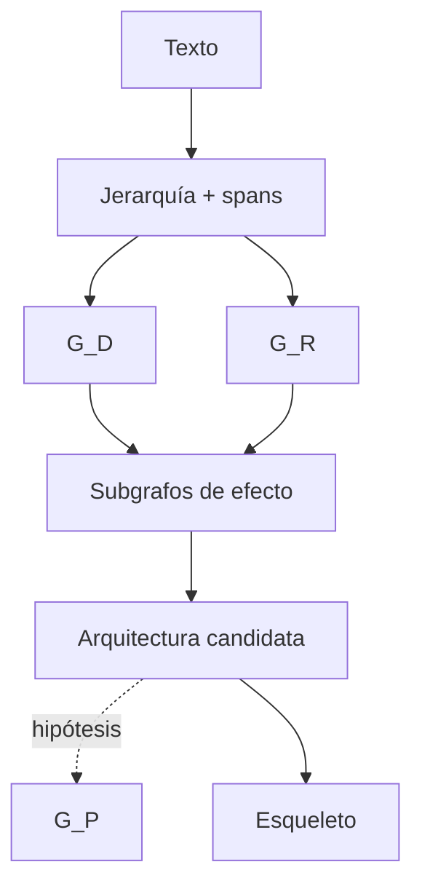

# SP-TEXT-RETROCONSTRUCTION

**Modalidad:** texto · **Estado:** `MATERIALIZED_SPEC` · **Extiende:** kernel MRRE, no lo redefine.

## Objetos y módulos

Ingesta texto inmutable; unidades palabra/oración/párrafo/parte/módulo/pieza; mNodes; spans; `G_D`, `G_R`, `G_P`; negación, modalidad, referencia, evidencia y procedencia. MCCR puede activar observadores macroestructura, expositivo, segmentación funcional, trayectoria, retórica, coherencia, situación cognitiva, intencional-atencional, esquemas, moves, metadiscurso, argumentación, causal, temporal, ontológico y sistémico.

## Restricciones

Deslinealizar no elimina orden; una oración no es unidad funcional por defecto; función es situada; red discursiva y conocimiento supuesto son distintos; intención real permanece `NO_INFERIBLE_BY_DEFAULT`; `G_A` requiere evidencia receptoral. Expansión hasta palabra ocurre cuando cambia causalidad, asociación o riesgo, como “succión” en aspiradora.

## Schemas, corpus y fallos

Extiende manifestation input con encoding, idioma y character/token locators; subgraph con relaciones discursivas. Corpus inicial: Reuters, aspiradora y casos MAANC de Carnegie, Ley 27 y negación activa/pasiva. Fallos: segmentación frágil, coreferencia ambigua, función esencializada, causalidad retórica, intención atribuida. Pertenencia: conserva spans/orden, integra observers sobre el mismo grafo y entrega alternativas/trace.

## Procedimiento de trabajo

1. preserva texto o referencia y encoding;
2. crea spans jerárquicos y coreferencias candidatas;
3. reconstruye por separado `G_D` y `G_R`;
4. activa sólo observadores que respondan al propósito;
5. integra claims sobre IDs compartidos;
6. detecta chains discursivos/argumentales/causales sin confundirlos;
7. eleva `G_P` sólo como hipótesis y `G_A` sólo con evidencia receptoral.

La composición adapta [SRC-MAANC-COMPOSITION](../../../../04_conocimiento_y_contexto/memoria_conceptual/construccion_conceptual/modelo-composicion-cognitiva.md) y [SRC-MAANC-STRUCTURAL](../../../../04_conocimiento_y_contexto/memoria_conceptual/construccion_conceptual/modelo_instrucciones_procesamiento_estructural.md). Ejecuciones: [CASE-MRRE-REUTERS](../09_casos_y_ejemplos/reuters/DOSSIER_OPERATIVO.md) y [CASE-MRRE-VACUUM](../09_casos_y_ejemplos/aspiradora/DOSSIER_OPERATIVO.md).
