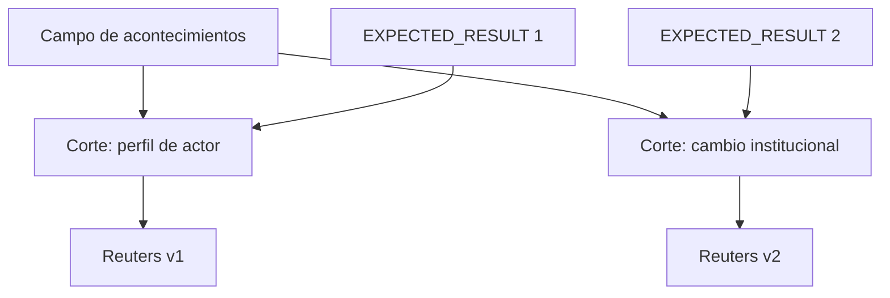

# SP-EVENT-FIELD

**Modalidades:** texto, datos estructurados · **Caso inicial:** Reuters

## Modelo

Representa eventos, actores, estados, intervalos, fuentes, versiones, relaciones causales evidenciadas, contradicciones y omisiones dentro de un campo común. Cada relato es un corte orientado; identidad compartida no implica el mismo foco.

## Contratos

Evento: `event_id`, participantes, estado anterior/posterior, temporalidad, fuente, certainty. Corte: inclusión/exclusión, prominencia, `IDENTITY_SELECTION`, orden y omisiones. Triangulación conserva fecha, fuente y región exclusiva.

## Pruebas y fallos

Compara Reuters v1/v2 como cortes del mismo campo sólo si identidad y fuentes lo permiten. Valida que textos distintos puedan compartir arquitectura y textos semejantes producir efectos diferentes. Fallos: fusionar homónimos, deducir causalidad de sucesión, borrar versiones, tratar omisión como inexistencia. Pertenencia: field/cut reversibles y comparación por estructura, no vocabulario.

## Procedimiento de trabajo

1. crea event IDs y estados before/after;
2. resuelve actores/roles/instituciones por evidencia;
3. conserva fuente, versión y tiempo por afirmación;
4. construye un campo por identidad candidata;
5. produce cortes por expected result;
6. compara prominencia, omisiones, orden y procedencia;
7. conserva causalidad como hipótesis salvo evidencia adicional.

La ejecución de referencia es [CASE-MRRE-REUTERS](../09_casos_y_ejemplos/reuters/DOSSIER_OPERATIVO.md), apoyada en [CASE-SRC-REUTERS-V1](../../../../03_aplicaciones/creacion_de_contenido/referencias_de_estilo/interpretacion_de_eventos/ejemplos_de_noticias/noticia-cambios_en_mandos_militares/unidad_de_analisis_1/noticiero-reuters-v1.md) y [CASE-SRC-REUTERS-V2](../../../../03_aplicaciones/creacion_de_contenido/referencias_de_estilo/interpretacion_de_eventos/ejemplos_de_noticias/noticia-cambios_en_mandos_militares/unidad_de_analisis_1/noticiero-reuters-v2.md). Usa [MRRE-PROC-TRIANGULATE](../03_protocolos_operacionales/03_triangulacion_multimanifestacion.md).
