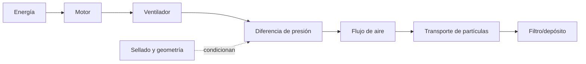

# SP-MECHANISM-EXPLANATION

**Modalidades:** texto, diagrama, datos · **Caso inicial:** aspiradora

## Modelo

Reconstruye parte–todo, entradas/salidas, transformación, controles, condiciones, estados, rutas suficientes, cuellos de botella y cut-sets. Distingue función, causalidad observada y modelo cotidiano.

## Alineación multiescala

Descendente: resultado global→subresultados→partes→unidades→términos. Ascendente: cada término/oración/parte declara contribución al efecto mayor. El término “succión” no basta si activa un modelo causal falso; se expande a presión, flujo y transporte.

## Validación

Eliminar un nodo/arista debe predecir capacidad perdida; rutas alternativas y cut-sets se declaran sólo con soporte (`PAT-COG-128/129`). Fallos: nombrar partes sin mecanismo, secuencia=causalidad, modelo cotidiano como hecho, score alto con invariante roto. Pertenencia: inputs/outputs y relaciones funcional-causales trazables, más alternativas.

## Procedimiento de trabajo

1. define resultado global y frontera;
2. inventaría partes, estados, inputs/outputs y controles;
3. crea edges con fuerza causal exacta;
4. compone rutas y condiciones;
5. ejecuta alineación descendente/ascendente;
6. elimina/invierte componentes para predecir pérdida;
7. conserva modelo rival y huecos técnicos.

[CASE-MRRE-VACUUM](../09_casos_y_ejemplos/aspiradora/DOSSIER_OPERATIVO.md) muestra el original, subgrafos, chain y seis mutaciones. Los patrones de rutas/cut-sets proceden de [SRC-CAT-ASIOO-04](<../../ARQUITECTURA DE SISTEMAS INTEGRADOS ORIENTADOS A OBJETIVOS/CATALOGO_DE_PATRONES_DE_DISENO_COGNITIVO_REUTILIZABLES_EXTENSION_v0_4_0.md>); no autorizan causalidad sin evidencia.
