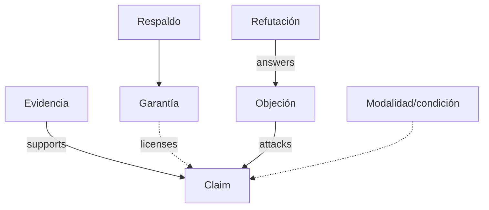

# SP-ARGUMENT-MAP

**Modalidad:** texto · **Observador principal:** analizador argumentativo MAANC

## Objetos

Claims, grounds/evidencia, garantías, respaldos, qualifiers, objeciones, refutaciones, condiciones, modalidad, fuente, contradicciones y alternativas. Orden retórico y validez argumentativa se representan por aristas distintas.



## Procedimiento y schemas

Segmentar unidades argumentales; ligar spans; tipar edges; registrar regla inferencial y estatus; identificar evidencia ausente; buscar lectura rival; separar persuasión, coherencia y validez. Extiende subgraph con `claim_type`, `support_rule`, `burden`, `qualifier` y `source_status`.

Fallos: cita=verdad, orden=soporte, coherencia=validez, objeción omitida, modalidad perdida. Aceptación: cada edge fuerte tiene evidencia o regla; contradicciones y garantías tácitas son hipótesis, nunca observaciones.

## Cuaderno operativo

Por cada claim registra locator, modalidad, carga de prueba y fuente; por cada edge registra regla de soporte/ataque; por cada garantía tácita crea hipótesis y falsador. Después detecta chains argumentativos con [MRRE-WORKBOOK § Algoritmo D](../03_protocolos_operacionales/07_libro_de_trabajo_y_algoritmos.md#algoritmo-d-detección-y-prueba-de-chains).

```yaml
argument_edge: {source: EVID-01, relation: SUPPORTS, target: CLAIM-01, rule: "...", status: SOURCE_ASSERTION}
```

El observador se deriva de la familia [SRC-MAANC-MACRO](../../../../04_conocimiento_y_contexto/memoria_conceptual/construccion_conceptual/modelo_arquitectura_macro_narrativo_cognitiva/) y no sustituye validación factual ni autoridad.
