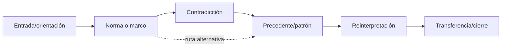

# SP-NARRATIVE-EXPOSITORY-PATH

**Modalidades:** texto, secuencia · **Fuentes:** constructor de trayectoria, detector de esquemas y detector expositivo MAANC.

## Modelo

Una manifestación es recorrido por grafo con entrada, orientación, foco, revelación, tensión, omisión, repetición, transición y cierre. El orden es relación funcional porque cada unidad opera sobre un estado ya modificado.

## Contratos

Cada paso declara precondición, función local, estado de entrada/salida proyectado, edges previas/siguientes, omisiones y alternativas. `trajectory_position` no es índice únicamente. El esqueleto abstrae operaciones, no capítulos.

Fallos: intro/desarrollo/conclusión como plantilla, cronología confundida con función, revelación atribuida al autor sin evidencia, cierre tratado como verdad. Aceptación: alterar orden debe permitir predecir qué efecto cambia; recorridos alternativos se conservan.

## Procedimiento de trabajo

1. registra estado/expectativa de entrada por unidad;
2. tipa operación local (`orienta`, `contrasta`, `revela`, `reencuadra`, `cierra`);
3. enlaza precondiciones y outputs proyectados;
4. construye rutas alternativas;
5. permuta unidades y predice pérdidas;
6. abstrae operaciones, nunca nombres de capítulos.

Los observadores se configuran desde [SRC-MAANC-MACRO](../../../../04_conocimiento_y_contexto/memoria_conceptual/construccion_conceptual/modelo_arquitectura_macro_narrativo_cognitiva/). La distinción orden/chain se ejecuta con [MRRE-WORKBOOK](../03_protocolos_operacionales/07_libro_de_trabajo_y_algoritmos.md); [CASE-MRRE-REUTERS](../09_casos_y_ejemplos/reuters/DOSSIER_OPERATIVO.md) muestra dos trayectorias locales distintas.
